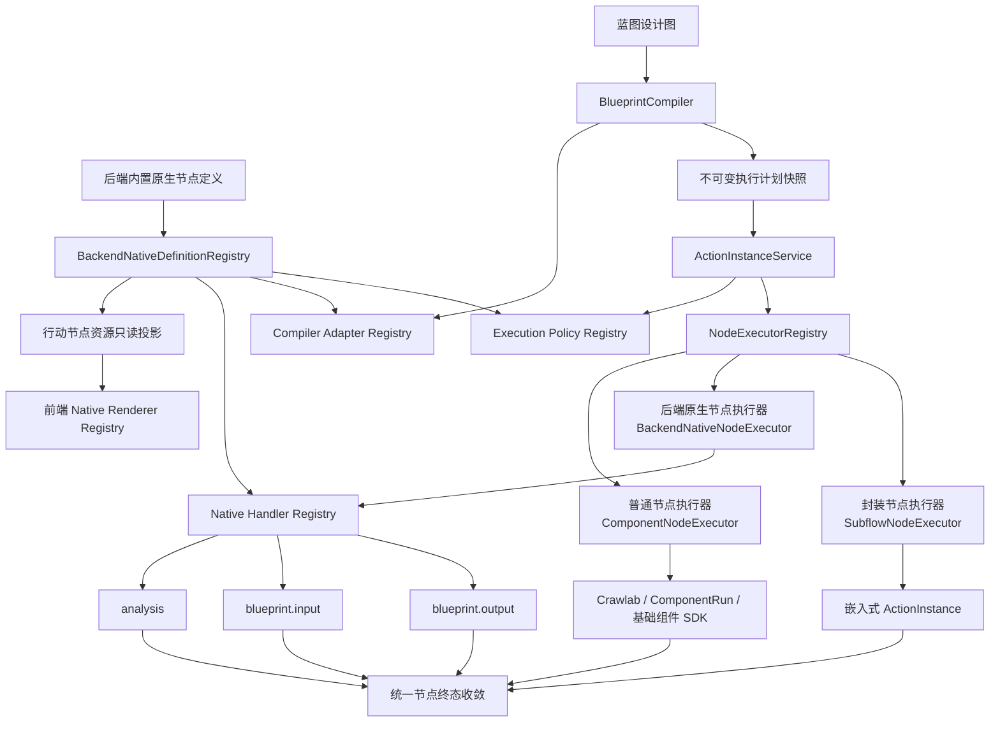

# 行动组件与蓝图封装重构实施计划

## 1. 文档信息

- 文档名称：`COMPONENTS_REFACT_PLAN.md`
- 适用范围：`csi-back`、`csi-front`、`base_components_sdk`、`base_components`
- 目标：在现有普通节点之外增加后端原生节点和封装节点，实现分析引擎、蓝图输入、蓝图输出及蓝图封装，并建立不依赖具体未来功能的节点扩展契约
- 实施原则：分阶段交付、保持现有行动兼容、先抽象执行框架再增加新能力

## 2. 背景

当前行动系统中的所有节点都属于普通节点。普通节点以基础组件作为执行单元：

- 节点定义通过 `related_components` 关联一个或多个基础组件。
- 每个普通节点对应至少一个可独立运行的程序，程序代码统一保存在 `base_components` 目录。
- 行动调度通过 `ComponentRunModel` 创建组件运行，并交由 Crawlab 调度。
- 基础组件通过 `csi_base_component_sdk` 获取输入、上报心跳、提交日志和结果。
- 节点完成后，行动服务负责搬运输出、启动后继节点和收敛行动状态。

该模型适合由 Crawlab 调度独立程序运行的采集、处理和存储组件，但无法自然承载以下能力：

1. 分析引擎完全在后端实现，不适合复制到基础组件进程。
2. 蓝图输入输出节点不需要启动独立进程。
3. 蓝图封装节点需要启动并跟踪一个子蓝图，而不是一个基础组件。
4. 后续可能增加当前尚未确定的其他后端内置能力，现有架构不能要求每次扩展都修改行动核心或迁移基础数据模型。
5. 当前 `ActionNode.type` 同时被用于界面分类，不能继续承担运行时分发职责。
6. 当前 Handle 的实例身份和接口类型没有明确分离，不利于生成稳定的封装节点接口。
7. 当前行动实例保存蓝图图结构快照，但运行时仍可能重新读取可变的节点定义。

本次重构需要把“节点是什么”和“节点如何执行”分离，并引入版本化执行契约、注册式编译与运行扩展、嵌入式子行动和公开接口模型。

## 3. 已确认的产品语义

### 3.1 节点一级分类

系统中的节点必须且只能归属以下三种一级类型：

| 一级节点类型 | 定义 | 程序位置 | 运行方式 | 当前或首批实例 |
|---|---|---|---|---|
| 普通节点 | 一个节点对应至少一个独立程序 | `base_components` | 由 Crawlab 调度，使用基础组件 SDK 与后端交互 | 当前系统中的全部既有节点 |
| 后端原生节点 | 没有独立组件程序，节点能力直接集成在后端 | `csi-back` | 不依赖 Crawlab，由后端原生 Handler 执行 | 分析引擎节点、蓝图输入节点、蓝图输出节点 |
| 封装节点 | 由一个已发布蓝图封装生成，节点内部包含完整行动流程蓝图 | 蓝图 Revision 和后端编排代码 | 启动并跟踪嵌入式子行动 | 采集处理节点等用户封装节点 |

三类节点的包含关系如下：

```text
节点
├── 普通节点
├── 后端原生节点
│   ├── 分析引擎节点
│   ├── 蓝图输入节点
│   └── 蓝图输出节点
└── 封装节点
```

必须明确：

- 后端原生节点、分析引擎节点、输入节点和输出节点不是并列关系；后三者是后端原生节点的具体子类型。
- 封装节点虽然由后端负责调度，但不属于后端原生节点。其业务身份、生命周期和详情展示都属于独立的第三类节点。
- “普通节点”是正式一级类型，不再作为“任意常规显示节点”的泛称。
- 后续新增任何后端内置能力时，应作为新的后端原生节点子类型注册，而不是增加一级类型或在行动核心中增加节点名称判断。

### 3.2 蓝图输入输出节点

蓝图输入输出节点必须是蓝图中真实存在的节点，支持两种创建方式：

1. 从节点面板拖入蓝图，作为独立边界节点。
2. 将节点面板中的边界节点直接拖到可绑定目标节点的节点本体上，或将画布中已有的边界节点拖到目标节点本体上，选择目标端口并建立绑定关系。

本阶段不在普通节点或其他目标节点的 Handle 菜单中增加“暴露为输入/输出”入口。创建边界节点和建立绑定的唯一前端交互分别是“从节点面板拖入”和“将边界节点拖到目标节点上”。

输入输出节点可以不绑定任何节点，作为一个单独的节点连接上、下行节点，支持多对多关系。具体含义为：

- 一个独立输入节点可以通过多条出边向多个下游节点提供同一个公开输入。
- 一个独立输出节点可以通过多条入边接收多个上游节点的结果。
- 蓝图可以包含多个输入节点和多个输出节点，并通过现有图连线形成多输入、多输出、分支和汇合关系。
- 多条边的数据扇出、汇合和结果合并继续遵循行动系统已有的数据搬运规则，不由边界节点隐式增加新的业务合并算法。

输入节点和输出节点的节点表单 `inputs` 都必须包含一个必填文本输入框 `interface_name`：

- 用户在蓝图中设置公开接口名称。
- 蓝图发布为封装节点后，该名称作为对应 Handle 的界面名称。
- Handle 的稳定身份仍使用不可变 `port_id`，不能直接使用可修改名称作为关联主键。
- 同一蓝图 Revision 内，同一方向的接口名称必须唯一。
- 修改接口名称属于公开接口契约变更，保存到新的蓝图 Revision，不修改已经发布的 Revision。

### 3.3 独立运行语义

蓝图作为独立行动运行时：

- 未绑定的输入节点被跳过。
- 未绑定的输出节点被跳过。
- 输入节点与全部下游节点之间的出边从执行图中移除。
- 全部上游节点与输出节点之间的入边从执行图中移除。
- 删除边界节点和边后，重新计算实际起始节点、结束节点和依赖关系。
- 系统不提示用户为未绑定输入节点填写数据。
- 系统不因未绑定输入节点没有数据而拒绝启动。
- 如果新的起始节点自身要求上一级输入，由该节点在运行时自行报错。
- 系统不替业务节点检查或补齐这类输入。

示例：

```text
输入节点 -> 数据处理节点A -> 数据处理节点B -> ... -> 数据处理节点X -> 输出节点
```

独立运行时等价于：

```text
数据处理节点A -> 数据处理节点B -> ... -> 数据处理节点X
```

### 3.4 绑定节点的独立运行语义

边界节点可绑定的目标节点包括：

1. 任意普通节点。
2. 任意非蓝图输入、非蓝图输出的后端原生节点，例如分析引擎节点。
3. 任意封装节点。

输入节点和输出节点不能互相绑定，也不能绑定到另一个输入节点或输出节点。以下示例中的“平台生成器”和“存储器”都只是普通节点示例，不是系统特殊组件，编译器不得按这两个名称编写特例。

如果输入节点绑定“平台生成器”普通节点：

- 独立运行时跳过输入节点。
- 正常执行作为绑定目标的“平台生成器”普通节点。
- 后续节点使用该普通节点的原始输出。

如果输出节点绑定“存储器”普通节点：

- 独立运行时跳过输出节点。
- 正常执行作为绑定目标的“存储器”普通节点。
- 行动流程与未封装前保持一致。

当绑定目标是后端原生节点或封装节点时规则完全相同：独立运行只跳过边界节点，目标节点仍按自身一级类型对应的执行器正常运行。

### 3.5 封装运行语义

蓝图作为封装节点运行时：

- 输入节点接收父流程传入的数据。
- 如果输入节点绑定了目标节点，跳过被绑定目标节点。
- 输入节点的数据替代被绑定节点原本产生的数据。
- 输出节点捕获内部流程数据并返回给父流程。
- 如果输出节点绑定了目标节点，跳过被绑定目标节点。
- 输出节点替代被绑定节点的功能。

示例：

```text
平台生成器（普通节点） -> 采集器 -> HTML分析器 -> 存储器（普通节点）
```

输入节点绑定示例中的平台生成器、输出节点绑定示例中的存储器后，作为封装节点运行时等价于：

```text
父流程输入 -> 采集器 -> HTML分析器 -> 父流程输出
```

### 3.6 封装节点展示语义

- 封装蓝图在父蓝图中与普通节点使用一致的展示方式。
- 父行动历史中只展示封装节点，不单独展示内部子行动。
- 点击封装节点可以进入其嵌入式蓝图详情。
- 封装节点状态等于内部蓝图整体状态。
- 封装节点进度等于内部蓝图整体进度。
- 封装节点日志为内部蓝图所有节点日志的聚合结果。
- 内部执行记录可以持久化，但必须标记为嵌入式并从常规行动历史列表隐藏。

### 3.7 模板蓝图语义

- 模板蓝图封装为节点时，模板参数自动生成封装节点的表单输入 `inputs`。
- 非模板蓝图封装为节点时，不自动生成表单输入。
- 模板参数属于节点配置表单。
- 蓝图输入输出节点属于流程数据接口。
- 模板参数和蓝图公开接口不得混为同一概念。

## 4. 目标与非目标

### 4.1 本次重构目标

1. 建立明确的一级节点类型。系统仅包含普通节点、后端原生节点和封装节点三种互斥一级类型，展示分类不参与运行分发。
2. 保持普通节点运行方式兼容。普通节点继续关联 `base_components` 中至少一个独立程序，通过 Crawlab、基础组件 SDK 和 `ComponentRunModel` 执行；`csi-component main:run` 仅作为默认命令，允许普通节点使用其他合法命令。
3. 建立后端原生节点执行框架。后端原生节点不包含独立程序、不创建 Crawlab 运行，由后端注册的 Handler 直接执行；行动编排服务只依赖统一执行器协议，不硬编码分析、输入、输出等具体子类型。
4. 将后端原生节点定义为系统内置资源。节点定义、Handler、配置 Schema、Handles 和默认展示信息均由后端代码维护并同步到资源列表，不允许用户手动新增、编辑或删除。
5. 提供后端原生节点资源管理入口。后端原生节点可以在“行动资源配置－行动节点”中查看，界面必须标记“系统内置”；仅允许具备相应权限的用户启用或禁用，不能修改其 Handler、Schema 或其他定义。
6. 区分资源定义和蓝图实例配置。用户不能修改后端原生节点资源定义，但将其拖入蓝图后，可以填写该内置节点 Schema 明确开放的实例参数，例如分析 Agent、提示词模板或边界接口名称。
7. 首批实现三种后端原生节点。包括分析引擎节点、蓝图输入节点和蓝图输出节点；其中输入输出节点支持独立放置、多对多连线，以及拖动到可绑定目标节点上建立替换绑定。
8. 建立蓝图设计图到执行图的编译过程。编译器根据独立运行或封装运行模式处理边界节点跳过、绑定目标替换、依赖重写、起止节点重算和接口映射。
9. 建立清晰的蓝图封装交互。用户从蓝图列表、蓝图详情页或蓝图编辑器点击“封装为节点”，填写封装节点名称等基本信息，预览模板表单和公开 Handles，通过校验后发布不可变 Revision，并生成可在其他蓝图中拖入使用的封装节点资源。
10. 建立蓝图封装的版本管理。封装节点固定引用不可变 Revision；源蓝图后续修改不会自动影响已有节点，用户必须重新发布并显式升级引用版本。
11. 实现封装节点运行和详情。封装节点在父行动中保持单节点身份，内部通过嵌入式子行动运行完整蓝图，并向父节点同步状态、进度、输出、取消、超时和聚合日志。
12. 建立公开接口契约。输入输出节点的 `interface_name` 生成封装节点 Handle 名称，稳定 `port_id` 负责连线身份；模板参数只生成节点表单 `inputs`，不得与流程数据 Handles 混用。
13. 明确后端原生节点禁用语义。禁用后不再出现在蓝图节点面板中，不能新建引用，也不能启动包含该节点的新行动；已运行行动和历史记录不受影响，已有草稿和 Revision 仍可查看并显示禁用警告。
14. 保证可靠性和可恢复性。普通节点、异步后端原生节点和封装节点都必须支持幂等启动、重复结果保护、取消、超时、状态对账和执行配置快照。
15. 建立与具体未来功能无关的扩展契约。新增后端原生节点时，应通过注册节点定义、运行 Handler、可选 Compiler Adapter、可选 Execution Policy 和可选 Renderer 完成；扩展专属配置和状态使用版本化扩展载荷保存，不新增节点一级类型、不修改行动核心分发分支，也不为每种节点增加数据库字段。

### 4.2 暂不纳入本次范围

1. 不开放用户自定义后端原生节点。用户不能通过界面或通用 CRUD 创建、编辑、删除、上传或替换后端原生 Handler；新增原生节点必须通过后端代码发布。
2. 不允许在普通节点、后端原生节点或封装节点之间直接转换一级类型；类型变化必须创建新的节点定义。
3. 不把分析引擎、输入输出或封装节点实现迁移到 `base_components`，也不为它们创建用于调用后端的空壳组件程序。
4. 不让后端通过自身 HTTP API 间接启动分析引擎；分析 API 和分析节点必须复用同一应用层调用门面。
5. 本阶段不提供节点 Handle 菜单中的“暴露为输入/输出”快捷功能，也不自动为某个 Handle 创建边界节点。
6. 不允许输入输出边界节点绑定另一个输入输出边界节点；边界绑定只面向普通节点、非边界后端原生节点和封装节点。
7. 不为未绑定输入节点增加独立运行时输入对话框，不因缺少边界输入拒绝启动，也不在启动前替业务节点校验或补齐运行数据。
8. 不自动修复业务节点因边界跳过导致的输入缺失；新的起始节点如果强制依赖上游数据，由该节点自身执行时报错。
9. 不直接封装可变蓝图草稿；封装操作必须先生成不可变 Revision。
10. 不把子蓝图所有节点展开写入父行动历史；父行动只展示封装节点，内部节点通过嵌入式详情查看。
11. 不自动把源蓝图新 Revision 推送到已有封装节点引用，也不支持行动运行中切换蓝图版本。
12. 本版本不支持跨系统远程蓝图调用、跨项目公开封装节点市场或封装节点递归形成依赖环。
13. 本版本不实现除分析引擎、蓝图输入和蓝图输出之外的其他后端原生节点。本阶段只交付通用扩展契约、默认实现和测试夹具；测试夹具不进入产品资源列表，也不代表任何其他节点的产品路线。

## 5. 总体架构



总体设计分为六层：

1. 定义层：后端代码注册原生节点定义及其 Handler、Compiler Adapter、Execution Policy 引用，并同步只读资源投影；普通节点和封装节点使用各自的资源来源。
2. 设计与展示层：保存用户编辑的完整蓝图、节点实例参数、边界名称和绑定，并通过 Renderer 注册表展示原生节点。
3. 编译层：根据独立运行或封装运行调用 Compiler Adapter，生成有效执行图。
4. 编排层：通过默认规则或已注册 Execution Policy 管理节点就绪、逻辑执行、结果路由、超时和后继节点。
5. 执行层：由执行器注册表选择具体执行器。
6. 能力层：普通节点对应基础组件程序；后端原生节点包含分析引擎、边界输入输出等 Handler；封装节点对应子蓝图。

## 6. 节点分类模型

### 6.1 分离一级节点类型和展示分类

节点至少需要区分以下字段：

```json
{
  "node_kind": "backend_native",
  "category": "processor",
  "execution": {
    "driver": "backend_native",
    "handler": "analysis",
    "schema_version": 1,
    "config": {}
  },
  "extension": {
    "contract_version": 1,
    "compiler_adapter": "default",
    "execution_policy": "default",
    "renderer_key": "schema",
    "config": {}
  }
}
```

字段职责：

| 字段 | 用途 |
|---|---|
| `node_kind` | 权威一级节点类型，只允许 `ordinary`、`backend_native`、`encapsulated` |
| `category` | 业务展示分类、图标、颜色和检索标签，不表示一级节点类型 |
| `execution.driver` | 一级节点类型对应的执行器，在执行快照中显式保存 |
| `execution.handler` | 选择一级类型内部的具体运行 Handler |
| `execution.schema_version` | 支持 Handler 配置演进 |
| `execution.config` | Handler 专属配置 |
| `extension` | 版本化通用扩展契约，选择编译适配器、执行策略和前端渲染器，并保存扩展配置 |

`extension` 对后端原生节点必填，对普通节点和封装节点为空。该字段与 `execution.config` 分开，避免将展示和编译信息混入具体 Handler 的业务配置。

`node_kind` 与执行器存在固定约束，不能任意组合：

| `node_kind` | `execution.driver` | 约束 |
|---|---|---|
| `ordinary` | `component` | 必须关联至少一个 `base_components` 独立程序，并创建 Crawlab 组件运行 |
| `backend_native` | `backend_native` | 禁止创建 Crawlab 组件运行，必须使用已注册的后端原生 Handler |
| `encapsulated` | `subflow` | 必须引用不可变蓝图 Revision，并创建嵌入式子行动 |

节点定义保存时由后端校验上述映射。前端不允许用户为一级节点类型任意切换不兼容的 Driver。

### 6.2 执行驱动

建议初始支持：

| Driver | 含义 |
|---|---|
| `component` | 普通节点执行器，通过 Crawlab 运行 `base_components` 中的独立程序 |
| `backend_native` | 后端原生节点执行器，不创建 Crawlab 运行 |
| `subflow` | 封装节点执行器，运行蓝图 Revision |

虽然 `subflow` 也由后端运行，但单独保留 Driver 有利于：

- 明确父子行动生命周期。
- 独立处理蓝图版本、递归和日志聚合。
- 避免通用原生 Handler 承担过多子流程特例。

### 6.3 初始 Handler

| Driver | Handler | 节点 |
|---|---|---|
| `component` | `component.run` | 普通节点 |
| `backend_native` | `analysis` | 后端原生节点／分析引擎节点 |
| `backend_native` | `blueprint.input` | 后端原生节点／蓝图输入节点 |
| `backend_native` | `blueprint.output` | 后端原生节点／蓝图输出节点 |
| `subflow` | `blueprint.call` | 封装节点 |

### 6.4 分发与校验规则

不得使用展示分类 `category` 分发运行：

```python
if node.category == "analysis":
    ...
elif node.category == "input":
    ...
```

正确流程为：

1. 根据 `node_kind` 校验 `execution.driver` 是否匹配。
2. 根据执行计划快照中的 `execution.driver` 选择三类顶层执行器之一。
3. 后端原生执行器再根据 `execution.handler` 从注册表选择具体 Handler。
4. 普通节点必须进入 Crawlab 派发链路，后端原生节点和封装节点必须禁止进入该链路。

### 6.5 后端原生节点定义注册表

后端原生节点不是用户创建的资源，其权威定义必须来自后端代码中的注册表：

```python
class NativeNodeExtensionSpec(BaseModel):
    contract_version: int = 1
    compiler_adapter: str = "default"
    execution_policy: str = "default"
    renderer_key: str = "schema"
    config: dict[str, dict[str, Any]] = Field(default_factory=dict)


class BackendNativeNodeDefinition(BaseModel):
    builtin_key: str
    definition_version: int
    name: str
    description: str
    handler: str
    category: str
    icon: str | None = None
    instance_input_schema: dict
    handles: list[HandleDefinition]
    extension: NativeNodeExtensionSpec
```

注册表职责：

- 注册 `analysis`、`blueprint.input`、`blueprint.output` 等内置定义。
- 校验 `builtin_key`、Handler、Schema、端口定义和扩展契约唯一、完整且版本兼容。
- 将定义同步为“行动资源配置－行动节点”中的只读资源投影。
- 后端版本升级时按 `builtin_key + definition_version` 幂等更新定义。
- 同步定义时保留数据库中的 `enabled`、`disabled_at` 和 `disabled_by` 状态，不因服务重启重新启用。

资源投影不是后端原生节点定义的事实来源。用户不得修改名称、Handler、Schema、Handles 或执行配置，只能在授权范围内修改 `enabled`。

禁用检查分为三层：

1. 节点面板只返回或只展示已启用的后端原生节点。
2. 蓝图保存和发布时，对禁用节点给出明确校验错误。
3. 根行动启动前递归校验当前 Revision 及其封装依赖中的原生节点是否启用。

已经进入运行状态的行动使用启动时的执行快照继续运行；禁用操作不终止在途行动。历史蓝图、历史 Revision 和行动详情仍可读取禁用节点的定义快照。

### 6.6 与具体功能无关的原生节点扩展契约

后端原生节点的扩展由四个相互独立的注册点组成：

| 扩展点 | 职责 | 默认实现 |
|---|---|---|
| Handler | 执行业务能力，返回统一节点结果 | 无；每个原生节点必须注册 |
| Compiler Adapter | 校验并将设计节点转换为执行计划节点，必要时重写执行图 | `default`，保持节点和连线拓扑 |
| Execution Policy | 决定逻辑执行何时就绪、如何生成执行请求以及结果如何路由 | `default`，按现有 DAG 依赖执行一次 |
| Renderer | 展示 Schema 表单、节点卡片和运行详情 | `schema`，按定义和 Schema 通用渲染 |

首批后端原生节点的装配关系为：

| `builtin_key` | Handler | Compiler Adapter | Execution Policy | Renderer |
|---|---|---|---|---|
| `analysis` | `analysis` | `default` | `default` | `analysis` |
| `blueprint.input` | `blueprint.input` | `blueprint.input` | `default` | `blueprint.input` |
| `blueprint.output` | `blueprint.output` | `blueprint.output` | `default` | `blueprint.output` |

注册关系示意：

```python
native_handlers.register(definition.handler, handler)
compiler_adapter = compiler_adapters.require(
    definition.extension.compiler_adapter,
    definition.extension.contract_version,
)
execution_policy = execution_policies.require(
    definition.extension.execution_policy,
    definition.extension.contract_version,
)
native_definitions.register(definition)
```

`native_definitions.register()` 必须在启动阶段确认 Handler、Compiler Adapter 和 Execution Policy 已注册。前端以相同的 `renderer_key + contract_version` 注册 Renderer，并通过资源定义响应完成兼容性校验。

各协议只交换稳定的通用对象：

| 协议 | 输入 | 输出 |
|---|---|---|
| Handler | `NodeExecutionContext`、`NodeExecutionSpec` | `NodeStartResult`、`NodeExecutionOutcome` |
| Compiler Adapter | 编译上下文、设计节点快照 | 执行节点、边变更、跳过原因和版本化扩展载荷 |
| Execution Policy | 调度上下文、执行计划节点、已持久化执行记录 | 待执行请求和结果路由决定 |
| Renderer | 节点定义快照、实例配置、通用执行记录 | 节点表单、节点卡片和详情视图 |

约束如下：

1. `BackendNativeNodeDefinition` 是四个扩展点的唯一装配入口，行动核心不得根据 `builtin_key`、Handler 名称或展示分类增加条件分支。
2. 当前分析引擎节点使用默认编译适配器和默认执行策略；蓝图输入、蓝图输出通过各自注册的编译适配器实现边界重写。具体适配器名称是实现细节，不进入一级类型枚举。
3. 默认执行策略覆盖当前“依赖满足后执行一次”的节点。后续能力如果具有不同编排语义，应新增策略实现并注册，不修改行动核心的分发结构。
4. `extension.config`、执行计划中的扩展载荷以及执行记录中的扩展状态均为版本化 JSON；通用层只负责校验版本、快照和持久化，具体含义由已注册实现解释。
5. 注册键只能解析到随服务发布的可信后端实现，禁止从请求值动态导入模块。
6. Handler、Compiler Adapter 或 Execution Policy 不存在或版本不兼容时，定义注册、蓝图发布或行动启动必须明确失败。Renderer 不存在或不兼容时，前端必须阻止编辑和保存；只有显式声明 `renderer_key=schema` 的节点才能使用通用渲染器。
7. `extension.config` 只使用 `compiler`、`execution_policy`、`renderer` 三个命名空间。每个注册实现必须声明支持的契约版本并校验自身配置；定义注册时完成整体校验。扩展配置由后端代码提供，不是用户可编辑的节点实例表单。
8. Compiler Adapter 和 Execution Policy 返回声明式变更或决策，由编译器、编排器统一校验和持久化；扩展实现不得绕过通用层直接修改执行图或节点调度状态。

本阶段只实现分析引擎、蓝图输入和蓝图输出及其所需扩展实现。上述契约用于保证后续新增节点能够直接接入，并不预定义任何未来节点及其产品语义。

三个版本字段职责不同：

| 字段 | 版本对象 | 变更规则 |
|---|---|---|
| `definition_version` | 完整内置节点定义 | Handler、Handles、Schema、扩展装配或展示定义变化时递增 |
| `execution.schema_version` | Handler 业务配置 | `execution.config` 结构或含义变化时递增 |
| `extension.contract_version` | 通用扩展协议及载荷 | Compiler Adapter、Execution Policy 或 Renderer 协议不兼容变化时递增 |

旧 Revision 仍可能引用旧版本，因此注册表必须在引用存续期间保留对应实现。本文所称“新增节点无需修改底层”，是指新增节点只增加自身定义、实现、可选适配器／策略／视图和测试，不修改三种一级类型、通用数据模型、通用协议或按节点名称分发的核心逻辑。

## 7. 通用节点执行框架

### 7.1 执行器接口

建议定义统一协议：

```python
class NodeExecutor(Protocol):
    async def start(
        self,
        context: NodeExecutionContext,
        spec: NodeExecutionSpec,
    ) -> NodeStartResult:
        ...

    async def reconcile(
        self,
        execution: ActionNodeExecutionModel,
    ) -> NodeExecutionOutcome | None:
        ...

    async def cancel(
        self,
        execution: ActionNodeExecutionModel,
        reason: str,
    ) -> bool:
        ...
```

其中：

- `start()` 可以返回立即完成或异步运行引用。
- `reconcile()` 用于轮询、事件漏失修复和进程重启恢复。
- `cancel()` 统一处理停止、整体超时和节点超时。

### 7.2 启动结果

```python
class NodeStartResult(BaseModel):
    state: Literal["completed", "running"]
    provider_run_id: str | None = None
    outputs: dict[str, Any] = Field(default_factory=dict)
    progress: float = 0
    extension_state: dict[str, Any] = Field(default_factory=dict)
    extension_result: dict[str, Any] = Field(default_factory=dict)
```

适用方式：

- 封装运行中保留的输入输出后端原生节点通常立即完成；独立运行中被编译跳过的边界节点不调用 Handler。
- 分析引擎后端原生节点和封装节点通常返回 `running`。
- 普通节点在完成基础组件 SDK 回调前返回 `running`。
- `NodeExecutionOutcome` 使用相同的 `outputs`、`extension_state` 和 `extension_result` 字段，确保异步完成、对账和重启恢复走同一持久化路径。
- `outputs` 是允许沿蓝图边传递的业务结果；`extension_state` 和 `extension_result` 只供扩展实现恢复与展示，除非 Handler 显式映射，否则不得自动暴露给下游节点。

### 7.3 执行器注册表

```python
registry.register("component", ComponentNodeExecutor())
registry.register("backend_native", BackendNativeNodeExecutor(native_handlers))
registry.register("subflow", SubflowNodeExecutor())
```

后端原生 Handler 使用二级注册：

```python
native_handlers.register("analysis", AnalysisNodeHandler())
native_handlers.register("blueprint.input", BlueprintInputHandler())
native_handlers.register("blueprint.output", BlueprintOutputHandler())
```

新增原生节点的改动范围必须限制为：

1. 注册节点定义、配置 Schema、Handles 和扩展契约版本。
2. 实现并注册 Handler。
3. 只有默认图编译或默认执行方式不能满足需要时，才新增并注册 Compiler Adapter 或 Execution Policy。
4. 优先使用 Schema 通用渲染；确需专用交互时注册 Renderer。
5. 增加该节点自身测试，并通过第 22.7 节的通用扩展契约测试。

不得修改一级节点类型、行动核心调度分支或通用执行表结构。

### 7.4 通用执行记录

新增 `ActionNodeExecutionModel`：

```text
id
action_id
node_instance_id
execution_key
driver
handler
schema_version
extension_contract_version
attempt
status
idempotency_key
provider_run_id
provider_session_id
child_action_id
progress
outputs
extension_state
extension_result
error_message
started_at
finished_at
created_at
updated_at
```

索引建议：

```text
unique(action_id, node_instance_id, execution_key, attempt)
unique(idempotency_key)
index(action_id, status)
index(provider_run_id)
index(child_action_id)
```

`ComponentRunModel` 继续记录具体基础组件子运行。一个节点执行记录可以对应多个 `ComponentRunModel`。

只有实际发起的节点尝试创建 `ActionNodeExecutionModel`。编译阶段标记为 `SKIPPED` 的节点只在 `ActionInstanceNodeModel` 保存状态和 `skip_reason`，不创建伪执行记录。

`execution_key` 是一次行动中同一设计节点的逻辑执行标识。当前所有节点固定使用 `default`；通用层将其作为不透明字符串参与唯一约束和幂等，不推断业务含义。非默认执行策略可以生成其他稳定值，从而不必为新的执行方式修改执行记录主键语义。

`extension_state` 和 `extension_result` 保存扩展实现恢复运行所需的中间状态和结果。两者必须与 `extension_contract_version` 一起写入，不得为单个原生节点增加专属执行表字段。

扩展载荷必须受统一大小限制；大对象保存为受权限控制的引用，不能把无界结果写入行动文档。

普通节点和封装节点的 `extension_contract_version`、`extension_state`、`extension_result` 为空；它们继续由各自的顶层 Driver 和执行器管理。

### 7.5 执行配置快照

`ActionInstanceNodeModel` 必须保存：

```text
execution_spec_snapshot
extension_spec_snapshot
node_definition_version
extension_contract_version
current_execution_id
```

`execution_spec_snapshot` 保存 Driver、Handler 和 Handler 配置，`extension_spec_snapshot` 保存 Compiler Adapter、Execution Policy、Renderer 标识及版本化扩展配置。行动启动后不得重新读取可变节点定义决定执行方式。

现有旧行动没有快照时，兼容路径可以读取节点定义，但新建行动必须写入完整执行快照。

### 7.6 幂等性

节点执行幂等键：

```text
action_id:node_instance_id:execution_key:attempt
```

要求：

- 同一次节点尝试最多创建一个通用执行记录。
- 分析引擎投递必须接受或派生相同幂等键。
- 子行动创建必须按父节点尝试幂等。
- SDK 重复结果不得重复完成节点。
- 事件重复消费不得重复启动后继节点。

### 7.7 统一状态

通用节点状态建议增加：

```text
QUEUED
RUNNING
WAITING
AWAITING_APPROVAL
COMPLETED
FAILED
CANCELLED
TIMEOUT
PAUSED
SKIPPED
```

`SKIPPED`：

- 是终态。
- 不阻塞行动完成。
- 不计入实际执行步骤进度分母。
- 必须保存 `skip_reason`。

### 7.8 组件启动命令兼容策略

基础组件的启动命令不再做固定值校验，执行语义调整为：

- 组件未提交 `command` 或提交空值时，后端补充默认命令 `csi-component main:run`。
- 组件显式提交其他非空命令时，完整保存并按提交值执行。
- 创建、更新、导入和复制组件必须使用同一套默认值策略，不能在单个 API 中单独限制。
- Worker 或容器执行层只负责按参数启动，不再次断言命令必须等于默认值。
- 命令仍需经过现有的参数类型、长度、权限和安全校验；“允许自定义”不等于绕过安全控制。
- 旧组件缺少命令字段时，兼容读取逻辑返回默认命令，不要求立即批量修改全部历史数据。

建议将默认值集中定义为单一常量或 Schema 默认值，避免模型、接口和 Worker 分别维护：

```python
DEFAULT_COMPONENT_COMMAND = "csi-component main:run"
```

请求示例：

```json
{
  "command": "python -m custom_component"
}
```

该请求应通过业务校验，并在执行快照中保留原始命令。执行失败时应返回实际命令对应的运行错误，不能静默回退到默认命令。

## 8. 蓝图设计图与执行图

### 8.1 两种图的职责

设计图：

- 保存普通节点、后端原生节点和封装节点三类完整节点定义。
- 输入输出边界节点作为后端原生节点保存在图中。
- 保存边界绑定。
- 用于编辑、发布和展示。

执行图：

- 由 `BlueprintCompiler` 生成。
- 与一次行动调用模式绑定。
- 只包含本次调用真正需要的节点和边。
- 是行动实例的不可变快照。

### 8.2 调用模式

```text
standalone  蓝图独立运行
subflow     蓝图作为封装节点运行
```

`ActionInstanceModel` 增加 `invocation_mode`。

### 8.3 执行计划模型

建议新增：

```python
class BlueprintExecutionPlan(BaseModel):
    plan_schema_version: int
    revision_id: str
    invocation_mode: Literal["standalone", "subflow"]
    nodes: list[ExecutionPlanNode]
    edges: list[ExecutionPlanEdge]
    skipped_nodes: list[SkippedNode]
    public_interface_snapshot: BlueprintInterfaceSpec
    extension: dict[str, Any] = Field(default_factory=dict)
```

行动实例保存完整 `execution_plan_snapshot`。

`ExecutionPlanNode` 和 `ExecutionPlanEdge` 同样预留 `extension_contract_version` 与 `extension`。`plan_schema_version` 只表示执行计划自身结构版本，不能替代原生节点扩展契约版本。编译器核心只处理稳定的节点、边、依赖和版本字段，并按注册表调用 Compiler Adapter；适配器产生的扩展载荷原样进入不可变快照，由对应 Execution Policy 解释。默认实现忽略空扩展载荷。

Compiler Adapter 基于不可变设计图快照返回声明式图变更，不直接修改共享图对象。编译器按稳定节点和边 ID 合并变更；多个适配器修改同一目标且结果不一致时发布失败，不能依赖注册顺序得到不同执行计划。

### 8.4 独立运行编译规则

1. 找出全部 `blueprint.input` 和 `blueprint.output` 节点。
2. 将边界节点标记为 `SKIPPED`。
3. 删除未绑定输入节点及其所有出边。
4. 删除未绑定输出节点及其所有入边。
5. 对已绑定输入节点：
   - 删除输入边界节点。
   - 保留被绑定目标节点。
   - 保留目标节点原有边。
6. 对已绑定输出节点：
   - 删除输出边界节点。
   - 保留被绑定目标节点。
   - 保留目标节点原有边。
7. 在处理后的图上重新计算入度、出度、起始节点和结束节点。
8. 不校验新起始节点是否缺少业务输入。

### 8.5 封装运行编译规则

1. 保留输入输出边界节点。
2. 对未绑定边界节点，保留其正常连线。
3. 对绑定输入节点：
   - 将被绑定目标节点标记为 `SKIPPED`。
   - 使用边界输入替代目标节点映射的输出 Handle。
   - 将目标节点对应的下游边重写到边界输入节点。
4. 对绑定输出节点：
   - 将被绑定目标节点标记为 `SKIPPED`。
   - 将原本进入目标节点映射输入 Handle 的数据重写到边界输出节点。
5. 重新计算依赖图。
6. 根据父节点输入创建子行动调用输入。
7. 根据边界输出生成子行动调用输出。

### 8.6 编译校验

保存蓝图或发布蓝图时必须校验：

- 图中节点 ID 唯一。
- 图中边 ID 唯一。
- 边引用的节点和端口存在。
- 绑定目标只能是普通节点、非边界后端原生节点或封装节点。
- 输入和输出边界均禁止绑定 `blueprint.input`、`blueprint.output`。
- 输入边界只能绑定目标节点的输出端口。
- 输出边界只能绑定目标节点的输入端口。
- 端口接口类型兼容。
- 绑定节点属于当前蓝图。
- 同一端口不能被多个同方向边界重复替换。
- 每个边界节点必须具有非空 `interface_name`，且同一方向名称唯一。
- 边界节点的公开 `port_id` 必须稳定且唯一。
- 使用的后端原生节点必须处于启用状态。
- 后端原生节点引用的扩展契约版本、Compiler Adapter 和 Execution Policy 必须已注册且兼容。
- 重写后不能产生循环依赖。
- 重写后不能产生指向已移除节点的悬空边。
- 封装蓝图递归依赖不能形成环。

不校验：

- 新起始节点是否有业务必填输入。
- 未绑定输入是否会导致具体组件失败。
- 业务数据内容是否满足组件要求。

编译器不得直接判断 `analysis`、`blueprint.input`、`blueprint.output` 等 Handler 名称。第 8.4、8.5 节的边界处理规则由输入输出节点注册的 Compiler Adapter 实现，`BlueprintCompiler` 仅负责按稳定协议组织校验、调用适配器并生成快照。

## 9. 蓝图接口与端口模型

### 9.1 蓝图公开接口

蓝图新增正式接口定义：

```python
class BlueprintInterfaceSpec(BaseModel):
    inputs: list[BlueprintInterfacePort]
    outputs: list[BlueprintInterfacePort]
```

端口模型：

```text
id
name                 来自边界节点 inputs.interface_name
label
direction
interface_type_id
required
description
schema_version
```

公开接口是封装节点 Handles 的唯一来源。蓝图编辑阶段以边界节点为配置入口，发布时从边界节点生成并冻结 `BlueprintInterfaceSpec`，避免用户分别维护边界节点名称和另一份接口名称。

### 9.2 端口身份与接口类型分离

现有 Handle ID 同时承担端口身份和兼容类型职责，需要逐步拆分：

```text
port_id             节点定义内的稳定端口身份
handle_config_id    可复用的 Handle 展示与数据类型配置
interface_type_id   数据类型和兼容性标识
```

边使用 `port_id`：

```text
source_port_id
target_port_id
```

兼容性检查使用 `interface_type_id`。

迁移期间兼容读取旧字段：

```text
sourceHandle
targetHandle
```

新保存的蓝图应同时生成稳定 `port_id`，完成迁移后再删除旧字段。

### 9.3 边界节点和公开接口关系

每个边界节点对应一个公开接口端口：

```text
interface_port_id
interface_name
bound_node_id
port_mappings
```

其中：

- `interface_port_id` 在边界节点创建时生成并保持稳定。
- `interface_name` 来自节点表单的必填文本框，是封装节点 Handle 的显示名称。
- `bound_node_id` 为空表示独立边界节点，非空表示绑定替换一个目标节点。
- `port_mappings` 记录公开端口与绑定目标端口的映射。

一个边界节点对应一个公开 Handle，但可以通过多条图边与多个内部节点连接；多对多能力由多个边界节点和多条边共同组成，不通过一个边界节点生成多个公开 Handle。

接口定义是发布后的数据契约，边界节点是设计图上的配置入口、调用位置和替换位置。删除边界节点时必须提示将删除对应公开接口；修改名称后只有新 Revision 使用新名称，旧 Revision 保持不变。

## 10. 蓝图输入节点（后端原生节点）

### 10.1 节点定义

```json
{
  "node_kind": "backend_native",
  "definition_origin": "backend_builtin",
  "category": "input",
  "execution": {
    "driver": "backend_native",
    "handler": "blueprint.input",
    "schema_version": 1
  },
  "inputs": [
    {
      "id": "interface_name",
      "type": "text",
      "label": "接口名称",
      "required": true
    }
  ]
}
```

`inputs` 是后端内置且不可由用户修改的实例表单 Schema。用户将节点拖入蓝图后填写 `interface_name`，该值只属于当前蓝图节点实例。

### 10.2 未绑定输入节点

独立运行：

- 节点标记 `SKIPPED`。
- 从执行图删除。
- 删除其出边。
- 下游节点可能成为新的起始节点。
- 不产生输出。
- 不提示输入。
- 不阻止行动启动。

封装运行：

- 从父节点输入中读取对应公开端口值。
- 将存在的值写入自身输出。
- 如果父流程未提供值，可以输出空或不生成该端口值。
- 下游节点是否能够处理缺失值，由下游节点负责。

### 10.3 绑定输入节点

绑定对象是一个可绑定目标节点的一个或多个输出端口。目标节点可以是普通节点、非边界后端原生节点或封装节点。

独立运行：

- 输入边界节点 `SKIPPED`。
- 被绑定目标节点按自身执行器正常执行。

封装运行：

- 被绑定目标节点 `SKIPPED`。
- 输入边界节点读取父流程输入。
- 输入值替代被绑定目标节点的对应输出。
- 原目标节点下游边被重写到输入边界节点。

### 10.4 固定值

边界输入节点本身不承担独立运行固定值逻辑。

如需固定值，应使用普通构造器或常量节点，并将输入节点绑定到该节点：

```text
Input(绑定常量节点) -> 处理节点
```

结果：

- 独立运行执行常量节点。
- 封装运行跳过常量节点，使用父流程输入。

## 11. 蓝图输出节点（后端原生节点）

### 11.1 节点定义

```json
{
  "node_kind": "backend_native",
  "definition_origin": "backend_builtin",
  "category": "output",
  "execution": {
    "driver": "backend_native",
    "handler": "blueprint.output",
    "schema_version": 1
  },
  "inputs": [
    {
      "id": "interface_name",
      "type": "text",
      "label": "接口名称",
      "required": true
    }
  ]
}
```

与输入节点一致，输出节点的 `inputs` Schema 由后端内置，用户填写的 `interface_name` 生成当前蓝图公开输出 Handle 的界面名称。

### 11.2 未绑定输出节点

独立运行：

- 节点标记 `SKIPPED`。
- 从执行图删除。
- 删除其入边。
- 上游节点可能成为新的结束节点。

封装运行：

- 接收内部上游数据。
- 允许多条入边，按照现有汇合和结果合并规则形成该公开输出的数据。
- 将数据写入子行动 `invocation_outputs`。
- 作为父封装节点的输出返回。

### 11.3 绑定输出节点

绑定对象是一个可绑定目标节点的一个或多个输入端口。目标节点可以是普通节点、非边界后端原生节点或封装节点。

独立运行：

- 输出边界节点 `SKIPPED`。
- 被绑定目标节点按自身执行器正常执行。

封装运行：

- 被绑定目标节点 `SKIPPED`。
- 原本进入被绑定节点输入端口的数据改为进入输出边界节点。
- 输出边界节点将数据返回父流程。

### 11.4 存储和继续处理分支

若封装节点既要存储又要向父流程输出，蓝图设计者应显式建立分支：

```text
                                -> 存储节点
输入 -> 采集 -> HTML处理节点
                                -> 输出节点
```

系统不隐式复制或重放存储节点输入。

## 12. 边界节点前端交互

### 12.1 独立拖入

节点面板增加：

- 蓝图输入节点
- 蓝图输出节点

两者均由后端内置并且不能编辑资源定义。拖入蓝图后，节点实例表单至少包含：

- 接口名称 `interface_name`：必填文本框，作为封装节点 Handle 的界面名称。
- 接口类型：选择允许连接的数据接口类型。
- 是否必填：仅用于封装节点接口契约说明，不改变独立运行跳过规则。
- 描述：可选的接口说明。

独立边界节点使用普通图连线操作连接内部节点：

- 输入节点允许一对多连接多个下游。
- 输出节点允许多对一接收多个上游。
- 多个输入和多个输出组合后形成蓝图级多对多接口。

### 12.2 拖动绑定

仅支持通过拖动边界节点到目标节点本体建立绑定，具体交互为：

1. 用户将节点面板中的输入或输出节点直接拖到目标节点本体，或者将画布上已有的边界节点拖到目标节点本体。
2. 前端确认目标是普通节点、非边界后端原生节点或封装节点。
3. 前端检测输入输出方向是否允许。
4. 展示目标节点的可绑定端口列表。
5. 自动匹配兼容接口类型。
6. 用户填写 `interface_name` 并确认端口映射。
7. 保存 `bound_node_id` 和 `port_mappings`。
8. 边界节点以贴边节点、徽标或折叠附属节点展示，但在设计图数据中仍是独立真实节点。

以下交互本阶段不存在：

- 普通节点 Handle 上的“暴露为输入/输出”。
- 后端原生节点 Handle 上的“暴露为输入/输出”。
- 封装节点 Handle 上的“暴露为输入/输出”。
- 仅通过点击菜单自动创建边界节点和绑定。

### 12.3 解绑

解绑后：

- 原绑定目标节点恢复所有模式下正常执行。
- 边界节点继续作为未绑定接口节点存在。
- 原公开接口端口保留，除非用户明确删除。
- 前端提示独立运行和封装运行语义变化。

## 13. 蓝图封装与发布

### 13.1 发布模型

不应直接封装可随时修改的蓝图草稿。

新增不可变发布版本：

```text
ActionBlueprintRevisionModel
```

字段建议：

```text
id
blueprint_id
version
revision_number
graph_snapshot
execution_specs_snapshot
interface_snapshot
template_snapshot
dependency_snapshot
content_hash
published_at
published_by
is_active
```

一个已发布 Revision 不允许原地修改。

### 13.2 “封装为节点”交互流程

前端在以下位置提供“封装为节点”操作：

- 蓝图列表的行操作菜单。
- 蓝图详情页的主要操作区。
- 蓝图编辑器的发布区域。

操作流程：

1. 用户保存当前蓝图草稿并点击“封装为节点”。
2. 如果草稿相对最新 Revision 有改动，系统提示本次操作将创建新的不可变 Revision。
3. 打开封装对话框，要求填写封装节点名称；描述、展示分类和图标可以选填。
4. 用户选择“创建新的封装节点”或“为已有封装节点发布新版本”。已有封装节点必须来源于当前蓝图。
5. 对话框展示蓝图校验结果，并预览：
   - 每个输入输出边界节点的 `interface_name` 和生成的 Handles。
   - 模板蓝图将生成的表单 `inputs`。
   - 被引用封装节点的版本依赖。
   - 被禁用或不存在的后端原生节点。
6. 后端执行图结构、接口名称唯一性、绑定端口、递归依赖、权限和原生节点启用状态校验。
7. 校验通过后发布不可变 `ActionBlueprintRevisionModel`。
8. 后端创建新的封装节点定义，或为用户选定的已有封装节点增加一个版本；节点固定引用刚发布的 Revision。
9. 操作成功后跳转到封装节点详情，并允许用户返回源蓝图或在其他蓝图中使用该节点。

封装节点创建成功后：

- 在“行动资源配置－行动节点”中以“封装节点”类型展示。
- 在蓝图节点面板中可拖入使用。
- 用户可以编辑封装节点自身允许修改的展示元数据，但不能改变历史版本绑定的 Revision 内容。
- 删除或禁用封装节点不得删除源蓝图和历史 Revision。
- 源蓝图发布新 Revision 后，现有父蓝图不会自动升级；用户需要在父蓝图中显式选择新版本。

“发布蓝图”和“封装为节点”不是同一个操作：普通发布只生成 Revision；封装操作在生成 Revision 后额外创建或更新封装节点资源。

### 13.3 封装节点定义

执行“封装为节点”后生成封装节点定义：

```text
definition_origin = blueprint
node_family_id
definition_version
source_blueprint_id
source_revision_id
is_latest
```

版本规则：

- `node_family_id` 标识用户看到的同一个封装节点资源。
- `definition_version` 在同一资源内单调递增。
- `source_revision_id` 在一个定义版本内不可修改。
- 父蓝图节点实例固定引用具体定义版本 ID，而不是只引用 `node_family_id`。
- 新版本发布后只更新资源列表的 `is_latest`，不删除旧版本、不改写已有父蓝图。
- 资源族仍有有效版本时，删除单个版本采用逻辑删除，版本号不复用。
- 删除最后一个有效版本时，物理删除该资源族的全部版本墓碑和旧式专属 Handle 配置；再次封装创建新的资源族并从 v1 开始。

封装节点配置：

```json
{
  "node_kind": "encapsulated",
  "definition_origin": "blueprint",
  "category": "subflow",
  "execution": {
    "driver": "subflow",
    "handler": "blueprint.call",
    "schema_version": 1,
    "config": {
      "blueprint_id": "...",
      "revision_id": "..."
    }
  }
}
```

### 13.4 Handles 生成

- Revision 的公开输入生成封装节点目标 Handles。
- Revision 的公开输出生成封装节点源 Handles。
- Handle 端口实例 ID、公开端口稳定 ID 与共享 `handle_config_id` 分开保存。
- Handle 类型继承公开接口快照，不再为每个 Revision 创建全局 Handle 配置。
- Handle 界面名称使用对应边界节点的 `interface_name`。
- 发布新 Revision 时生成新节点版本。
- 已有父蓝图继续引用旧 Revision，除非用户主动升级。

### 13.5 模板参数生成表单

模板蓝图：

- `template.params` 转换为封装节点 `inputs`。
- 参数 ID 必须稳定。
- 参数类型、标签、必填、描述、默认值和选项应完整复制。
- 父蓝图中填写的表单值作为子行动 `inject_params`。

非模板蓝图：

- 自动生成的封装节点 `inputs=[]`。
- 蓝图公开输入仍然通过 Handles 传递。

### 13.6 模板参数模型补充

现有模板参数建议增加：

```text
id
default
options
validation
```

绑定关系由参数稳定 ID 建立，不再仅依赖可修改的参数名称。

## 14. 封装节点执行

### 14.1 嵌入式子行动

封装节点运行时创建一个子 `ActionInstanceModel`：

```text
visibility = embedded
parent_action_id
parent_node_instance_id
parent_node_execution_id
invocation_mode = subflow
blueprint_revision_id
nesting_depth
invocation_inputs
invocation_outputs
```

嵌入式子行动不出现在常规历史查询中。

### 14.2 启动流程

1. 父节点执行器获取父节点输入。
2. 根据封装节点 Handle 映射构造 `invocation_inputs`。
3. 使用指定 Revision 编译子蓝图执行计划。
4. 幂等创建嵌入式子行动。
5. 启动子行动。
6. 父节点进入 `RUNNING`。
7. 子行动状态变化时更新父节点状态和进度。
8. 子行动完成后读取 `invocation_outputs`。
9. 将输出写入父节点输出。
10. 完成父节点并启动父流程后继节点。

### 14.3 状态映射

| 子行动状态 | 父封装节点状态 |
|---|---|
| `READY` | `QUEUED` |
| `RUNNING` | `RUNNING` |
| `PAUSED` | `PAUSED` |
| `COMPLETED` | `COMPLETED` |
| `FAILED` | `FAILED` |
| `CANCELLED` | `CANCELLED` |
| `TIMEOUT` | `TIMEOUT` |
| `STOPPED` | `CANCELLED` |

父节点进度直接使用子行动整体进度。

### 14.4 取消和超时

- 父行动停止时级联停止全部活动子行动。
- 父节点超时时停止对应子行动。
- 父行动整体超时时停止全部嵌套子行动。
- 子行动完成后的迟到结果不得覆盖已终态父节点。
- 取消操作必须通过通用执行器 `cancel()`。

### 14.5 暂停

本版本保持现有行动软暂停语义：

- 父行动暂停后不启动新的后继节点。
- 已运行的子行动可以继续运行。
- 子行动完成后父节点可以记录完成，但父流程暂停期间不启动后继节点。

如后续需要硬暂停，必须单独设计跨层恢复语义。

### 14.6 递归限制

发布时建立蓝图依赖图：

- 禁止蓝图直接调用自身。
- 禁止蓝图间接形成递归环。
- 建议默认最大嵌套深度为 8。
- 运行时再次检查 `nesting_depth`，防止脏数据绕过发布校验。

## 15. 嵌入式详情和日志聚合

### 15.1 历史列表

常规行动历史查询默认条件：

```text
visibility != embedded
```

嵌入式行动只允许通过父封装节点访问。

### 15.2 节点详情

封装节点详情增加：

```text
embedded_action_id
source_blueprint_id
source_revision_id
child_status
child_progress
child_node_count
child_completed_node_count
```

前端点击封装节点后进入嵌入式行动详情页。

### 15.3 日志

现有日志模型偏向 `ComponentRunModel`，需要扩展为通用节点日志：

```text
action_id
node_instance_id
node_execution_id
component_run_id
driver
handler
source
level
message
fields
timestamp
```

封装节点日志查询：

1. 找到对应嵌入式子行动。
2. 查询子行动全部节点日志。
3. 按时间排序并分页返回。
4. 不把子日志复制到父节点，避免双份存储。
5. 支持按子节点、组件运行、日志级别和关键字过滤。

### 15.4 可观测性

所有日志和指标必须携带：

```text
root_action_id
action_id
parent_action_id
node_instance_id
node_execution_id
driver
handler
provider_run_id
```

## 16. 分析引擎节点（后端原生节点）

### 16.1 设计原则

分析引擎已有后端持久化 Run、Worker、租约、取消、审批、SSE 和结构化结果能力。

禁止：

- 将分析引擎代码复制到 `base_components`。
- 由空壳基础组件调用后端 `/agent/start`。
- 在行动代码中复制提示词查找和 Jinja 渲染逻辑。
- 将 SSE 作为唯一完成通知。

### 16.2 应用层门面

将现有 Agent HTTP Endpoint 中的业务准备逻辑提取为：

```text
AnalysisInvocationService
```

接口建议：

```python
async def submit(request: AnalysisInvocationRequest) -> AnalysisInvocationRef
async def get_outcome(ref: AnalysisInvocationRef) -> AnalysisInvocationOutcome | None
async def cancel(ref: AnalysisInvocationRef, reason: str) -> bool
```

调用方：

- `/agent/start`
- 分析引擎节点 Handler
- 后续其他后端业务

### 16.3 节点配置

```json
{
  "node_kind": "backend_native",
  "definition_origin": "backend_builtin",
  "builtin_key": "analysis",
  "category": "analysis",
  "execution": {
    "driver": "backend_native",
    "handler": "analysis",
    "schema_version": 1
  }
}
```

以上资源定义由后端注册，不允许用户修改。用户把分析节点拖入蓝图后，实例表单可以按内置 Schema 保存：

```json
{
  "instance_config": {
    "agent_id": "...",
    "user_prompt_template": "...",
    "merge_user_prompts": false,
    "auto_approve": false,
    "timeout_seconds": 1800,
    "input_mapping": {},
    "output_mapping": {}
  }
}
```

后端原生资源“不可配置”指不能修改资源定义和执行实现，不代表蓝图节点实例不能填写后端明确开放的业务参数。

### 16.4 输入

分析节点输入转换为：

```text
user_prompt
injection_param
context
```

本版本建议：

- 优先支持 `VALUE` 输入。
- 大数据传递对象存储、数据库实体或结果引用。
- 不直接在 Prompt 中拼接大批量数据。
- `REFERENCE` 队列输入需要先通过聚合或物化组件转换为稳定引用。

### 16.5 输出

统一输出建议：

```text
analysis_session_id
analysis_run_id
analysis_success
analysis_summary
analysis_payload
analysis_markdown
analysis_tools_used
analysis_result_ref
```

大结果仅保存引用和摘要，避免在行动节点和分析 Session 中重复保存完整内容。

### 16.6 状态映射

| 分析 Run | 节点状态 |
|---|---|
| `queued` | `QUEUED` |
| `running` | `RUNNING` |
| `awaiting_approval` | `AWAITING_APPROVAL` |
| `completed` | `COMPLETED` |
| `failed` | `FAILED` |
| `cancelled` | `CANCELLED` |
| `paused` | `PAUSED` |
| `interrupted` | `FAILED` |

### 16.7 审批策略

分析节点配置增加：

```text
approval_policy
```

建议值：

```text
manual
auto_readonly
auto_all
```

禁止默认对所有写工具自动批准。

行动详情需要显示分析 Session、待审批状态和审批入口。

### 16.8 完成通知和对账

快速路径：

- 分析 Run 完成时发布持久化领域事件。

修复路径：

- 后台 Reconciler 定期扫描仍为活动状态的分析节点执行记录。
- 读取分析 Run 持久化终态。
- 幂等完成节点。

不得只依赖临时 SSE 或 Redis 实时事件。

## 17. 行动数据模型调整

### 17.1 `ActionNodeModel`

新增：

```text
node_kind
category
execution
extension
definition_origin
builtin_key
node_family_id
definition_version
enabled
disabled_at
disabled_by
is_latest
source_blueprint_id
source_revision_id
```

字段规则：

- `definition_origin` 取值建议为 `user`、`backend_builtin`、`blueprint`。
- 后端原生节点固定使用 `definition_origin=backend_builtin`，并具有唯一 `builtin_key`。
- 普通节点使用 `definition_origin=user`。
- 封装节点使用 `definition_origin=blueprint`，并保存 `node_family_id`、源蓝图、Revision 和版本信息。
- `enabled` 适用于资源可用性；后端原生节点只允许通过专用启用/禁用接口修改该字段。
- `disabled_at`、`disabled_by` 用于审计禁用操作。
- `extension` 是后端原生节点必填的版本化通用扩展契约，保存 Compiler Adapter、Execution Policy、Renderer 注册键和扩展配置；普通节点和封装节点为空，新增原生节点不得在 `ActionNodeModel` 增加专属字段。

兼容：

- 旧 `type` 映射到 `category`。
- 所有旧节点的 `node_kind` 默认为 `ordinary`。
- 没有 `execution` 的旧节点默认为 `component/component.run`。
- 旧 `command`、`command_args`、`related_components` 保留在组件执行配置中。
- 新建后端原生节点必须使用 `node_kind=backend_native`。
- “封装为节点”流程生成的封装节点必须使用 `node_kind=encapsulated`。

### 17.2 蓝图节点实例配置

资源定义和蓝图节点实例必须分开保存。建议蓝图图节点增加：

```text
node_definition_id
node_definition_version
instance_config
interface_port_id
boundary_binding
```

其中：

- 普通节点的 `instance_config` 保存用户允许覆盖的组件参数。
- 分析引擎节点的 `instance_config` 保存后端 Schema 开放的 Agent、模板等实例参数。
- 输入输出节点的 `instance_config.interface_name` 保存接口名称。
- `interface_port_id` 是边界节点对应公开 Handle 的稳定身份。
- `boundary_binding` 保存 `bound_node_id` 和 `port_mappings`。
- 封装节点实例保存选定的封装节点版本和 Revision，不直接复制可变蓝图草稿。

用户编辑实例配置不会修改后端原生节点资源定义。

### 17.3 `ActionInstanceModel`

新增：

```text
blueprint_revision_id
execution_plan_snapshot
invocation_mode
visibility
root_action_id
parent_action_id
parent_node_instance_id
parent_node_execution_id
nesting_depth
invocation_inputs
invocation_outputs
```

### 17.4 `ActionInstanceNodeModel`

新增：

```text
execution_spec_snapshot
extension_spec_snapshot
node_definition_version
extension_contract_version
current_execution_id
skip_reason
effective_in_degree
effective_out_degree
```

### 17.5 `ActionNodeExecutionModel`

作为所有节点执行方式的统一父记录，具体字段见第 7.4 节。新的原生节点只能使用通用 `execution_key`、`extension_state` 和 `extension_result` 保存执行差异，不得新建与某个 Handler 绑定的行动执行表。

## 18. API 调整

### 18.1 节点资源 API

节点资源响应增加：

```text
node_kind
category
execution
extension
definition_origin
builtin_key
definition_version
enabled
disabled_at
disabled_by
```

后端先校验 `node_kind` 和 `execution.driver` 的固定映射，再按 `handler + schema_version` 校验类型内部配置，并校验 `extension.contract_version` 及其注册键。API 只传输通用扩展契约和载荷，不根据 Handler 增加不同的顶层响应结构。

不同一级类型使用不同的写入权限：

- 普通节点继续通过现有节点资源 CRUD 维护。
- 后端原生节点由后端注册表同步，只允许查询，不允许通用新增、编辑或删除。
- 后端原生节点通过专用接口启用或禁用：

```text
PATCH /action/resources/nodes/{node_id}/enabled
```

请求仅允许：

```json
{
  "enabled": false
}
```

后端必须确认目标为 `definition_origin=backend_builtin`，记录操作者和时间，并拒绝通过该接口修改其他字段。

封装节点只能通过蓝图“封装为节点”流程创建版本，不能在普通节点 CRUD 中手工拼装 `source_revision_id`。

### 18.2 蓝图 API

蓝图创建和更新增加：

```text
boundary_node.instance_config.interface_name
boundary_node.interface_port_id
boundary_bindings
```

`interface` 由后端根据边界节点生成并返回，不作为一份可脱离边界节点独立编辑的请求数据。后端保存前校验名称、稳定端口、连线、绑定目标类型和原生节点启用状态。

### 18.3 蓝图发布 API

建议新增：

```text
POST /action/blueprint/{blueprint_id}/publish
POST /action/blueprint/{blueprint_id}/encapsulate
GET  /action/blueprint/{blueprint_id}/revisions
GET  /action/blueprint/revisions/{revision_id}
POST /action/blueprint/{blueprint_id}/validate
```

普通发布返回：

```text
revision
validation_warnings
```

“封装为节点”接口请求包含：

```text
node_name
description
category
icon
mode = create | add_version
target_encapsulated_node_id
```

当 `mode=create` 时 `target_encapsulated_node_id` 为空；当 `mode=add_version` 时必须引用来源为当前蓝图的封装节点。

封装返回：

```text
revision
encapsulated_node
encapsulated_node_version
generated_handles
generated_inputs
validation_warnings
```

### 18.4 行动启动 API

蓝图独立运行保持现有接口。

后端自动使用：

```text
invocation_mode = standalone
```

不为未绑定边界输入收集额外参数。

启动事务创建行动实例前，递归检查执行计划涉及的后端原生节点是否启用。检查失败时返回具体蓝图 Revision、节点名称和 `builtin_key`；已经启动的行动不受后续禁用操作影响。

### 18.5 嵌入式详情 API

建议新增：

```text
GET /action/instances/{action_id}/nodes/{node_id}/embedded
GET /action/instances/{action_id}/nodes/{node_id}/embedded/logs
```

必须校验父行动和父节点关系，不能通过任意嵌入式 Action ID 越权访问。

## 19. 前端调整

### 19.1 资源配置

“行动资源配置－行动节点”按一级节点类型提供筛选，并采用不同操作权限。

普通节点：

- 保留新增、编辑、删除和现有组件配置能力。
- 显示关联组件、命令、命令参数和组件超时。

后端原生节点：

- 在列表和详情中标记“系统内置”。
- 展示名称、说明、Handler、定义版本、Handles、实例表单 Schema 和启用状态。
- 隐藏新增、编辑、删除、复制和导入操作。
- 唯一写操作是“启用／禁用”，并显示该操作对新蓝图和新行动的影响。
- 禁用节点仍保留在资源列表中，但不出现在蓝图节点面板。

封装节点：

- 展示源蓝图、当前版本、对应 Revision、公开 Handles 和模板表单。
- 新增入口只指向源蓝图的“封装为节点”流程，不提供手工创建执行配置的表单。
- 版本升级必须通过重新封装源蓝图完成。

一级节点类型只读，任何类型都不能在编辑页直接切换为另一类型。

### 19.2 蓝图编辑器

增加：

- 已启用的输入节点和输出节点
- 封装节点资源
- 将边界节点拖到目标节点本体的绑定交互
- 由边界节点生成的接口预览面板
- 编译校验结果面板
- 蓝图发布入口
- “封装为节点”入口
- 封装依赖和版本提示

不增加任何节点 Handle 的“暴露为输入/输出”菜单。

### 19.3 蓝图封装对话框

对话框至少包含：

- 封装节点名称。
- 描述、展示分类和图标。
- 创建新封装节点／为已有封装节点发布新版本。
- 源蓝图和即将生成的 Revision 信息。
- 输入输出 Handle 名称、方向和类型预览。
- 模板表单 `inputs` 预览。
- 递归依赖、禁用原生节点和其他发布错误。

提交成功后展示封装节点详情，并提供“在蓝图中使用”和“返回源蓝图”操作。

### 19.4 模板蓝图

封装节点渲染：

- 模板参数作为表单 Inputs。
- 公开接口作为 Handles。
- 模板参数和 Handles 分区展示。

### 19.5 行动详情

普通节点显示：

- 通用执行记录
- Crawlab 和组件子运行信息

后端原生节点显示：

- 通用执行记录
- 原生 Handler 类型和运行信息

封装节点显示：

- 子蓝图名称和 Revision
- 整体状态和进度
- 聚合日志
- “查看内部蓝图”入口

分析节点显示：

- 分析 Session
- 当前状态
- 审批状态
- 结果摘要
- 分析详情入口

### 19.6 后端原生节点通用渲染

前端建立 `NativeNodeRendererRegistry`，按定义快照中的 `extension.renderer_key + extension.contract_version` 选择渲染器：

- `schema` 是默认渲染器，根据 `instance_input_schema`、Handles 和通用执行记录生成节点表单、节点卡片与详情。
- 分析引擎、输入输出等确有专用交互的节点可以注册专用渲染器。
- 编辑器、资源列表和行动详情不得根据 Handler 名称散落 `if/else`；专用渲染器只能通过注册表接入。
- Renderer 不决定节点执行语义。找不到渲染器或契约版本不兼容时显示明确的“不支持此节点版本”，不得错误回退后允许用户保存。

因此，后续仅使用标准表单和 Handles 的后端原生节点无需新增 Vue 组件；需要特殊交互的节点只增加自身 Renderer，不改编辑器通用节点框架。

## 20. 兼容与迁移

### 20.1 兼容读取

迁移期规则：

- 所有存量节点在缺少 `node_kind` 时均视为普通节点 `ordinary`。
- 旧节点缺少 `execution` 时使用普通节点执行器 `component/component.run`。
- 旧 `type` 继续返回，同时新增 `category`。
- 旧蓝图缺少 `interface` 时使用空接口。
- 旧行动缺少执行计划快照时走旧图快照兼容路径。
- 新建行动必须使用新编译器。

### 20.2 数据回填

需要编写可重复执行的迁移脚本：

1. 为全部旧节点回填 `node_kind=ordinary`。
2. 为旧节点补充普通节点组件执行配置。
3. 为旧节点生成稳定端口 ID。
4. 为旧蓝图生成空公开接口。
5. 为旧行动标记 `visibility=normal`、`invocation_mode=standalone`。
6. 为旧行动节点补充默认执行器信息，原生扩展字段保持为空。
7. 从后端注册表创建分析引擎、蓝图输入和蓝图输出的内置资源投影，并写入完整扩展契约；初始状态默认启用。

迁移脚本必须：

- 支持 dry-run。
- 输出修改数量。
- 可重复执行。
- 不覆盖已经迁移的新字段。
- 不覆盖后端原生节点已经保存的启用／禁用状态。
- 在 `.venv` 中运行。

### 20.3 双写阶段

端口迁移期间：

- 新边同时保存新旧端口字段。
- 读取优先使用 `port_id`，缺失时回退旧 Handle ID。
- 前后端完成切换后停止写旧字段。
- 最后一个版本再清理旧字段。

## 21. 分阶段实施

### 阶段 0：基线和契约

任务：

1. 固化现有普通节点行为测试。
2. 补充行动状态、超时、取消和并发派发回归测试。
3. 定义 `NodeExecutionSpec`、执行器协议和状态枚举。
4. 定义原生节点扩展契约、Compiler Adapter、Execution Policy 和 Renderer 协议及默认行为。
5. 定义版本化扩展载荷、`execution_key` 和兼容读取规则。
6. 明确日志通用字段。

完成标准：

- 现有蓝图、普通节点和基础组件行为无变化。
- 新契约通过单元测试。

### 阶段 1：通用执行器

任务：

1. 新增 `ActionNodeExecutionModel`。
2. 新增执行器注册表。
3. 实现 `ComponentNodeExecutor`。
4. 将现有组件派发从 `run_node()` 移入组件执行器。
5. 统一完成、取消、超时和结果合并路径。
6. 保存执行配置快照。
7. 移除组件命令固定值校验，将 `csi-component main:run` 改为缺省值。
8. 确认创建、更新、复制、导入和 Worker 执行均接受自定义命令。
9. 实现 `BackendNativeDefinitionRegistry` 和只读资源投影同步。
10. 实现后端原生节点专用启用／禁用接口及审计字段。
11. 实现 Native Handler、Execution Policy 注册表、默认执行策略以及扩展状态快照。

完成标准：

- 现有所有普通节点通过 `ComponentNodeExecutor` 和 Crawlab 运行。
- 行动核心不再直接调用组件派发函数。
- 行为与重构前一致。
- 未填写命令的组件仍按 `csi-component main:run` 启动。
- 自定义命令可以保存、读取并进入执行快照。
- 用户无法通过通用 CRUD 新增、编辑或删除后端原生节点。
- 后端原生节点可以查询、禁用、重新启用，且服务重启不覆盖禁用状态。
- 默认执行策略下，当前节点仍按既有 DAG 依赖执行一次。

### 阶段 2：蓝图编译器

任务：

1. 定义设计图和执行计划 Schema。
2. 实现独立运行编译。
3. 实现封装运行编译。
4. 增加 `SKIPPED`。
5. 将依赖查询切换到执行图。
6. 增加结构校验和循环检测。
7. 保存执行计划快照。
8. 实现 Compiler Adapter 注册表和默认编译适配器，编译器通过协议调用适配器。

完成标准：

- 编译结果可重复。
- 独立运行跳过边界节点后起始节点正确。
- 行动运行期间修改蓝图不影响执行计划。
- 编译器核心不包含具体原生节点 Handler 名称判断。

### 阶段 3：后端原生输入输出边界节点

任务：

1. 以 `node_kind=backend_native` 注册蓝图输入、蓝图输出节点。
2. 增加蓝图公开接口模型。
3. 实现输入输出原生 Handler，且禁止创建 Crawlab 运行。
4. 增加必填 `interface_name` 实例表单和稳定 `interface_port_id`。
5. 实现独立边界节点多出边、多入边和蓝图级多对多连线。
6. 通过输入输出 Compiler Adapter 实现未绑定节点独立运行跳过。
7. 通过输入输出 Compiler Adapter 实现绑定节点独立运行保留。
8. 通过输入输出 Compiler Adapter 实现普通节点、非边界后端原生节点和封装节点的绑定替换。
9. 增加 `NativeNodeRendererRegistry`、Schema 通用渲染器和边界节点专用渲染器。
10. 增加独立拖入、拖到节点本体绑定和解绑交互。
11. 增加边界节点详情和跳过原因展示。

完成标准：

- 独立、绑定、普通节点目标、原生节点目标和封装节点目标均符合第 8、10、11 节语义。
- 前端不存在 Handle“暴露为输入/输出”入口。
- 发布后的 Handle 名称与边界节点 `interface_name` 一致。
- 缺少业务输入不会阻止行动启动。
- 下游组件可以自行报告缺少输入。

### 阶段 4：蓝图 Revision 和封装节点

任务：

1. 增加不可变 Revision。
2. 实现发布和依赖校验。
3. 实现蓝图列表、详情页和编辑器中的“封装为节点”入口。
4. 实现封装对话框、校验预览和创建／增加版本两种模式。
5. 生成封装节点定义、Handles 和模板表单 Inputs。
6. 实现封装节点资源详情和显式版本升级。
7. 实现 `SubflowNodeExecutor`。
8. 实现嵌入式子行动。
9. 实现状态、进度、取消和输出传播。
10. 实现嵌入式详情和日志聚合。

完成标准：

- 封装节点在父历史中仅显示为一个节点。
- 可以进入内部蓝图详情。
- 父节点状态与内部蓝图一致。
- 父节点日志可以查询内部全部日志。
- 第三方用户无需了解内部 API 即可从界面完成“保存蓝图－封装－在其他蓝图中使用”的完整流程。

### 阶段 5：后端原生分析引擎节点

任务：

1. 以 `node_kind=backend_native` 注册分析引擎节点。
2. 提取 `AnalysisInvocationService`。
3. 让现有 Agent API 调用该门面。
4. 实现分析引擎原生 Handler，且禁止创建 Crawlab 运行。
5. 增加输入输出映射。
6. 增加审批状态和节点详情。
7. 增加完成事件和后台对账。
8. 增加取消、超时和迟到结果保护。

完成标准：

- 分析引擎实现没有复制到基础组件。
- 行动不通过自身 HTTP 接口启动分析。
- 分析结果可以可靠完成节点。
- 后端重启或漏事件后能够对账恢复。

### 阶段 6：迁移和清理

任务：

1. 执行旧数据回填。
2. 前后端切换到新端口模型。
3. 删除旧执行分支。
4. 删除不再使用的临时组件限制。
5. 完成性能测试和运维文档。
6. 运行后端与前端原生节点扩展契约测试夹具。

完成标准：

- 旧蓝图可正常运行。
- 新旧行动详情可正常展示。
- 不存在两套并行调度实现。
- 测试夹具证明新增原生节点不需要修改一级类型、通用数据模型或核心名称分支。

## 22. 测试计划

### 22.1 执行器单元测试

- `node_kind` 只接受 `ordinary`、`backend_native`、`encapsulated`。
- `node_kind` 与 `execution.driver` 不匹配时拒绝保存或编译。
- 普通节点创建 `ComponentRunModel` 并进入 Crawlab 派发链路。
- 后端原生节点不创建 `ComponentRunModel`，也不调用 Crawlab。
- 封装节点必须引用有效蓝图 Revision，并进入子行动执行器。
- 后端原生定义同步不会覆盖 `enabled=false`。
- 通用节点 CRUD 拒绝新增、编辑和删除后端原生节点。
- 专用接口只能修改后端原生节点的 `enabled`。
- 禁用原生节点不影响已经运行的行动。
- 未注册 Driver 返回明确错误。
- 未注册 Handler 返回明确错误。
- 配置 Schema 版本校验。
- 扩展契约版本和注册键校验。
- 立即完成节点。
- 异步运行节点。
- 重复启动幂等。
- 重复结果幂等。
- 默认 `execution_key` 的唯一性和幂等。
- 扩展状态及结果能够按契约版本写入和恢复。
- 取消和超时。
- 组件未提交命令时使用 `csi-component main:run`。
- 组件提交自定义命令时原样保存并执行。
- 更新、复制和导入组件时不恢复为默认命令。
- 非法命令仍由现有安全规则拒绝。

### 22.2 蓝图编译测试

至少覆盖：

```text
未绑定输入 -> A
A -> 未绑定输出
绑定输入(普通节点) -> A
A -> 绑定输出(普通节点)
绑定输入(分析原生节点) -> A
A -> 绑定输出(封装节点)
输入 -> A -> 输出
输入绑定节点 -> A -> 输出绑定节点
多输入
多输出
单输入 -> 多下游
多上游 -> 单输出
多输入 <-> 多内部节点 <-> 多输出
分支
汇合
无起始节点
循环图
悬空端口
重复绑定
不兼容接口
边界绑定边界
接口名称为空
同方向接口名称重复
禁用原生节点
未注册或不兼容的 Compiler Adapter
未注册或不兼容的 Execution Policy
```

每个场景同时测试：

- `standalone`
- `subflow`

### 22.3 封装节点集成测试

- 从蓝图列表发起封装。
- 从蓝图详情页发起封装。
- 从蓝图编辑器发起封装。
- 创建新的封装节点。
- 为已有封装节点增加版本。
- 封装预览的 Handles 与 `interface_name` 一致。
- 普通发布不会隐式生成封装节点。
- 已有父蓝图不会自动升级 Revision。
- 父输入传入子蓝图。
- 子输出返回父节点。
- 无输出封装节点。
- 模板参数注入。
- 子行动失败。
- 子行动超时。
- 父行动停止级联。
- 子行动完成事件重复。
- 父节点迟到结果保护。
- 子行动不出现在常规历史。
- 嵌入式详情权限。
- 聚合日志顺序和分页。

### 22.4 分析节点测试

- Agent 不存在。
- 模板不存在。
- 提示词渲染。
- 分析 Run 投递。
- 分析完成。
- 分析失败。
- 审批等待。
- 自动审批策略。
- 取消。
- 超时。
- Worker 重启。
- 租约丢失。
- 完成事件丢失后的对账。
- 大结果引用。

### 22.5 回归测试

- 现有组件多运行合并输出。
- VALUE 数据搬运。
- REFERENCE 队列分支。
- 行动暂停和恢复。
- 行动整体超时。
- 节点组件超时。
- 调度计划。
- 蓝图模板注入。
- 蓝图快照。
- 组件 SDK 心跳、日志和结果。

### 22.6 前端测试

- 拖入输入输出节点。
- 拖到普通节点本体建立绑定。
- 拖到非边界后端原生节点本体建立绑定。
- 拖到封装节点本体建立绑定。
- Handle 菜单中不存在“暴露为输入/输出”。
- 边界节点 `interface_name` 必填和同方向重名提示。
- 多入边和多出边渲染。
- Handle 映射。
- 解绑。
- 编译错误提示。
- 后端原生资源显示“系统内置”。
- 后端原生资源无新增、编辑和删除操作。
- 禁用后端原生节点后从节点面板消失，重新启用后恢复。
- 发布新 Revision。
- “封装为节点”对话框。
- 封装节点表单。
- 封装节点嵌入式详情。
- 分析节点审批和结果展示。
- Schema 通用渲染器能够展示未注册专用视图的测试节点。
- Renderer 注册选择不依赖 Handler 名称条件分支。

### 22.7 扩展契约测试

增加仅用于自动化测试、不进入产品资源列表的原生节点测试夹具，验证：

- 使用默认 Compiler Adapter、默认 Execution Policy 和 Schema Renderer 时，只注册定义与 Handler 即可完成保存、编译、运行和展示。
- 使用测试专用 Compiler Adapter 或 Execution Policy 时，编译器和编排器通过注册协议调用实现，不修改行动核心分支。
- Compiler Adapter 对同一设计图生成确定性结果，冲突的声明式图变更会被拒绝。
- 节点 `extension`、执行计划扩展载荷、`extension_state` 和 `extension_result` 能完整快照、持久化和恢复。
- 同一设计节点的不同 `execution_key` 不冲突，同一键的重复启动保持幂等。
- 未注册键、未知契约版本和不兼容快照均返回明确错误。
- 内置定义升级后，仍可使用保留的旧契约实现运行和展示引用旧版本的 Revision。
- 完成上述测试不增加一级节点类型、通用数据库字段或面向测试 Handler 的条件判断。

该测试夹具只证明扩展机制，不代表任何未来节点功能或产品计划。

## 23. 性能和并发

### 23.1 编译缓存

- Revision 不可变，可按 `revision_id + invocation_mode` 缓存编译结果。
- 行动实例仍保存独立执行计划快照，不能只依赖缓存。

### 23.2 子行动数量

- 嵌入式子行动会增加文档数量。
- 历史列表必须通过索引过滤 `visibility`。
- 父子关系字段必须建立索引。

### 23.3 日志聚合

- 不复制日志。
- 使用 `action_id` 和时间索引查询。
- 聚合查询必须分页。
- 避免一次加载整个子行动日志。

### 23.4 状态同步

- 快速路径使用事件。
- 可靠路径使用数据库对账。
- 所有终态写入必须带条件更新。
- 父子状态同步必须可重复执行。

## 24. 安全

- 封装节点只能引用用户有权限读取和执行的蓝图 Revision。
- 发布权限和执行权限分离。
- 嵌入式行动详情通过父行动权限校验。
- 分析节点不得暴露模型密钥。
- 分析节点审批必须记录操作者。
- 子行动继承父行动安全上下文时必须保存发起用户 ID。
- 不允许用户通过 Handler 名称加载任意 Python 模块。
- Handler 只能从后端白名单注册表选择。
- Compiler Adapter 和 Execution Policy 同样只能引用后端静态注册表，`extension.config` 不得包含可执行模块路径。
- Renderer 只能从前端静态注册表选择，不得根据服务端字符串动态加载任意前端模块。
- 后端原生节点启用／禁用必须经过专门权限校验并记录审计信息。
- 通用节点 CRUD 必须拒绝修改 `definition_origin=backend_builtin` 的资源。
- “封装为节点”必须同时校验源蓝图读取、发布以及封装节点创建权限。

## 25. 风险与应对

| 风险 | 影响 | 应对 |
|---|---|---|
| 执行图仍读取原始蓝图 | 边界跳过后依赖错误 | 强制使用执行计划快照 |
| 节点定义运行时被修改 | 历史行动行为漂移 | 保存完整执行配置快照 |
| Handle 身份和类型混用 | 封装接口不稳定 | 拆分 `port_id` 和 `interface_type_id` |
| 接口名称重复或改名 | 封装节点 Handle 歧义 | 同方向名称唯一校验，稳定 ID 与名称分离 |
| 多入边结果含义不一致 | 输出数据不可预测 | 复用并记录现有汇合规则，不在边界 Handler 中隐式合并 |
| 原生定义同步覆盖禁用状态 | 管理员禁用失效 | 定义字段与运行状态字段分离，同步时保留 `enabled` |
| Revision 引用了已禁用原生节点 | 新行动运行到中途失败 | 根行动启动前递归预检，运行中行动使用快照继续 |
| 子蓝图递归 | 无限创建行动 | 发布期依赖图校验和运行时深度限制 |
| 子行动完成事件丢失 | 父节点永久运行 | 持久化状态加 Reconciler |
| 日志复制 | 存储膨胀和重复 | 查询时聚合，不复制 |
| 节点结果或扩展载荷过大 | MongoDB 文档过大 | 统一限制载荷大小，大对象保存受权限控制的引用和摘要 |
| 自动审批滥用 | 后端自动产生写操作 | 节点级审批策略，默认人工 |
| 兼容迁移跨度大 | 旧蓝图不可运行 | 双读双写和分阶段回填 |
| 编译器、调度器或前端按 Handler 名称分支 | 每新增节点都要修改底层逻辑 | 统一通过 Compiler Adapter、Execution Policy 和 Renderer 注册表分发 |
| 扩展 JSON 缺少版本或被静默忽略 | 历史快照含义漂移 | 所有扩展载荷携带契约版本；后端在注册、发布和启动时校验运行扩展，前端在编辑和保存时校验 Renderer |

## 26. 验收标准

### 26.1 通用执行体系

- 一级节点类型严格限定为普通节点、后端原生节点和封装节点。
- 所有存量节点兼容识别为普通节点。
- 普通节点对应 `base_components` 中至少一个独立程序，并继续由 Crawlab 调度。
- 后端原生节点没有独立程序，不依赖 Crawlab，代码和 Handler 均位于后端。
- 后端原生节点由后端注册并在资源列表只读展示，用户不能新增、编辑或删除。
- 后端原生节点可以禁用和重新启用，禁用状态具有审计记录且服务重启后保持。
- 禁用节点不能用于新蓝图或新行动，但不影响在途行动和历史查看。
- 封装节点由蓝图 Revision 生成，节点内容为一套完整行动流程。
- 行动核心不包含分析、输入、输出等具体节点子类型分支。
- 新 Handler 可以通过注册方式加入。
- 现有基础组件行为保持兼容。
- 所有实际发起的节点尝试都有通用执行记录；编译跳过的节点只保存 `SKIPPED` 和 `skip_reason`。
- `csi-component main:run` 仅作为默认命令，不再是允许值白名单。
- 自定义组件命令能够贯穿保存、执行快照和 Worker 启动链路。

### 26.2 后端原生输入输出节点

- 输入节点和输出节点的 `node_kind` 均为 `backend_native`。
- 执行输入输出节点时不创建 Crawlab 运行。
- 可以作为独立节点拖入。
- 独立节点支持多入边、多出边和蓝图级多对多关系。
- 可以通过拖到节点本体绑定普通节点、非边界后端原生节点或封装节点。
- 输入输出节点不能绑定另一个输入输出节点。
- 任何节点 Handle 上都不提供“暴露为输入/输出”入口。
- 输入输出节点均具有必填 `interface_name` 文本框。
- 封装节点 Handle 名称与对应 `interface_name` 一致。
- 独立运行时边界节点被跳过。
- 独立运行时不提示或校验边界输入。
- 封装运行时正确替换绑定节点。
- 输出边界正确返回父流程数据。

### 26.3 封装节点

- 封装节点的 `node_kind` 为 `encapsulated`，不得作为后端原生节点保存。
- 蓝图列表、详情页和编辑器均可发起“封装为节点”。
- 封装对话框可以预览公开 Handles、模板表单和校验结果。
- 蓝图可以发布为不可变 Revision。
- 只有明确执行“封装为节点”操作，才会基于 Revision 创建封装节点或增加定义版本。
- 普通发布不隐式创建封装节点。
- 新 Revision 不自动升级已有父蓝图中的封装节点引用。
- 模板参数自动生成表单 Inputs。
- 非模板蓝图没有自动表单 Inputs。
- 父流程只看到一个封装节点。
- 可以查看内部蓝图详情和聚合日志。
- 父节点状态、进度和结果与子行动一致。

### 26.4 后端原生分析节点

- 分析引擎节点的 `node_kind` 为 `backend_native`。
- 执行分析节点时不创建 Crawlab 运行。
- 分析实现只保留在后端。
- Agent API 和行动节点复用同一应用层门面。
- 支持输入、结果、审批、取消和超时。
- 漏事件和重启后可以恢复终态。

### 26.5 扩展性

- 使用测试专用原生节点完成定义、编译、运行、持久化和前端展示的契约测试。
- 接入测试节点时不增加一级节点类型、不修改通用数据库字段，也不在行动核心、编译器核心或编辑器核心增加该节点名称分支。
- 简单原生节点可以复用默认 Compiler Adapter、默认 Execution Policy 和 Schema Renderer；特殊行为通过新增注册实现接入。
- 执行定义、执行计划和执行记录中的扩展载荷均有契约版本并可完整快照、恢复。
- 未注册或不兼容的 Handler、Compiler Adapter、Execution Policy 会在注册、发布或启动阶段明确失败；不兼容的 Renderer 会阻止前端编辑和保存，不发生静默降级。
- 内置定义升级后，引用旧版本的 Revision 仍能使用保留的旧契约实现运行和展示。

## 27. 预计主要文件调整

后端可能涉及：

```text
csi-back/app/models/action/node.py
csi-back/app/models/action/action.py
csi-back/app/models/action/blueprint.py
csi-back/app/models/action/component_run.py
csi-back/app/schemas/action/node.py
csi-back/app/schemas/action/blueprint.py
csi-back/app/schemas/constants.py
csi-back/app/service/action.py
csi-back/app/service/component.py
csi-back/app/service/action_log.py
csi-back/app/service/analyst/service.py
csi-back/app/api/v1/endpoints/action/resource.py
csi-back/app/api/v1/endpoints/action/blueprint.py
csi-back/app/api/v1/endpoints/action/instance.py
```

建议新增：

```text
csi-back/app/models/action/node_execution.py
csi-back/app/models/action/blueprint_revision.py
csi-back/app/schemas/action/execution.py
csi-back/app/schemas/action/interface.py
csi-back/app/service/action_compiler.py
csi-back/app/service/node_executors/base.py
csi-back/app/service/node_executors/registry.py
csi-back/app/service/node_executors/component.py
csi-back/app/service/node_executors/native.py
csi-back/app/service/node_executors/subflow.py
csi-back/app/service/native_nodes/registry.py
csi-back/app/service/native_nodes/contracts.py
csi-back/app/service/native_nodes/compiler_registry.py
csi-back/app/service/native_nodes/policy_registry.py
csi-back/app/service/native_nodes/definitions.py
csi-back/app/service/native_nodes/analysis.py
csi-back/app/service/native_nodes/blueprint_input.py
csi-back/app/service/native_nodes/blueprint_output.py
csi-back/app/service/analysis_invocation.py
csi-back/app/service/action_reconciler.py
```

`base_components` 仅继续承载普通节点的独立程序。分析引擎、蓝图输入、蓝图输出和封装节点均不得在该目录增加空壳程序或重复实现。

前端可能涉及：

```text
csi-front/src/views/action/NewActionBlueprint.vue
csi-front/src/views/action/ActionResourceConfig.vue
csi-front/src/views/action/ActionDetail.vue
csi-front/src/components/action/nodes/GenericNode.vue
csi-front/src/components/action/nodes/components/HandleRenderer.vue
```

建议新增：

```text
csi-front/src/components/action/nodes/BlueprintInputNode.vue
csi-front/src/components/action/nodes/BlueprintOutputNode.vue
csi-front/src/components/action/nodes/SubflowNode.vue
csi-front/src/components/action/nodes/AnalysisNode.vue
csi-front/src/components/action/nodes/SchemaNativeNode.vue
csi-front/src/components/action/nodes/nativeNodeRendererRegistry.ts
csi-front/src/components/action/BlueprintInterfacePanel.vue
csi-front/src/components/action/BoundaryBindingDialog.vue
csi-front/src/components/action/BlueprintPublishDialog.vue
csi-front/src/components/action/BlueprintEncapsulateDialog.vue
csi-front/src/components/action/NativeNodeResourceDetail.vue
csi-front/src/views/action/EmbeddedActionDetail.vue
```

## 28. 实施检查清单

### 架构

- [ ] `node_kind` 已限定普通、后端原生、封装三种一级类型
- [ ] 分析、输入、输出已定义为后端原生节点子类型
- [ ] `node_kind` 与执行 Driver 的固定映射已校验
- [ ] 一级节点类型和展示分类已分离
- [ ] 后端原生定义注册表已建立
- [ ] 后端原生资源只读投影已建立
- [ ] 原生节点启用／禁用状态不会被定义同步覆盖
- [ ] 执行器注册表已建立
- [ ] 原生节点扩展契约和契约版本已定义
- [ ] Compiler Adapter、Execution Policy 和 Renderer 注册表已建立
- [ ] 默认编译适配器、默认执行策略和 Schema Renderer 已实现
- [ ] 行动核心不存在具体原生节点名称分支
- [ ] 通用节点执行记录已建立
- [ ] `execution_key`、扩展状态和扩展结果已进入通用执行记录
- [ ] 执行配置已快照
- [ ] 默认组件命令已集中定义
- [ ] 固定命令校验已移除
- [ ] 自定义组件命令可保存并执行

### 编译

- [ ] 设计图和执行图已分离
- [ ] 独立运行编译完成
- [ ] 封装运行编译完成
- [ ] 循环和悬空边校验完成
- [ ] 所有依赖查询使用执行图
- [ ] 输入输出重写由注册的 Compiler Adapter 实现
- [ ] 执行计划扩展载荷已版本化并快照

### 后端原生边界节点

- [ ] 输入和输出节点均使用 `node_kind=backend_native`
- [ ] 输入和输出节点均不创建 Crawlab 运行
- [ ] `interface_name` 必填且同方向唯一
- [ ] `interface_port_id` 稳定
- [ ] 独立边界节点支持多对多图连线
- [ ] 只通过拖到目标节点本体建立绑定
- [ ] 不存在 Handle“暴露为输入/输出”入口
- [ ] 可绑定普通、非边界原生和封装节点
- [ ] 禁止绑定输入输出边界节点
- [ ] 未绑定输入独立运行跳过
- [ ] 未绑定输出独立运行跳过
- [ ] 绑定输入独立运行保留目标节点
- [ ] 绑定输出独立运行保留目标节点
- [ ] 封装运行输入替换完成
- [ ] 封装运行输出替换完成
- [ ] 不进行业务输入完整性校验

### 封装节点

- [ ] 使用 `node_kind=encapsulated`
- [ ] 不可变 Revision
- [ ] 蓝图列表、详情和编辑器提供封装入口
- [ ] 封装对话框支持创建和增加版本
- [ ] 普通发布不隐式生成封装节点
- [ ] 封装节点通过明确用户操作生成
- [ ] Handles 名称来自边界 `interface_name`
- [ ] 模板表单自动生成
- [ ] 嵌入式子行动
- [ ] 历史隐藏
- [ ] 状态进度同步
- [ ] 日志聚合
- [ ] 递归防护

### 后端原生分析节点

- [ ] 使用 `node_kind=backend_native`
- [ ] 不创建 Crawlab 运行
- [ ] 统一分析调用门面
- [ ] 分析 Handler
- [ ] 结果映射
- [ ] 审批状态
- [ ] 取消超时
- [ ] 完成事件
- [ ] 后台对账

### 扩展契约

- [ ] 测试专用原生节点可仅通过注册接入默认执行链路
- [ ] 测试专用 Compiler Adapter 和 Execution Policy 可通过注册调用
- [ ] Schema Renderer 可展示没有专用 Vue 组件的原生节点
- [ ] 后端运行扩展不兼容时阻止注册、发布或启动，Renderer 不兼容时阻止前端编辑和保存
- [ ] 新增测试节点未增加一级类型、通用数据库字段或核心名称分支

### 兼容

- [ ] 所有旧节点默认回填或读取为 `node_kind=ordinary`
- [ ] 旧节点默认使用普通节点组件执行器
- [ ] 首批后端原生定义完成幂等同步
- [ ] 禁用状态在同步和迁移中保留
- [ ] 旧蓝图可继续运行
- [ ] 旧行动详情可查看
- [ ] 迁移脚本支持 dry-run
- [ ] 端口字段完成双读双写

## 29. 最终原则

本次重构最终应满足以下原则：

1. 节点一级类型只有普通节点、后端原生节点和封装节点，三者互斥。
2. 普通节点对应 `base_components` 独立程序，并且只能通过 Crawlab 调度运行。
3. 后端原生节点没有独立程序，不依赖 Crawlab，其代码只能在后端实现。
4. 分析引擎、蓝图输入和蓝图输出都是后端原生节点的具体子类型，不与后端原生节点并列。
5. 封装节点由蓝图 Revision 生成并包含完整行动流程，不归入后端原生节点。
6. 展示分类不参与执行分发，一级节点类型和执行 Driver 必须保持固定映射。
7. 行动编排不感知分析引擎、输入输出或子蓝图的内部实现。
8. 后端原生能力通过定义、Handler、Compiler Adapter、Execution Policy 和 Renderer 注册表扩展，不开放用户自定义。
9. 后端原生节点资源只读展示，用户只能在授权范围内启用或禁用。
10. 输入输出节点是蓝图中的真实边界节点，不是其他节点的布尔属性。
11. 边界节点通过拖到目标节点本体建立绑定，不提供 Handle“暴露为输入/输出”快捷入口。
12. 绑定目标可以是普通节点、非边界后端原生节点或封装节点，但不能是另一个输入输出节点。
13. 独立边界节点通过图边支持多对多关系，每个边界节点对应一个稳定公开 Handle。
14. 边界节点的 `interface_name` 是封装 Handle 的界面名称，`port_id` 是稳定身份。
15. 边界节点的独立运行和封装运行语义由编译器决定。
16. 独立运行不替蓝图设计者处理缺少输入的问题。
17. “发布蓝图”和“封装为节点”是两个明确操作，只有后者创建或更新封装节点资源。
18. 封装节点在父行动中保持单节点身份，内部执行通过嵌入式行动复用现有能力。
19. 蓝图封装必须绑定不可变 Revision，已有引用只能由用户显式升级。
20. 模板表单参数和流程数据接口始终分离。
21. 所有异步节点都必须具备幂等、取消、超时和对账能力。
22. 与具体功能无关的扩展数据必须版本化并进入不可变快照，通用层只校验和传递，不解释业务含义。
23. 新增后端原生节点可以增加自身实现，但不能要求修改一级节点类型、通用执行表结构或行动、编译、前端核心中的节点名称分支。
