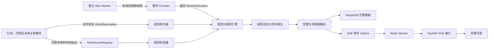
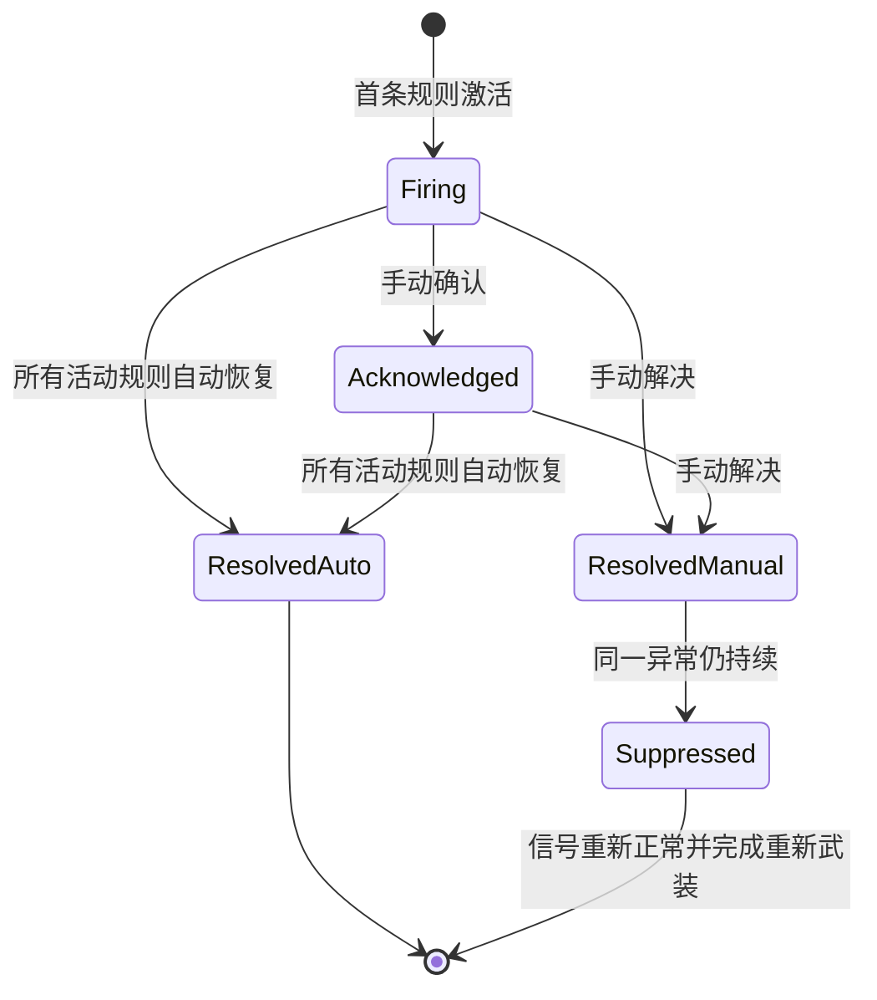

# 通用告警系统详细实现方案

## 1. 文档说明

本文档用于指导当前项目第一版通用告警系统的设计与实现，覆盖后端领域模型、模块接入契约、检测调度、规则引擎、告警生命周期、等级变化、SSE 实时更新、接口鉴权、前端改造、测试和上线步骤。

本文档基于当前项目的实际技术栈和代码结构编写：

- 前端：Vue 3、Vue Router、Element Plus、Axios。
- 后端：FastAPI、Beanie、MongoDB、Redis。
- 调度：项目内已有独立行动调度器和 `croniter`。
- 实时通信：项目内已有基于 Bearer Token 的 SSE 客户端与 FastAPI `StreamingResponse` 实现。
- 权限：页面权限和后端接口权限分离，后端接口必须登记到 `route_permissions.yml`。

第一版只实现告警中心，不实现邮件、Webhook 等通知渠道，不新增外部依赖。

---

## 项目现状（截至 2026-07-30）

### 状态总览

本文档描述的第一版通用告警系统已经完成主要代码实现，不再只是设计方案。当前状态如下：

| 范围 | 当前状态 | 说明 |
|---|---|---|
| 告警后端领域模型 | 已实现 | 规则、规则资源状态、信号聚合状态、告警实例、永久事件、观测 Inbox 和 SSE Outbox 均已落地 |
| 告警规则引擎 | 已实现 | 支持类型化条件、触发、恢复、连续命中、等级聚合、升级和降级 |
| 告警生命周期 | 已实现 | 支持生成、确认、手动解决、自动恢复、再次异常新建告警和事件历史 |
| 实时观测 | 已实现 | 业务模块将 `AlertObservation` 持久化到 MongoDB Inbox，由 Worker 异步消费 |
| 周期检测 | 已实现 | 独立 Alert Worker 按规则调用已注册 Provider |
| SSE 页面更新 | 已实现 | MongoDB Outbox 分发到 Redis Stream，前端支持断线重连和刷新补偿 |
| 告警管理 API | 已实现 | 数据源、规则、告警实例、事件、统计、处理动作、Worker 状态和 SSE 接口均已提供 |
| 告警前端页面 | 已实现 | `/alert` 已由占位页升级为可操作的告警中心 |
| 行动系统接入 | 已实现 | 当前提供行动实例状态检测 |
| 基础组件 SDK 接入 | 已实现 | 通过受控组件信号接入，详见 `ALERT_COMPONENTS.md` |
| 代理资源接入 | 未实现 | 代理资源管理系统和代理主动健康检查服务尚未实现 |
| 通知模块 | 未实现 | 邮件、短信、Webhook、即时通信和重复提醒不属于第一版 |

### 当前运行架构

告警系统当前由三个运行部分和两个主要持久化组件组成：

1. **FastAPI API 服务**

   - 提供规则、告警、统计、处理动作和 SSE 接口。
   - 接收行动系统及基础组件产生的实时观测。
   - 在应用启动时注册内置告警源。
   - 不在 API 请求线程中执行全量周期扫描。

2. **独立 Alert Worker**

   - 入口为 `python -m app.alert_worker`。
   - 与 FastAPI 使用同一套 MongoDB、Redis、配置和告警源注册引导。
   - 消费 `alert_observation_inbox` 中的实时观测。
   - 扫描到期规则并调用 Provider。
   - 将告警领域 Outbox 事件发布到 Redis Stream。
   - 定期写入 Worker 心跳，供 API 和前端展示在线状态。
   - Worker 是独立进程；只启动 FastAPI 不会执行规则扫描和 Inbox 消费。

3. **Vue 告警页面**

   - 路由为 `/alert`。
   - 通过 REST 获取当前快照，通过 SSE 获取后续增量变化。
   - SSE 与检测周期相互独立；即使没有实时检测规则，页面仍保持实时连接。

4. **MongoDB**

   - 保存规则、规则计算状态、信号聚合状态、告警实例和永久事件历史。
   - 保存可靠观测 Inbox 和 SSE Outbox。
   - 告警实例及领域事件不设置 TTL。
   - 已处理技术观测按 `ALERT_OBSERVATION_RETENTION_DAYS` 清理。

5. **Redis**

   - 提供规则扫描锁、信号处理短锁、Worker 心跳和 SSE Stream。
   - Redis Stream 不是告警事实数据源；告警事实仍保存在 MongoDB。

### 当前已经实现的后端功能

#### 告警源和模块接入

- 提供 `AlertSourceProvider` 协议。
- 提供进程内 `AlertSourceRegistry`。
- Provider 可以声明模块、资源类型、字段、值类型、枚举、运算符和检测方式。
- API 与 Worker 执行相同的内置源注册引导。
- 新增普通业务模块时只需实现 Provider 和实时观测发布，不需要修改规则引擎或生命周期服务。
- 基础组件通过组件信号定义、快照和通用 Provider 接入，不允许组件直接创建告警。

#### 规则管理

- 支持规则创建、读取、修改、启停、软删除、校验和测试。
- 规则按 `source_key + field_key` 绑定模块字段，默认作用于该模块的全部资源。
- 支持枚举、字符串、布尔、数值、百分比、时长和日期时间值。
- 支持 `eq`、`ne`、`lt`、`lte`、`gt`、`gte`、`in` 和 `not_in`。
- 表达式模型支持多条件 `all`、`any`；当前前端第一版主要编辑单触发条件和单恢复条件。
- 支持无恢复条件规则，此类告警只能手动解决。
- 支持触发连续次数和恢复连续次数。
- 支持 `realtime`、`interval` 和 `hybrid`。
- 支持“从规则启用时间开始”和“包含已有资源”两种初始检测策略。
- Provider 契约或 Schema 版本变化时，Worker 会将不兼容规则标记为无效。

#### 规则状态和乱序保护

- 每条规则按资源保存独立计算状态。
- 同一资源、同一信号下的多条规则共同决定当前有效等级。
- 旧观测不会回滚已经处理的新状态。
- 相同时间的观测使用稳定排序键决定顺序，不依赖到达先后。
- 相同观测、相同业务事件和未变化快照不会重复增加连续命中次数。
- 规则条件发生变化时，会使用当前有效观测重新计算规则状态。

#### 生命周期

- 四级告警已经实现：一般、重要、严重、致命。
- 同一资源、同一信号、同一异常周期只维护一条告警实例。
- 告警可以从“告警中”进入“已确认”，确认后仍参与等级变化和自动恢复。
- 手动解决后，当前异常持续期间不重复创建告警。
- 资源恢复正常后重新布防；再次异常会创建新的告警实例。
- 存在恢复条件时支持自动恢复。
- 多规则同时活动时取最高等级。
- 高等级规则触发时实时升级，高等级规则恢复后可以降级。
- 触发、确认、等级变化、自动恢复、手动解决和规则关联变化均保存永久事件。
- 严重、致命告警手动解决时处理说明由后端强制必填；一般、重要为选填。

#### 可靠性

- 实时观测先写入 MongoDB Inbox，API 或业务模块不依赖 Worker 当时在线。
- Inbox 使用确定性 ID 去重。
- Worker 通过原子领取、租约、失败次数和退避时间处理观测。
- Worker 异常退出后，租约到期的观测可以重新领取。
- 周期规则使用 Redis 锁避免多 Worker 重复扫描。
- 告警实例和事件使用稳定键、版本和唯一索引防止重复创建。
- SSE 事件先写 MongoDB Outbox，再异步发布到 Redis。
- 前端重连时可以使用事件 ID 继续读取有限范围内的事件。

#### API 和权限

当前已经提供：

- 告警源列表和接入状态。
- Worker 在线状态。
- 规则列表、详情、创建、更新、启停、删除、校验和测试。
- 告警实例列表、详情和事件历史。
- 告警确认和手动解决。
- 告警统计。
- SSE 事件流。

以上业务接口均登记在 `route_permissions.yml`，分别使用数据源读取、规则管理、告警读取、确认、解决和 Worker 状态等后端权限。组件 Token 不能调用用户告警管理接口。

### 当前已经实现的前端功能

`/alert` 当前采用统一功能页 Header 和白底红色主题，包含：

- 页面实时流连接状态、检测 Worker 在线状态和手动刷新。
- 正在告警、已确认、今日已解决和致命告警统计卡片。
- “告警事件”“规则管理”“模块接入”三个页签。
- 按关键字、状态、等级和模块筛选告警。
- 告警分页、详情、当前值、资源链接和永久事件时间线。
- 告警确认和手动解决。
- 根据等级控制手动解决说明是否必填。
- 规则搜索、模块筛选、启停、创建、编辑、测试和删除。
- 根据 Provider 描述动态生成字段、运算符、枚举值和检测方式选项。
- 展示模块注册状态、字段能力和 Worker 状态。
- SSE 收到告警或规则变化后自动刷新相关数据。
- SSE 断线后自动重试，REST 刷新作为补偿。

### 当前已接入的检测源

| 告警源 | 模块 | 资源 | 字段 | 值和能力 | 当前用途 |
|---|---|---|---|---|---|
| `action.instance` | 行动系统 | 行动实例 | `status` | 行动状态枚举；支持实时、周期和混合检测 | 可配置行动超时、失败等状态告警 |
| `component.demo` | 基础组件 | 演示组件资源 | `health` | `normal` / `abnormal`；支持实时和混合检测 | 验证通用组件 SDK 信号链路 |

行动状态源当前覆盖的稳定状态值包括未知、未就绪、就绪、运行中、已完成、失败、已取消、超时、已暂停和已停止。

`component.demo` 是通用接入演示源，不代表采集器、代理或存储组件的正式业务规则。正式接入时应新增具有明确资源语义、组件授权和资源解析器的信号定义。

### 数据库和兼容性现状

当前主要集合包括：

- `alert_rules`
- `alert_rule_evaluation_states`
- `alert_signal_states`
- `alert_instances`
- `alert_events`
- `alert_observation_inbox`
- `alert_stream_outbox`
- `component_signal_snapshots`

Beanie 在应用初始化时注册模型并创建所需索引。当前新增集合和可选字段不需要离线数据迁移脚本；旧文档可以继续读取，并在后续有效观测时自然补齐新字段。上线前仍应按常规流程备份 MongoDB，并确认生产账号具有创建集合和索引的权限。

### 配置现状

系统配置页已经纳入告警 Worker、观测处理、SSE、Provider 分页、观测保留和组件信号限制等配置。主要配置包括：

- `ALERT_WORKER_POLL_SECONDS`
- `ALERT_RULE_LOCK_SECONDS`
- `ALERT_OBSERVATION_LEASE_SECONDS`
- `ALERT_OBSERVATION_MAX_ATTEMPTS`
- `ALERT_REALTIME_RECONCILE_SECONDS`
- `ALERT_WORKER_HEARTBEAT_SECONDS`
- `ALERT_WORKER_HEARTBEAT_TTL_SECONDS`
- `ALERT_SSE_HEARTBEAT_SECONDS`
- `ALERT_SSE_STREAM_MAXLEN`
- `ALERT_PROVIDER_PAGE_SIZE`
- `ALERT_OBSERVATION_RETENTION_DAYS`
- `COMPONENT_SIGNAL_*`

配置项根据目录声明以运行时生效或服务重启后生效。

### 验证状态

截至本章日期，当前工作区完成了以下验证：

- 后端完整测试：`1324 passed, 18 skipped`。
- 基础组件 SDK 测试：`34 passed, 1 skipped`。
- 前端测试：`13 passed`。
- 前端生产构建成功。
- 本次新增和修改的 Python 文件通过 Ruff 检查。
- 后端和 SDK 源码通过 Python 编译检查。
- `git diff --check` 通过。

跳过项为测试套件中按运行环境或测试条件跳过的既有用例。验收时 MongoDB、Redis、MariaDB、Elasticsearch、RabbitMQ、FastAPI 和前端服务均处于停止状态，因此本轮没有重新执行连接真实基础设施的浏览器端到端测试。

### 当前尚未实现和明确边界

以下内容仍属于后续工作：

- 代理资源管理、代理切换、代理主动健康检查和正式 `proxy.resource` 告警源。
- 采集器针对网站不可访问、代理失效及故障归因的正式业务信号。
- Elasticsearch、RabbitMQ、存储、解析和验证组件的正式信号定义。
- 邮件、短信、Webhook、Slack、企业微信等通知渠道。
- 重复提醒、按持续时间升级通知和值班策略。
- 静默、维护窗口、抑制规则和告警批量处理。
- 指定资源、标签和复杂作用范围。
- 操作者记录和完整审计日志。
- 组件安装 Manifest 动态注册信号定义。
- 独立于行动系统的组件运行身份。
- 告警报表、趋势分析和长期指标聚合。

上述未实现内容不影响当前告警中心、行动状态告警和通用组件信号链路的使用。

---

## 2. 已确认需求

### 2.1 告警等级

保留四级告警，内部编码沿用当前前端已有值：

| 内部编码 | 中文名称 | 等级顺序 |
|---|---|---:|
| `info` | 一般 | 1 |
| `warning` | 重要 | 2 |
| `error` | 严重 | 3 |
| `critical` | 致命 | 4 |

等级比较、升级和降级必须使用固定顺序，不能依赖字符串排序。

### 2.2 手动处理

手动处理区分：

- 确认：表示告警已经被接手处理，告警仍然处于活动状态。
- 解决：表示人工结束当前异常周期，当前告警进入已解决状态。

确认和解决都不能为相同异常周期创建重复告警。

### 2.3 相同事件与再次告警

第一版将“相同事件”定义为：

> 同一个告警源、同一个资源、同一个检测信号，在没有重新回到正常状态之前持续存在的同一异常周期。

处理规则：

- 同一异常周期只允许存在一个告警实例。
- 手动确认后不创建重复告警，但活动告警仍可发生等级变化和自动恢复。
- 手动解决后，在当前异常周期内进入抑制状态，不重新创建告警。
- 自动恢复时结束当前异常周期，并永久保存自动恢复事件。
- 异常恢复正常后再次出现，视为新的异常周期，创建新的告警实例。
- 如果业务模块能够提供稳定的 `source_event_id`，则优先使用该值判断是否为同一事件。

手动解决不是永久屏蔽资源。永久或定时屏蔽应由后续“静默”功能承担，不与告警解决动作混用。

### 2.4 规则作用范围

第一版规则按模块资源类型生效，不选择具体资源。

例如：

- `action.instance` 的状态超时规则作用于所有行动实例。
- `proxy.resource` 的剩余有效期规则作用于所有代理资源。

模型中预留 `resource_scope` 字段，但第一版固定为：

```json
{
  "type": "all"
}
```

第一版不开放资源 ID、标签或自定义资源过滤条件。

### 2.5 条件能力

- 第一版规则编辑界面主要实现单触发条件和单恢复条件。
- 后端表达式结构预留多条件以及 `all`、`any` 逻辑。
- 第一版禁止嵌套表达式、脚本和任意数据库查询。

### 2.6 两类实时性

资源检测实时性与页面更新实时性相互独立：

1. 资源检测周期为“实时”时，由业务模块在资源状态变化后主动发布观测事件。
2. 告警页面始终通过 SSE 接收告警领域变化，不依赖系统是否存在实时检测规则。

即使所有规则都是 5 分钟或 1 小时检测一次，告警页面仍保持 SSE 连接，并实时接收规则变化、告警生成、确认、解决、自动恢复和等级变化。

### 2.7 告警等级变化

- 当前活动告警的等级由同一资源、同一检测信号下所有已激活规则共同决定。
- 当前等级取所有活动规则中的最高等级。
- 更高等级规则满足时实时升级。
- 更高等级规则恢复、但较低等级规则仍然满足时实时降级。
- 每次等级变化都写入永久事件历史并通过 SSE 推送。
- 第一版不重复发送相同等级提醒。

### 2.8 接口鉴权与操作记录

- 第一版对读取、确认、解决、规则读取、规则创建、规则修改、规则删除等接口分别鉴权。
- 第一版暂不记录操作用户。
- 仍需记录确认时间、解决时间、解决方式和处理说明。
- 数据模型可预留可空的操作者字段，但第一版不赋值，也不在页面展示。

### 2.9 历史保留

- 告警实例永久保留。
- 自动恢复、手动确认、手动解决、等级变化等告警事件永久保留。
- 技术性的观测收件箱不属于告警历史，可在成功处理后按配置清理。

### 2.10 手动解决说明

- 当前等级为严重或致命时，手动解决必须填写非空处理说明。
- 当前等级为一般或重要时，处理说明选填。
- 必填校验必须在后端执行，不能只依赖前端校验。

---

## 3. 设计目标和非目标

### 3.1 设计目标

1. 告警核心不依赖行动、代理或其他业务模块的数据库模型。
2. 新业务模块通过实现统一 Provider 和发布统一观测接入告警系统。
3. 新增业务模块时不修改规则引擎、生命周期服务和告警 API。
4. 支持实时检测、周期检测和实时加周期补偿三种方式。
5. 保证同一异常周期不会因重复事件、重复扫描或多 Worker 而创建重复告警。
6. 支持显式恢复条件和触发/恢复回差，避免阈值附近频繁抖动。
7. 支持多条规则共同驱动同一告警的实时等级升降。
8. 支持 API 多副本和 Worker 重启后的幂等恢复。
9. SSE 支持鉴权、心跳、断线重连和有限回放。
10. 与现有权限、API 响应、分页和状态码规范保持一致。

### 3.2 第一版非目标

- 邮件、短信、Webhook、第三方即时通信通知。
- 重复提醒、超时升级通知和通知值班表。
- 维护窗口和定时静默。
- 指定资源、资源标签或复杂资源范围过滤。
- 用户自定义脚本、SQL、Mongo 查询或 Python 表达式。
- 跨独立微服务的动态 Provider 注册。
- 告警聚合统计分析和复杂报表。
- 记录确认人、解决人和完整操作审计。

---

## 4. 总体架构



整体分为六层：

1. 模块接入层：由业务模块声明可检测能力和提供观测值。
2. 规则层：保存用户配置并做类型、运算符、恢复条件和周期校验。
3. 检测层：实时消费业务事件，或按周期调用 Provider。
4. 规则状态层：维护每条规则对每个资源的活动状态。
5. 信号聚合与生命周期层：去重、生成告警、确认、解决、恢复和等级变化。
6. 展示层：REST 提供快照与管理接口，SSE 提供增量实时更新。

---

## 5. 模块接入设计

### 5.1 接入边界

告警核心只能依赖接入契约，不能：

- 导入 `ActionInstanceModel`、代理模型等业务模型。
- 根据字符串拼接 MongoDB 查询。
- 直接理解 `timeout`、代理到期、CPU 使用率等业务含义。
- 在告警核心中增加 `if module == "action"` 之类分支。

具体业务模型查询和业务值计算由模块 Provider 负责。

### 5.2 告警源描述

每个模块注册一个或多个 `AlertSourceDescriptor`：

```python
class AlertSourceDescriptor(BaseModel):
    source_key: str
    module_key: str
    module_name: str
    resource_type: str
    resource_name: str
    schema_version: int
    fields: list[AlertFieldDescriptor]
    supported_evaluation_modes: list[str]
```

字段描述：

```python
class AlertFieldDescriptor(BaseModel):
    field_key: str
    field_name: str
    signal_key: str
    value_type: str
    unit: str | None
    enum_options: list[AlertEnumOption]
    supported_operators: list[str]
    supported_evaluation_modes: list[str]
    default_interval_seconds: int | None
    initial_evaluation_policy: str
```

字段含义：

- `source_key`：全局稳定标识，例如 `action.instance`。
- `field_key`：模块内稳定字段标识，例如 `status`。
- `signal_key`：用于关联同一类异常，例如 `execution_status`。
- `value_type`：枚举、数值、时长、日期时间、布尔等。
- `schema_version`：模块修改字段定义时递增。
- `initial_evaluation_policy`：规则首次启用时是否扫描已经满足条件的资源。

`source_key`、`field_key` 和枚举值均为不可随显示名称变化的稳定编码。

### 5.3 类型系统

第一版支持：

| 类型 | 内部编码 | 规范化方式 |
|---|---|---|
| 枚举 | `enum` | 稳定字符串编码 |
| 字符串 | `string` | UTF-8 字符串 |
| 数值 | `number` | 有限浮点数或 Decimal |
| 百分比 | `percentage` | 统一为 `0~100` 数值 |
| 时长 | `duration` | 统一为整数秒 |
| 日期时间 | `datetime` | 统一为 UTC 时间 |
| 布尔值 | `boolean` | `true/false` |

第一版运算符：

| 内部编码 | 中文名称 | 支持类型 |
|---|---|---|
| `eq` | 当前为/等于 | 全部标量类型 |
| `ne` | 不等于 | 全部标量类型 |
| `lt` | 小于 | 数值、百分比、时长、日期时间 |
| `lte` | 小于等于 | 数值、百分比、时长、日期时间 |
| `gt` | 大于 | 数值、百分比、时长、日期时间 |
| `gte` | 大于等于 | 数值、百分比、时长、日期时间 |
| `in` | 属于 | 枚举、字符串 |
| `not_in` | 不属于 | 枚举、字符串 |

字段描述必须限制可用运算符。例如状态字段不能选择“小于”。

### 5.4 Provider 契约

Provider 至少提供：

```python
class AlertSourceProvider(Protocol):
    def describe(self) -> AlertSourceDescriptor:
        ...

    async def iter_observations(
        self,
        *,
        field_key: str,
        active_from: datetime,
        cursor: str | None,
        limit: int,
    ) -> AlertObservationPage:
        ...
```

要求：

- 支持分页，不能一次性加载所有资源。
- Provider 自己负责读取业务模型和计算派生字段。
- Provider 返回统一观测，不向规则引擎暴露业务模型对象。
- Provider 查询失败时抛出可识别异常，由 Worker 记录规则检测失败。
- Provider 不能直接创建或修改告警实例。

### 5.5 统一观测对象

```python
class AlertObservation(BaseModel):
    observation_id: str
    source_key: str
    resource_type: str
    resource_id: str
    resource_name: str
    resource_url: str | None
    field_key: str
    signal_key: str
    value_type: str
    value: Any
    observed_at: datetime
    source_event_id: str | None
    metadata: dict[str, Any]
```

约束：

- `observation_id` 必须支持幂等。实时事件应由模块生成确定性 ID。
- `resource_id` 必须是模块内稳定资源 ID。
- `resource_name` 用于展示快照，资源删除后历史告警仍可读。
- `resource_url` 由模块提供，前端不拼接业务路由。
- `source_event_id` 表示业务事件身份，例如一次明确的状态变更。
- `metadata` 只能保存展示所需的非敏感信息，不允许放入密码、Token 等内容。
- `observed_at` 在进入告警核心时统一转换为 UTC。

### 5.6 模块注册方式

当前系统以内置 FastAPI 模块为主，第一版使用进程内注册：

```python
def register_action_alert_sources(registry: AlertSourceRegistry) -> None:
    registry.register(ActionInstanceAlertSource())
```

应用组合层负责调用各模块的注册函数。新模块需要：

1. 在自己的模块代码中实现 Provider。
2. 在自己的模块初始化代码中调用注册接口。
3. 在状态变化处按需发布实时观测。

告警核心的比较器、生命周期、模型和 API 不因新模块增加而修改。

告警 API 进程和独立 Alert Worker 必须执行相同的 Provider 注册引导，保证：

- API 可以返回完整规则配置元数据。
- Worker 可以调用 Provider 完成周期检测。

第一版不做运行时 HTTP 动态注册。未来拆分独立服务时，可以在该契约外增加远程 Provider 适配器。

---

## 6. 规则模型

### 6.1 条件表达式

虽然第一版前端只编辑单条件，后端从第一版开始使用条件组：

```python
class AlertCondition(BaseModel):
    field_key: str
    operator: str
    value: Any


class AlertExpression(BaseModel):
    logic: Literal["all", "any"]
    conditions: list[AlertCondition]
```

第一版约束：

- `conditions` 数量固定为 1。
- `logic` 固定为 `all`。
- 后端仍按通用结构保存。

### 6.2 AlertRuleModel

建议字段：

```python
class AlertRuleModel(Document):
    id: str
    name: str
    description: str

    source_key: str
    source_schema_version: int
    field_key: str
    signal_key: str
    resource_scope: dict[str, Any]

    trigger_expression: dict[str, Any]
    recovery_expression: dict[str, Any] | None
    severity: str

    evaluation_mode: str
    interval_seconds: int | None
    reconciliation_interval_seconds: int | None
    initial_evaluation_policy: str

    trigger_consecutive_count: int
    recovery_consecutive_count: int

    enabled: bool
    validation_status: str
    validation_message: str | None
    version: int

    active_from: datetime
    next_evaluate_at: datetime | None
    last_evaluate_at: datetime | None
    last_success_at: datetime | None
    last_error: str | None

    is_deleted: bool
    created_at: datetime
    updated_at: datetime
```

建议集合名：`alert_rules`。

索引：

- `source_key + signal_key + enabled`
- `enabled + is_deleted + next_evaluate_at`
- `validation_status`
- `updated_at`

### 6.3 检测模式

内部编码：

| 编码 | 含义 |
|---|---|
| `realtime` | 模块主动推送观测，面向状态变化立即检测 |
| `interval` | Worker 按固定周期调用 Provider |
| `hybrid` | 实时推送，同时按周期补偿扫描 |

界面上的“实时”对应 `realtime`。为保证可靠性，后端可以对实时规则执行内部补偿扫描，但该补偿周期不改变用户配置的“实时”含义。

校验规则：

- 选择 `realtime` 时，字段描述必须声明支持实时观测。
- 选择 `interval` 时必须提供合法 `interval_seconds`。
- 周期第一版提供固定选项，例如 300 秒、3600 秒。
- 不允许用户填写小于系统最低值的周期。
- 第一版不开放任意 Cron 表达式。

### 6.4 恢复条件

- `recovery_expression = null` 表示不可自动恢复。
- 配置恢复条件后，只有恢复表达式成立才能自动恢复。
- 不使用“触发表达式不成立”隐式替代恢复条件。
- 触发和恢复可以形成回差。

例如代理剩余有效期：

```text
触发：remaining_validity < 7 天
恢复：remaining_validity > 10 天
```

规则保存时把“7 天”“10 天”规范化为秒，同时保留单位用于界面回显。

### 6.5 防抖

第一版字段保留：

- `trigger_consecutive_count`
- `recovery_consecutive_count`

默认都为 `1`，界面第一版可以暂不开放。

规则状态只有连续满足指定次数后才发生变化。实时事件和周期观测均按有效的新观测计数，重复 `observation_id` 不计数。

### 6.6 规则版本

- 每次修改规则递增 `version`。
- 规则状态保存对应 `rule_version`。
- 修改规则后将 `next_evaluate_at` 设置为当前时间，触发重新计算。
- 字段类型、运算符或阈值变化后，旧连续计数清零。
- 等级变化不清除条件状态，但需要重新计算当前告警有效等级。
- 规则引用的 Provider 字段不存在或版本不兼容时，将规则标记为 `invalid`，停止检测并在规则页面展示原因。

### 6.7 规则启停和删除

- 停用规则只阻止新的规则命中和后续检测。
- 停用规则不删除历史告警。
- 为防止停用规则导致活动告警被误判为恢复，规则停用本身不自动解决告警。
- 如果停用后该告警没有其他活动规则，告警保留，需手动解决。
- 删除使用软删除。
- 删除前端需要二次确认。

---

## 7. 多规则等级聚合

### 7.1 聚合范围

同一告警信号由以下字段确定：

```text
source_key
+ resource_type
+ resource_id
+ signal_key
```

由此生成稳定的 `incident_key`。

不同字段只有在 Provider 明确声明相同 `signal_key` 时才会聚合。

### 7.2 规则状态与告警等级

每条规则对每个资源维护独立状态：

- `normal`
- `active`

同一 `incident_key` 下：

- 没有活动规则：信号正常。
- 至少一条活动规则：信号异常。
- 告警当前等级为活动规则的最高等级。

示例：

| 规则 | 触发 | 恢复 | 等级 |
|---|---|---|---|
| R1 | CPU > 80% | CPU < 75% | 重要 |
| R2 | CPU > 95% | CPU < 90% | 致命 |

变化过程：

1. CPU 85%，R1 激活，生成“重要”告警。
2. CPU 97%，R2 激活，同一告警升级为“致命”。
3. CPU 92%，R2 尚未满足恢复条件，保持“致命”。
4. CPU 85%，R2 恢复、R1 仍激活，告警降级为“重要”。
5. CPU 70%，R1 恢复，没有活动规则，告警自动恢复。

### 7.3 等级变化事件

等级变化必须：

- 原子更新告警实例的 `current_severity`。
- 递增告警实例 `version`。
- 写入 `severity_changed` 告警事件。
- 保存 `from_severity`、`to_severity`、触发变化的规则和当前观测值。
- 写入 SSE Outbox。
- 不新建告警实例。
- 不产生重复等级事件。

手动确认后的活动告警仍然允许升级和降级。

手动解决后的当前异常周期被抑制，不再更新已解决告警的等级。

---

## 8. 告警生命周期

### 8.1 状态

告警实例状态：

| 状态 | 内部编码 | 含义 |
|---|---|---|
| 告警中 | `firing` | 已触发，尚未确认 |
| 已确认 | `acknowledged` | 已接手处理，异常仍存在 |
| 已解决 | `resolved` | 当前告警周期结束 |

解决方式：

| 内部编码 | 含义 |
|---|---|
| `auto` | 恢复条件成立后自动恢复 |
| `manual` | 用户手动解决 |

### 8.2 状态机



### 8.3 确认

- 仅 `firing` 可变为 `acknowledged`。
- 对已确认告警重复确认返回当前结果，不重复写事件。
- 确认不停止规则检测。
- 确认不阻止等级升降。
- 确认后恢复条件成立时仍可自动恢复。
- 确认不创建新的告警实例。

### 8.4 手动解决

- `firing` 和 `acknowledged` 均可手动解决。
- 解决时依据数据库中最新 `current_severity` 校验处理说明。
- 严重、致命必须填写去除首尾空白后非空的说明。
- 处理说明建议限制在 2000 字符以内。
- 手动解决后设置当前信号周期的 `manual_suppressed = true`。
- 在信号重新正常之前，即使规则仍然命中，也不创建新告警。
- 信号重新正常后清除抑制并重新武装。
- 下一次异常创建新的告警实例。

### 8.5 自动恢复

自动恢复条件：

1. 当前告警未被手动解决。
2. 当前 `incident_key` 下所有已激活规则均已恢复。
3. 每条规则均满足自己的显式恢复表达式。

自动恢复操作：

- 状态更新为 `resolved`。
- `resolution_type = auto`。
- 设置 `resolved_at`。
- 设置 `open_key = null`。
- 写入 `auto_resolved` 告警事件。
- 保存恢复观测值。
- 写入 SSE Outbox。
- 信号回到已武装状态。

后续再次异常时必须生成新告警 ID，不能复用旧告警。

### 8.6 去重和并发

为活动告警设置：

```text
open_key = incident_key
```

对 `open_key` 创建仅字符串值生效的唯一部分索引。告警解决后设置为 `null`。

即使发生以下情况，也只能创建一个活动告警：

- 相同实时事件被重复投递。
- 周期扫描和实时事件同时命中。
- 多个 Alert Worker 同时处理。
- Worker 处理成功但确认收件箱前重启。

告警创建使用原子 Upsert 或唯一索引冲突后重新读取已有告警。

### 8.7 乐观并发

`AlertInstanceModel` 保存整数 `version`。

确认和解决接口提交 `expected_version`：

- 版本一致时原子更新。
- 版本不一致时返回冲突，前端刷新告警详情。
- 如果目标状态已经由并发请求完成，可返回幂等成功和最新数据。

这样可以处理“页面显示重要，但提交解决前已升级为严重”的情况。后端必须按最新等级重新校验处理说明。

---

## 9. 数据模型

### 9.1 AlertRuleEvaluationStateModel

每条规则、每个资源一条：

```python
class AlertRuleEvaluationStateModel(Document):
    id: str
    rule_id: str
    rule_version: int
    source_key: str
    resource_type: str
    resource_id: str
    signal_key: str
    incident_key: str

    state: str
    trigger_match_count: int
    recovery_match_count: int

    last_value: Any
    last_value_type: str
    last_observation_id: str
    last_source_event_id: str | None
    last_observed_at: datetime

    activated_at: datetime | None
    recovered_at: datetime | None
    updated_at: datetime
```

建议集合名：`alert_rule_evaluation_states`。

唯一索引：

```text
rule_id + resource_type + resource_id
```

### 9.2 AlertSignalStateModel

每个资源检测信号一条，用于多规则聚合和手动解决抑制：

```python
class AlertSignalStateModel(Document):
    id: str
    incident_key: str
    source_key: str
    resource_type: str
    resource_id: str
    signal_key: str

    armed: bool
    manual_suppressed: bool
    anomaly_sequence: int

    active_rule_ids: list[str]
    effective_severity: str | None
    current_alert_id: str | None

    last_normal_at: datetime | None
    last_abnormal_at: datetime | None
    updated_at: datetime
```

建议集合名：`alert_signal_states`。

唯一索引：`incident_key`。

### 9.3 AlertInstanceModel

```python
class AlertInstanceModel(Document):
    id: str
    open_key: str | None
    incident_key: str
    anomaly_sequence: int

    source_key: str
    resource_type: str
    resource_id: str
    resource_name: str
    resource_url: str | None
    field_key: str
    signal_key: str

    title: str
    detail: str
    status: str
    initial_severity: str
    current_severity: str
    active_rule_ids: list[str]

    trigger_value: Any
    trigger_value_type: str
    latest_value: Any
    latest_observed_at: datetime

    acknowledged_at: datetime | None
    resolved_at: datetime | None
    resolution_type: str | None
    resolution_note: str | None

    # 与实例状态原子保存，永久事件和 Outbox 补齐后清空
    pending_event: dict[str, Any] | None
    version: int
    triggered_at: datetime
    created_at: datetime
    updated_at: datetime
```

建议集合名：`alert_instances`。

索引：

- `open_key` 唯一部分索引。
- `status + current_severity + triggered_at`。
- `source_key + status + triggered_at`。
- `resource_type + resource_id + triggered_at`。
- `resolved_at`。

第一版永久保留，不设置 TTL。

### 9.4 AlertEventModel

```python
class AlertEventModel(Document):
    id: str
    alert_id: str
    incident_key: str
    event_type: str

    from_status: str | None
    to_status: str | None
    from_severity: str | None
    to_severity: str | None

    rule_id: str | None
    rule_version: int | None
    observation_id: str | None
    value: Any
    value_type: str | None
    note: str | None

    alert_version: int
    created_at: datetime
```

事件类型：

- `triggered`
- `acknowledged`
- `severity_changed`
- `auto_resolved`
- `manual_resolved`
- `rule_attached`
- `rule_detached`

建议集合名：`alert_events`。

索引：

- `alert_id + created_at`
- `incident_key + created_at`
- `created_at`

第一版永久保留，不设置 TTL。

### 9.5 AlertObservationInboxModel

仅实时观测使用：

```python
class AlertObservationInboxModel(Document):
    id: str
    observation: dict[str, Any]
    status: str
    claimed_by: str | None
    lease_until: datetime | None
    attempts: int
    next_retry_at: datetime | None
    last_error: str | None
    created_at: datetime
    processed_at: datetime | None
    expire_at: datetime | None
```

建议集合名：`alert_observation_inbox`。

处理状态：

- `pending`
- `processing`
- `processed`
- `failed`

`observation_id` 作为文档 ID 或唯一索引，保证重复发布幂等。

成功处理的技术观测可配置保留 7 至 30 天后清理。告警实例和告警事件不受该策略影响。

### 9.6 AlertStreamOutboxModel

SSE Outbox 与永久告警事件分开保存，因为 SSE 还需要承载规则变化、Worker 状态和统计变化。

```python
class AlertStreamOutboxModel(Document):
    id: str
    event_type: str
    aggregate_type: str
    aggregate_id: str | None
    aggregate_version: int | None
    payload: dict[str, Any]

    status: str
    attempts: int
    next_retry_at: datetime | None
    last_error: str | None

    created_at: datetime
    published_at: datetime | None
    expire_at: datetime | None
```

建议集合名：`alert_stream_outbox`。

要求：

- `id` 使用对应领域变化的确定性事件 ID，避免重复广播。
- `status` 支持 `pending`、`publishing`、`published`、`failed`。
- 告警生命周期变化必须同时写入永久 `AlertEventModel` 和通用 Outbox。
- 规则变化、Worker 状态变化只需要写入通用 Outbox。
- 已发布 Outbox 可以设置 TTL，永久历史仍由业务模型保存。

索引：

- `status + next_retry_at + created_at`
- `aggregate_type + aggregate_id + created_at`
- `expire_at` TTL 索引

### 9.7 Beanie 注册

所有新增 Document 需要加入现有 `app/models/__init__.py` 的 `get_all_models()`，否则 Beanie 不会初始化集合和索引。

---

## 10. 规则引擎

### 10.1 规则保存校验

创建或修改规则时：

1. 从 `AlertSourceRegistry` 读取 `source_key`。
2. 校验字段存在。
3. 校验字段 `schema_version`。
4. 校验字段支持选择的检测模式。
5. 校验运算符适用于字段类型。
6. 规范化触发值。
7. 规范化恢复值。
8. 校验恢复条件与触发条件使用同一个信号。
9. 校验周期范围。
10. 保存规范化表达式和用于回显的显示单位。

规则校验失败时不写入数据库，返回明确字段错误。

### 10.2 观测校验

处理观测时：

- 校验 Provider 已注册。
- 校验 `source_key`、`field_key`、`signal_key` 与描述一致。
- 校验值类型。
- 拒绝 NaN、Infinity、非法日期和超大字符串。
- UTC 规范化时间。
- 对过旧事件根据 Provider 策略丢弃或仅做补偿。
- 相同 `observation_id` 只处理一次。

### 10.3 比较器

实现独立纯函数比较器：

```python
compare(value_type, actual, operator, expected) -> bool
```

要求：

- 不访问数据库。
- 不读取业务模块。
- 不使用 `eval`。
- 相同输入始终产生相同结果。
- 类型不匹配时抛出规则或观测错误，不能默认为不匹配。
- 日期时间只比较 UTC。

### 10.4 处理流程

每个有效观测：

1. 找到同一 `source_key + field_key` 的全部启用规则。
2. 对每条规则计算触发或恢复表达式。
3. 原子更新 `AlertRuleEvaluationStateModel`。
4. 读取或更新对应 `AlertSignalStateModel`。
5. 计算全部活动规则和最高等级。
6. 根据信号前后状态执行：
   - 创建告警。
   - 保持告警。
   - 升级或降级。
   - 自动恢复。
   - 保持手动解决抑制。
   - 在信号正常后重新武装。
7. 将领域变化写入 `AlertEventModel`。
8. 提交 SSE Outbox。

### 10.5 事务和一致性

理想情况使用 MongoDB 事务原子修改：

- 规则状态。
- 信号状态。
- 告警实例。
- 告警事件。

如果当前 MongoDB 部署不支持事务，第一版必须依赖：

- 唯一索引。
- 原子条件更新。
- 告警实例版本。
- 确定性事件 ID。
- 与实例状态原子保存的 `pending_event` 补偿标记。
- 可重复执行的生命周期方法。
- Worker 重试。

生命周期服务先原子更新告警状态和 `pending_event`，再使用确定性事件 ID
补齐永久事件与 SSE Outbox，最后清除 `pending_event`。如果进程在中途退出，
下一次处理同一信号或重复调用确认、解决接口时必须先补发未完成事件，不能用
后续变化覆盖它。生命周期服务的每一步都必须幂等，不能假设一次调用只执行一次。

---

## 11. Alert Worker

### 11.1 独立进程

新增独立入口，例如：

```text
app/alert_worker/__main__.py
```

新增 Docker Compose 服务：

```text
csi-alert-worker
```

Worker 初始化：

- MongoDB。
- Redis。
- AlertSourceRegistry。
- 日志。

Worker 不需要初始化 MariaDB、Elasticsearch、COS、Embedding 和 RabbitMQ，除非未来 Provider 明确依赖。

### 11.2 Worker 循环

Worker 内运行三个协作循环：

1. 实时观测收件箱消费。
2. 到期周期规则扫描。
3. SSE Outbox 分发。

另行写入 Worker 心跳。

### 11.3 周期规则扫描

流程：

1. 查询 `enabled=true`、`validation_status=valid`、`next_evaluate_at<=now` 的规则。
2. 按规则优先级和时间排序。
3. 获取规则级 Redis 租约：

```text
alert:rule-lock:{rule_id}
```

4. 分页调用对应 Provider。
5. 逐条交给统一规则引擎。
6. 成功后更新 `last_success_at` 和下一次时间。
7. 失败后记录 `last_error`，按退避策略重试。
8. 释放租约。

周期规则必须有最大单次扫描时间和分页上限，防止一个模块阻塞全部规则。

### 11.4 实时收件箱消费

业务模块发布观测时先写入持久化收件箱。

Worker 使用租约方式声明任务：

- 原子把 `pending` 或租约过期的 `processing` 改为 `processing`。
- 写入 `claimed_by` 和 `lease_until`。
- 处理成功后改为 `processed`。
- 失败增加 `attempts` 并设置 `next_retry_at`。
- 超过最大重试次数改为 `failed`。

实时事件不使用进程内队列作为唯一来源，否则 API 或 Worker 重启会丢事件。

### 11.5 混合检测

对于 `realtime` 字段，推荐内部使用：

```text
实时事件 + 5 分钟补偿扫描
```

补偿扫描用于处理：

- 业务状态已写入，但发布观测失败。
- Worker 长时间停机。
- 收件箱事件达到最大重试次数。
- 新版本部署期间的短暂中断。

补偿扫描产生的观测也必须通过相同去重和生命周期流程。

### 11.6 心跳

Redis Key：

```text
alert:worker:heartbeat
```

记录：

- `worker_id`
- `heartbeat_at`
- `last_observation_scan_at`
- `last_rule_scan_at`
- `last_sse_dispatch_at`

提供只读状态接口供前端显示 Worker 是否在线。

---

## 12. SSE 实时更新

### 12.1 独立性

SSE 推送的是告警领域变化，不直接推送资源原始检测数据。

因此：

- 没有实时检测规则时，SSE 仍然连接。
- 周期规则产生告警后，页面立即收到 SSE。
- 用户确认、解决或修改规则后，其他已打开页面立即收到 SSE。
- SSE 是否连接不会影响检测和告警持久化。

### 12.2 推送事件

建议事件类型：

| SSE 事件 | 含义 |
|---|---|
| `alert.created` | 创建新告警 |
| `alert.updated` | 告警一般字段变化 |
| `alert.acknowledged` | 告警被确认 |
| `alert.severity_changed` | 告警升级或降级 |
| `alert.resolved` | 自动或手动解决 |
| `rule.created` | 新建规则 |
| `rule.updated` | 修改或启停规则 |
| `rule.deleted` | 删除规则 |
| `worker.status_changed` | Worker 状态变化 |
| `stats.changed` | 告警统计发生变化 |

每条 SSE 消息包含：

```json
{
  "event_id": "稳定事件ID",
  "event_type": "alert.severity_changed",
  "occurred_at": "UTC时间",
  "alert_id": "告警ID",
  "alert_version": 3,
  "data": {}
}
```

前端依据 `alert_id + alert_version` 幂等合并，旧版本事件不能覆盖新数据。

### 12.3 传输实现

推荐使用 Redis Stream，而不是仅使用进程内 `asyncio.Queue` 或 Redis Pub/Sub：

- 支持 API 多副本。
- 支持短时间断线回放。
- 支持 `Last-Event-ID`。
- 避免订阅瞬间丢事件。

建议 Stream：

```text
alert:sse:events
```

告警领域变化先写入永久 `AlertEventModel` 和 `AlertStreamOutboxModel`，再由 Outbox 分发器写入 Redis Stream。规则和 Worker 状态变化只写入 `AlertStreamOutboxModel`。Redis 写入失败时，由 Worker 扫描待发送 Outbox 重试。

Redis Stream 只保留有限长度，例如最近 10000 至 50000 条。MongoDB 中的告警事件永久保留。

### 12.4 SSE 接口

建议：

```text
GET /alerts/stream
```

支持：

- `Last-Event-ID` 请求头。
- 或 `after_id` 查询参数，作为现有 fetch SSE 客户端的兼容方式。
- 每 15 秒发送 `: keep-alive`。
- 返回头：
  - `Cache-Control: no-cache`
  - `Connection: keep-alive`
  - `X-Accel-Buffering: no`

SSE 使用独立的读取告警权限。

### 12.5 初始快照与无缝衔接

前端进入页面时：

1. 请求告警列表、统计和规则数据。
2. REST 响应携带当前 `stream_cursor`。
3. 前端从该 cursor 建立 SSE。
4. 服务端回放 cursor 后仍在 Redis Stream 中的事件。
5. 前端按告警版本去重。

如果 cursor 已超过 Redis Stream 保留范围：

- SSE 返回 `stream.reset`。
- 前端重新请求 REST 快照并重新连接。

### 12.6 前端 SSE 客户端

现有项目已经有支持 Bearer Token 的 `openAuthenticatedSse`，第一版建议：

1. 抽取为通用 `authenticatedSseClient.js`。
2. 保留原 Agent 客户端兼容导出，避免影响现有 Agent 页面。
3. 告警页面使用 `fetch + ReadableStream`，不使用原生 `EventSource`，因为原生 `EventSource` 不能方便地携带 Authorization Header。
4. 支持指数退避重连。
5. 401 时沿用现有登录失效处理。
6. 403 时刷新权限并停止重连。
7. 组件卸载时使用 `AbortController` 关闭连接。

---

## 13. 行动系统首个接入

### 13.1 告警源描述

```text
source_key: action.instance
module_key: action
resource_type: action_instance
resource_name: 行动
field_key: status
signal_key: execution_status
value_type: enum
supported_modes: realtime, interval, hybrid
```

枚举选项至少包含现有 `ActionFlowStatusEnum`。

状态字段支持：

- `eq`
- `ne`
- `in`
- `not_in`

### 13.2 超时观测

行动系统已经负责把行动状态原子更新为 `timeout`。告警接入应放在状态更新成功之后：

```text
行动超时状态更新成功
→ Action 模块构造 AlertObservation
→ 写入观测收件箱
→ Alert Worker 处理
→ 告警规则命中
```

建议确定性 ID：

```text
observation_id = action.instance:{action_id}:status:{status_transition_version}
source_event_id = action:{action_id}:status:timeout:{status_transition_version}
```

如果行动模型暂时没有状态版本，可使用本次终态更新时间或确定性领域事件 ID，但不能使用每次重试都变化的随机 ID。

### 13.3 资源展示

观测包含：

- `resource_id = action.id`
- `resource_name`：优先使用行动/蓝图展示名称快照。
- `resource_url = /action/{action.id}`
- `value = timeout`
- `observed_at`：状态实际变更时间。

告警核心不查询行动详情。

### 13.4 补偿扫描

Action Provider 周期扫描满足条件的行动状态，用于补偿实时事件丢失。

对于行动终态历史，需要避免新规则启用后一次性把全部历史超时行动生成告警。建议：

- 行动状态字段默认 `initial_evaluation_policy = from_activation`。
- 默认只处理规则 `active_from` 之后发生的状态变化。
- 后续可以在规则高级选项中增加“立即检查现有异常资源”。

### 13.5 首条验收规则

```text
规则名称：行动超时
功能模块：行动系统
资源类型：行动
触发项：状态
触发条件：当前为
触发值：超时
恢复条件：无
等级：严重
检测周期：实时
```

预期：

- 未来行动首次进入超时状态时创建一条严重告警。
- 同一个行动的重复超时观测不创建重复告警。
- 告警确认后继续保留并不重复创建。
- 因无恢复条件，不自动恢复。
- 手动解决必须填写处理说明。
- 手动解决后同一行动的同一超时周期不再告警。

---

## 14. 代理资源未来接入示例

代理模块自行提供派生字段：

```text
source_key: proxy.resource
field_key: remaining_validity
signal_key: validity
value_type: duration
unit: second
```

Provider 负责：

```text
remaining_validity = expires_at - 当前UTC时间
```

告警核心不计算代理到期时间。

规则：

```text
触发：remaining_validity < 7天
恢复：remaining_validity > 10天
等级：一般
检测周期：1小时
```

预期：

1. 每小时检查所有代理。
2. 某代理剩余有效期小于 7 天时创建一般告警。
3. 继续小于 7 天时不重复创建。
4. 续期后剩余有效期大于 10 天时自动恢复。
5. 保存 `auto_resolved` 历史事件。
6. 将来再次小于 7 天时创建新的告警实例。

---

## 15. 后端 API

统一前缀建议使用：

```text
/api/v1/alerts
```

### 15.1 告警源

| 方法 | 路径 | 说明 |
|---|---|---|
| GET | `/alerts/sources` | 获取可配置模块、字段、枚举、运算符和检测模式 |
| GET | `/alerts/sources/status` | 获取 Provider 和 Worker 接入状态 |

### 15.2 规则

| 方法 | 路径 | 说明 |
|---|---|---|
| GET | `/alerts/rules` | 分页查询规则 |
| POST | `/alerts/rules` | 创建规则 |
| GET | `/alerts/rules/{rule_id}` | 查询规则详情 |
| PATCH | `/alerts/rules/{rule_id}` | 修改规则 |
| PATCH | `/alerts/rules/{rule_id}/enabled` | 启用或停用规则 |
| DELETE | `/alerts/rules/{rule_id}` | 软删除规则 |
| POST | `/alerts/rules/validate` | 不保存，仅校验规则 |
| POST | `/alerts/rules/{rule_id}/test` | 试运行并返回命中摘要，不生成告警 |

试运行必须限制最大资源数量和执行时间。

### 15.3 告警实例

| 方法 | 路径 | 说明 |
|---|---|---|
| GET | `/alerts/instances` | 分页查询告警 |
| GET | `/alerts/instances/{alert_id}` | 查询告警详情 |
| GET | `/alerts/instances/{alert_id}/events` | 查询永久事件时间线 |
| POST | `/alerts/instances/{alert_id}/acknowledge` | 确认告警 |
| POST | `/alerts/instances/{alert_id}/resolve` | 手动解决 |
| GET | `/alerts/stats` | 查询告警统计 |

列表过滤：

- 状态。
- 等级。
- 模块。
- 规则。
- 触发时间范围。
- 关键词。

服务端分页、服务端排序，默认按 `triggered_at desc`。

### 15.4 实时流和 Worker

| 方法 | 路径 | 说明 |
|---|---|---|
| GET | `/alerts/stream` | 告警领域 SSE |
| GET | `/alerts/worker/status` | Worker 心跳和扫描状态 |

### 15.5 统一响应

- 普通接口沿用 `ApiResponseSchema`。
- 分页沿用 `PageResponseSchema`。
- SSE 保持标准 `text/event-stream`，不使用普通 JSON 响应包装。
- 状态码按项目现有状态码编码规范分配告警模块编号。

---

## 16. 接口权限

建议新增后端权限：

| 权限编码 | 用途 |
|---|---|
| `operation:alert:source:read` | 查看接入源和 Provider 状态 |
| `operation:alert:rule:read` | 读取规则 |
| `operation:alert:rule:create` | 创建规则 |
| `operation:alert:rule:update` | 修改、启停规则 |
| `operation:alert:rule:delete` | 删除规则 |
| `operation:alert:rule:execute` | 校验和试运行规则 |
| `operation:alert:instance:read` | 查看告警、统计、事件和 SSE |
| `operation:alert:instance-acknowledge:execute` | 确认告警 |
| `operation:alert:instance-resolve:execute` | 手动解决告警 |
| `operation:alert:worker:read` | 查看 Worker 状态 |

所有路由必须登记到：

```text
app/core/route_permissions.yml
```

权限定义必须登记到：

```text
app/core/permissions.yml
```

前端 `permissions.js` 增加相同操作权限映射，用于按钮显示，但最终鉴权以后端为准。

第一版不记录操作用户，但不能因此合并确认与解决权限。

---

## 17. 前端页面方案

### 17.1 页面结构

保留 `/alert` 路由，将当前占位页改为三个视图：

1. 告警事件。
2. 规则管理。
3. 接入状态。

可使用页面内 Tab，避免第一版增加过多路由。

### 17.2 告警事件

顶部统计：

- 当前告警。
- 已确认。
- 今日自动恢复。
- 今日手动解决。
- 一般、重要、严重、致命活动数量。

列表字段：

- 告警名称。
- 模块。
- 关联资源。
- 当前值。
- 当前等级。
- 状态。
- 触发时间。
- 确认时间。
- 解决时间。
- 解决方式。

操作：

- 查看详情。
- 确认。
- 手动解决。
- 跳转关联资源。

移除当前占位页的：

- 手动升一级。
- 手动降一级。
- 告警行上的“停止监控”。

等级由规则引擎决定。停用监控在规则管理中完成。

### 17.3 告警详情

展示：

- 当前状态和当前等级。
- 资源快照和资源链接。
- 当前生效规则。
- 触发值、最新值和恢复值。
- 告警时间线。
- 自动恢复或手动解决说明。

时间线至少展示：

- 触发。
- 确认。
- 升级。
- 降级。
- 自动恢复。
- 手动解决。

### 17.4 规则管理

规则表单联动：

```text
模块
→ 资源类型
→ 检测字段
→ 运算符
→ 类型化触发值
→ 是否自动恢复
→ 恢复运算符和值
→ 告警等级
→ 检测周期
```

表单控件由 `/alerts/sources` 返回的描述动态生成：

- 枚举：下拉框。
- 时长：数值加时间单位。
- 百分比：限制 `0~100`。
- 布尔：开关。
- 日期时间：日期时间选择器。

规则保存前调用校验接口。

### 17.5 解决对话框

- 显示数据库最新告警等级。
- 严重、致命时处理说明显示必填标记。
- 提交 `expected_version`。
- 遇到版本冲突时刷新详情并重新校验。

### 17.6 SSE 状态

页面显示轻量连接状态：

- 实时更新已连接。
- 正在重连。
- 实时更新不可用。

SSE 断开不阻止 REST 查询和用户操作。

### 17.7 数据合并

前端保存：

```text
alertId -> alert row/detail
```

收到 SSE 时：

- 新版本覆盖旧版本。
- 相同版本忽略。
- 列表过滤条件不匹配时移除对应行。
- 统计优先使用 `stats.changed`，异常时重新请求 `/alerts/stats`。
- 无法解析或版本不连续时重新拉取 REST 快照。

---

## 18. 配置项

建议新增：

| 配置项 | 建议默认值 | 含义 |
|---|---:|---|
| `ALERT_WORKER_POLL_SECONDS` | 1 | Worker 主扫描间隔 |
| `ALERT_RULE_LOCK_SECONDS` | 300 | 单规则最大租约 |
| `ALERT_OBSERVATION_LEASE_SECONDS` | 60 | 实时观测处理租约 |
| `ALERT_OBSERVATION_MAX_ATTEMPTS` | 10 | 观测最大重试次数 |
| `ALERT_REALTIME_RECONCILE_SECONDS` | 300 | 实时规则内部补偿扫描周期 |
| `ALERT_WORKER_HEARTBEAT_SECONDS` | 5 | Worker 心跳间隔 |
| `ALERT_WORKER_HEARTBEAT_TTL_SECONDS` | 20 | Worker 离线判断阈值 |
| `ALERT_SSE_HEARTBEAT_SECONDS` | 15 | SSE 心跳 |
| `ALERT_SSE_STREAM_MAXLEN` | 20000 | Redis Stream 近似保留长度 |
| `ALERT_PROVIDER_PAGE_SIZE` | 200 | Provider 默认扫描分页 |
| `ALERT_OBSERVATION_RETENTION_DAYS` | 14 | 已处理技术观测保留天数 |

配置应遵循当前系统配置的运行时生效与重启生效规则。连接、Worker 并发等基础配置建议重启生效；心跳、分页和重试参数可考虑运行时生效。

---

## 19. 失败处理

### 19.1 Provider 不可用

- 单个 Provider 失败不能导致 Worker 退出。
- 规则记录 `last_error`。
- 接入状态页面标记模块异常。
- 使用指数退避。
- 不因 Provider 故障自动恢复现有告警。
- 第一版不要使用业务告警实例报告告警系统自身故障，避免递归。

### 19.2 Redis 不可用

- 周期规则不能安全获取分布式锁时暂停扫描并记录错误。
- REST 告警查询仍可使用 MongoDB。
- SSE 实时推送暂时不可用。
- 告警事件保留在 MongoDB Outbox，Redis 恢复后补发。

### 19.3 MongoDB 不可用

- 不在内存中假装创建告警。
- 业务模块发布实时观测失败时记录错误，并依赖后续补偿扫描。
- Worker 重试连接。

### 19.4 Worker 重启

- 过期租约可被新 Worker 重新声明。
- 重复事件通过 `observation_id` 去重。
- 重复生命周期操作通过唯一索引和版本控制幂等。
- 待广播事件由 Outbox 重发。

### 19.5 SSE 客户端断线

- 前端指数退避重连。
- 使用 cursor 回放 Redis Stream 未过期事件。
- cursor 过旧时重新加载 REST 快照。

---

## 20. 安全要求

1. 不允许用户提交任意代码或查询表达式。
2. 规则字段和运算符必须来自 Provider 描述。
3. 所有阈值由后端按字段类型校验。
4. `resource_url` 只允许站内相对路径或经过白名单校验的地址。
5. 观测 metadata 禁止敏感信息。
6. 告警详情不得通过告警系统绕过原资源权限读取敏感业务数据。
7. SSE 必须使用现有 Bearer Token 鉴权。
8. 每个接口必须登记后端权限矩阵。
9. 规则试运行限制资源数、时间和并发。
10. 解决说明在展示时按普通文本处理，不渲染不受信任 HTML。

---

## 21. 推荐代码结构

在保持当前项目结构的前提下，建议：

```text
csi-back/app/
├── api/v1/endpoints/
│   └── alert/
│       ├── __init__.py
│       ├── instances.py
│       ├── rules.py
│       ├── sources.py
│       └── stream.py
├── models/
│   └── alert/
│       ├── __init__.py
│       ├── event.py
│       ├── evaluation_state.py
│       ├── instance.py
│       ├── observation.py
│       ├── rule.py
│       ├── signal_state.py
│       └── stream_outbox.py
├── schemas/
│   └── alert/
│       ├── __init__.py
│       ├── condition.py
│       ├── instance.py
│       ├── observation.py
│       ├── rule.py
│       ├── source.py
│       └── stream.py
├── service/
│   ├── alert/
│   │   ├── __init__.py
│   │   ├── comparator.py
│   │   ├── engine.py
│   │   ├── lifecycle.py
│   │   ├── observation_inbox.py
│   │   ├── registry.py
│   │   ├── rule_service.py
│   │   ├── scheduler.py
│   │   ├── sse_dispatcher.py
│   │   └── source_contract.py
│   └── action_alert_source.py
└── alert_worker/
    ├── __init__.py
    └── __main__.py
```

前端建议：

```text
csi-front/src/
├── api/
│   └── alert.js
├── composables/
│   └── useAlertStream.js
├── components/alert/
│   ├── AlertDetailDrawer.vue
│   ├── AlertResolveDialog.vue
│   ├── AlertRuleDialog.vue
│   ├── AlertRuleList.vue
│   ├── AlertSourceStatus.vue
│   └── AlertTimeline.vue
└── views/
    └── Alert.vue
```

`action_alert_source.py` 属于行动模块接入代码，它可以导入行动模型；`service/alert/` 中的通用代码不能导入行动模型。

---

## 22. 测试方案

所有后端 Python 测试通过项目 `.venv` 执行。

### 22.1 比较器单元测试

- 每种类型的合法比较。
- 非法运算符。
- 非法阈值。
- 时长单位规范化。
- UTC 日期比较。
- NaN 和 Infinity。
- 枚举值不存在。

### 22.2 规则校验测试

- Provider 不存在。
- 字段不存在。
- Provider 版本变化。
- 实时规则使用不支持实时的字段。
- 恢复条件为空。
- 触发和恢复回差。
- 周期过短或过长。
- 第一版拒绝多个条件。

### 22.3 生命周期测试

- 正常到触发。
- 重复触发不新建。
- 触发后确认。
- 重复确认幂等。
- 确认后自动恢复。
- 触发后手动解决。
- 严重和致命无说明拒绝解决。
- 一般和重要允许空说明。
- 手动解决后持续异常不重开。
- 恢复正常后重新武装。
- 再次异常生成新告警 ID。
- 自动恢复事件永久保存。

### 22.4 等级聚合测试

- 一条规则触发。
- 多规则取最高等级。
- 低级升高级。
- 高级恢复后降级。
- 相同等级不产生重复事件。
- 已确认告警仍能升级和降级。
- 已手动解决告警不再变化。

### 22.5 并发与幂等测试

- 相同实时事件并发处理。
- 实时事件与补偿扫描同时命中。
- 两个 Worker 同时扫描。
- 告警唯一索引冲突。
- Worker 在创建告警后、确认收件箱前重启。
- SSE Outbox 重复分发。

### 22.6 API 和权限测试

- 每个告警路由都登记权限矩阵。
- 无读取权限不能查询列表和 SSE。
- 有读取权限但无确认权限不能确认。
- 有确认权限但无解决权限不能解决。
- 无规则管理权限不能创建、修改和删除。
- 分页、过滤和排序。
- 版本冲突。

### 22.7 SSE 测试

- 正确返回 `text/event-stream`。
- Bearer Token 鉴权。
- 心跳。
- 告警创建推送。
- 确认、等级变化、解决推送。
- `Last-Event-ID` 或 cursor 回放。
- cursor 过期后 `stream.reset`。
- Redis 临时失败后 Outbox 补发。

### 22.8 Action Provider 测试

- Action 状态枚举描述正确。
- 普通行动超时产生实时观测。
- 相同状态事件 ID 稳定。
- 不泄漏蓝图敏感配置。
- 资源地址正确。
- 补偿扫描只处理规则生效范围内的数据。

### 22.9 前端测试

- 规则动态表单联动。
- SSE 创建行。
- SSE 升降级更新现有行。
- SSE 解决后移出活动过滤结果。
- 旧版本事件不覆盖新数据。
- 断线重连。
- 严重、致命解决说明校验。
- 权限控制按钮。

---

## 23. 分阶段实施

### 阶段一：领域基础

1. 新增告警 Schema、Document 和索引。
2. 实现 Provider 契约和注册中心。
3. 实现类型规范化与比较器。
4. 实现规则 CRUD 和校验。
5. 实现规则状态、信号聚合和生命周期。
6. 完成单元测试。

完成标准：可以用测试 Provider 在后端创建、确认、解决和自动恢复告警。

### 阶段二：行动系统纵向打通

1. 实现 Action Provider。
2. 在普通行动超时状态更新成功后发布实时观测。
3. 实现 Action 补偿扫描。
4. 新增独立 Alert Worker。
5. 增加 Docker Compose 服务和健康状态。
6. 完成行动超时端到端测试。

完成标准：未来行动超时可以可靠生成严重告警，重复事件不重复生成。

### 阶段三：API、权限与 SSE

1. 完成告警实例、事件、统计、规则和接入源接口。
2. 增加接口权限和路由权限矩阵。
3. 实现 MongoDB Outbox 到 Redis Stream。
4. 实现鉴权 SSE、心跳、cursor 和重连。
5. 完成 API、权限和 SSE 测试。

完成标准：多个浏览器页面能实时看到告警创建、确认、等级变化和解决。

### 阶段四：前端替换占位页

1. 删除硬编码告警数据。
2. 接入服务端分页、筛选和统计。
3. 实现告警详情和时间线。
4. 实现确认和解决。
5. 实现规则管理动态表单。
6. 实现 SSE 数据合并和重连。
7. 实现权限控制。

完成标准：`/alert` 不再依赖任何假数据，所有操作由后端持久化。

### 阶段五：稳定性验证

1. 双 Worker 并发测试。
2. Redis 和 MongoDB 故障恢复测试。
3. Worker 重启测试。
4. 大量资源分页扫描测试。
5. SSE 多连接测试。
6. 规则版本升级和 Provider 失效测试。

---

## 24. 第一版验收标准

### 24.1 通用能力

- 可以从模块描述动态创建规则。
- 告警核心没有行动模型依赖。
- 新增 Provider 不修改通用比较器和生命周期。
- 周期扫描支持 Redis 分布式锁和 Worker 心跳。

### 24.2 行动超时

- 新行动进入 `timeout` 后在目标实时延迟内生成告警。
- 同一个行动同一个超时周期只生成一个告警。
- 告警默认为严重。
- 无恢复条件时不会自动恢复。
- 手动解决必须填写说明。

### 24.3 生命周期

- 确认与解决是两个独立动作和权限。
- 确认后不重复告警。
- 手动解决后持续异常不重复告警。
- 自动恢复后再次异常生成新的告警 ID。
- 自动恢复事件可在历史时间线中永久查询。

### 24.4 等级

- 多规则命中时取最高等级。
- 等级升级和降级实时写入历史。
- 等级变化通过 SSE 更新页面。
- 不产生相同等级的重复事件。

### 24.5 SSE

- 页面无论规则检测周期如何都建立 SSE。
- 告警创建、确认、解决、自动恢复和等级变化均实时更新。
- SSE 断线不影响告警检测和存储。
- 重连后可以恢复短时间内遗漏的事件。

### 24.6 权限

- 读取、确认、解决和规则管理分别鉴权。
- 无权限按钮前端隐藏且后端拒绝访问。
- 所有路由通过现有权限矩阵一致性测试。

---

## 25. 后续扩展方向

第一版稳定后可按优先级增加：

1. 资源标签和资源选择范围。
2. 多条件 `all/any` 规则。
3. 静默、维护窗口和按资源静默。
4. 重复提醒和长时间未处理升级。
5. 通知模块及邮件、Webhook、即时通信渠道。
6. 告警分派、处理人和完整审计。
7. 告警评论和附件。
8. 外部服务 Provider 注册和服务鉴权。
9. 告警趋势、平均恢复时间和模块健康报表。
10. 规则模板和批量导入导出。

---

## 26. 当前设计假设与待最终确认项

以下内容已在本文档中给出推荐默认值，不阻塞方案编写，但正式开发前建议最终确认：

1. **手动解决后的重新武装**

   当前方案定义为：手动解决抑制当前持续异常；资源恢复正常后清除抑制，再次异常可以生成新告警。手动解决不会永久屏蔽该资源。

2. **新规则是否处理历史异常**

   当前方案定义为：持续型指标默认立即检查现有资源；行动超时等终态事件默认只处理规则启用后的新状态变化，避免把全部历史超时行动一次性转成告警。

3. **多规则等级聚合**

   当前方案定义为：同一 `source_key + resource_id + signal_key` 的活动规则聚合为一个告警实例，等级取最高值，并允许实时升降级。

4. **确认后的自动恢复**

   当前方案允许已确认告警在恢复条件成立时自动恢复，并保留“确认 → 自动恢复”的完整时间线。

如上述默认值需要调整，应优先修改领域语义和测试用例，再开始实现业务代码。
