# 基础组件 SDK 接入通用告警系统设计与实现方案

## 1. 文档说明

本文档定义基础组件 SDK 接入通用告警系统的完整设计和实施方案，目标是让采集、存储、解析、验证及后续新增的基础组件能够上报结构化资源状态，并复用现有告警规则、生命周期、历史事件和 SSE 实时更新能力。

本文档是 [ALERT.md](./ALERT.md) 的扩展设计，依赖其中已经定义的以下能力：

- `AlertSourceRegistry` 和 Provider 契约。
- `AlertObservation` 统一观测模型。
- 实时、周期和混合检测模式。
- `AlertObservationInboxModel` 可靠观测收件箱。
- Alert Worker。
- 规则状态、信号聚合与告警生命周期。
- MongoDB Outbox、Redis Stream 和告警 SSE。

本文档当前状态为：

```text
第一版通用链路已实现（2026-07-30）
```

第一版只实现通用组件信号接入能力，不在本文档中固化采集器、代理、Elasticsearch、RabbitMQ 等具体业务的最终告警规则。

---

## 项目现状（截至 2026-07-30）

### 状态总览

通用组件告警接入第一版已经完成端到端代码实现。当前状态如下：

| 范围 | 当前状态 | 说明 |
|---|---|---|
| SDK 公共上报 API | 已实现 | `ComponentContext.report_signal()` 和 `report_signals()` 已发布 |
| SDK 版本 | 已更新 | 当前版本为 `2.2.0` |
| 组件信号传输 | 已实现 | 复用现有组件 Token 和行动 SDK 路由 |
| 组件信号鉴权 | 已实现 | 新增独立 `sdk:signals` Scope，并校验运行实例和定义授权 |
| 服务端信号定义 | 已实现 | 使用代码注册的 `ComponentSignalDefinitionRegistry` |
| 模块资源解析器 | 已实现 | 模块可校验资源归属、规范化资源 ID，并生成站内 URL |
| 最新状态快照 | 已实现 | 使用 `component_signal_snapshots` 跨组件运行保存资源状态 |
| 实时告警接入 | 已实现 | 组件报告转换为 `AlertObservation` 后写入现有 Inbox |
| 周期补偿 | 已实现 | `ComponentSignalSnapshotProvider` 可以扫描最新快照 |
| 幂等和乱序保护 | 已实现 | 支持重复报告、旧报告、并发更新和同时间稳定排序 |
| 内置演示信号 | 已实现 | `component.demo.health`，值为 `normal` / `abnormal` |
| 正式采集器业务信号 | 未实现 | 网站和代理故障归因仍待独立业务设计 |
| 代理资源正式信号 | 未实现 | 依赖尚未实现的代理资源管理和健康检查服务 |
| 动态 Manifest 注册 | 未实现 | 第一版只允许服务端代码注册 |

### 当前代码组成

当前实现已经落在以下层次：

1. **SDK 层**

   - `csi_base_component_sdk/signals.py`
   - `ComponentSignalInput`
   - `ComponentSignalResult`
   - `ComponentSignalBatchReceipt`
   - `ComponentSignalReporter`
   - `ComponentSignalReportError`
   - `ComponentContext.report_signal()`
   - `ComponentContext.report_signals()`

2. **组件传输层**

   - `BackendClient.submit_signals()`
   - `POST /api/v1/action/sdk/{component_run_id}/signals`
   - `sdk:signals` 组件 Scope
   - 组件 Runner 私有注入报告器
   - `_LocalClient` 本地信号批次保存和模拟接收

3. **服务端契约层**

   - `ComponentSignalDefinition`
   - `ComponentSignalResourceRef`
   - `ResolvedComponentSignalResource`
   - `ComponentSignalReport`
   - 批量请求和逐条响应 Schema
   - `ComponentSignalDefinitionRegistry`

4. **接入和持久化层**

   - `ComponentSignalIngestionService`
   - `ComponentSignalSnapshotModel`
   - 现有 `AlertObservationInboxModel`
   - 确定性快照 ID 和 Observation ID
   - MongoDB 乐观版本条件更新

5. **告警补偿层**

   - `ComponentSignalSnapshotProvider`
   - API 与 Alert Worker 共用的组件信号注册引导
   - AlertEngine 通用旧观测和稳定顺序保护

### 当前端到端数据路径

远程组件运行时的实际链路为：

```text
组件业务代码
→ ComponentContext.report_signal(s)
→ ComponentSignalReporter
→ BackendClient.submit_signals
→ POST /action/sdk/{component_run_id}/signals
→ 组件 Token、运行实例和 Scope 校验
→ ComponentSignalDefinitionRegistry
→ 可选资源解析器
→ ComponentSignalIngestionService
→ component_signal_snapshots
→ alert_observation_inbox
→ Alert Worker
→ AlertEngine
→ 规则状态和告警生命周期
→ MongoDB Outbox
→ Redis Stream
→ /alert SSE
```

API 在快照和 Inbox 持久化完成后返回，不等待 Worker 实际生成、更新或恢复告警。Worker 暂停期间，已经成功响应的报告仍保存在 MongoDB 中。

### SDK 当前能力

#### 单条上报

组件可以调用：

```python
ctx.report_signal(
    report_id="health-check:resource-1:20260730T120000Z",
    definition_key="component.demo.health",
    definition_version=1,
    resource_id="resource-1",
    resource_name="演示资源",
    value="abnormal",
    metadata={"message": "健康检查失败"},
)
```

当前行为：

- `observed_at` 未提供时由 SDK 使用当前 UTC 时间。
- 无时区时间按 UTC 解释。
- 日期时间类型的 `value` 会序列化为 UTC ISO 8601 字符串。
- 本地校验报告 ID、定义键、版本、资源标识、名称、事件 ID 和 JSON 可序列化性。
- SDK 会拒绝常见密码、Token、Cookie、Session、私钥和认证信息键。
- `accepted`、`duplicate` 和 `stale` 均表示服务端已给出终态结果，SDK 返回成功。
- 默认 `required=False`，信号上报失败只记录结构化错误并返回 `False`，不改变组件业务结果。
- `required=True` 时抛出 `ComponentSignalReportError`，Runner 将组件运行收敛为失败。

#### 批量上报

- `report_signals()` 接受 `ComponentSignalInput` 或同结构字典。
- 单批 SDK 固定上限为 100 条。
- 批量用于同一次业务判断产生的多个资源状态，不用于上传高频请求明细。
- 服务端按请求顺序返回每条报告结果。
- 某条报告校验失败时当前批次请求失败；此前已经成功持久化的报告可通过原 `report_id` 安全重试。

#### HTTP 重试

- 默认重试次数为 5。
- 默认最大退避时间为 5 秒。
- 可通过 SDK 环境变量 `COMPONENT_SIGNAL_HTTP_RETRY_ATTEMPTS` 和 `COMPONENT_SIGNAL_HTTP_RETRY_MAX_SECONDS` 调整。
- 每次网络重试复用完全相同的请求和 `report_id`。
- SDK 不对失败报告做无限期内存或磁盘缓存。

#### 本地模式

- 不访问后端。
- 执行与远程模式一致的基础结构和敏感键校验。
- `_LocalClient` 保存本次运行最近提交的批次。
- 返回模拟 `accepted` 结果。
- 输出结构化本地诊断，但不创建真实告警、快照或 Inbox。

#### Runner 集成

- 业务组件不能读取组件 Token。
- Runner 在创建 `ComponentContext` 时注入私有 `ComponentSignalReporter`。
- Runner 结束时记录本次运行的信号上报失败次数。
- 旧组件不调用新 API 时行为保持不变。

### 服务端信号定义现状

每个信号定义当前控制：

- 稳定定义键和定义版本。
- 告警源及其 Schema 版本。
- 模块、资源类型和资源显示名称。
- 字段键、字段名称和信号键。
- 值类型、单位和枚举选项。
- 支持的运算符和检测方式。
- 允许上报的组件 ID。
- 允许保存的 metadata 键和大小。
- 默认检测周期和初始检测策略。

组件请求不能覆盖：

- 告警等级。
- 触发或恢复条件。
- 告警状态。
- 告警规则 ID。
- `source_key`、`field_key`、`signal_key` 或 `value_type`。
- `resource_url`。
- 运算符和检测周期。

因此新增组件只能报告事实，最终是否告警、使用什么等级以及如何恢复仍由用户创建的告警规则决定。

### 资源解析器现状

定义注册中心支持为每个定义附加异步资源解析器。解析器可以：

- 校验资源是否属于当前行动、节点、组件或允许的业务范围。
- 将组件临时引用转换为跨运行稳定的资源 ID。
- 使用服务端数据生成资源名称。
- 生成告警页面可以打开的站内相对 URL。
- 通过 `PermissionError` 拒绝无权访问的资源。
- 通过 `ValueError` 拒绝格式或业务状态无效的资源。

若定义没有注册解析器，服务端使用组件提供且已经过长度和空白校验的资源 ID、资源名称，并将资源 URL 保持为 `null`。

服务端只接受以单个 `/` 开头的站内相对地址，拒绝外部 URL 和 `//` 协议相对地址。

### 当前内置信号

当前仅内置一个不依赖具体业务模型的演示定义：

| 字段 | 当前值 |
|---|---|
| 定义键 | `component.demo.health` |
| 定义版本 | `1` |
| 告警源 | `component.demo` |
| 模块 | 基础组件 |
| 资源类型 | `component_demo_resource` |
| 字段 | `health` |
| 信号 | `component_health` |
| 值类型 | 枚举 |
| 可选值 | `normal`、`abnormal` |
| 检测方式 | `realtime`、`hybrid` |
| 默认补偿周期 | 300 秒 |
| metadata | `message`、`error_type`、`elapsed_ms` |

该演示定义使用显式通配组件授权，目的是验证多个不同组件可以复用同一上报通道。正式业务定义必须优先使用具体 `component_id` 集合，不能照搬演示通配配置。

目前没有内置：

- `website.reachability`
- `proxy.health`
- `storage.elasticsearch`
- `queue.rabbitmq`

文档中的网站和代理信号仅是未来业务接入示例。

### 快照和数据库现状

最新资源状态保存在：

```text
component_signal_snapshots
```

快照当前保存：

- 定义键、定义版本和告警源 Schema 版本。
- 告警源、资源类型、稳定资源 ID、名称和站内 URL。
- 字段键、信号键和值类型。
- 当前值和过滤后的 metadata。
- 最近报告 ID、Observation ID 和业务事件 ID。
- 最近组件 ID、组件运行 ID、行动 ID 和节点实例 ID。
- 业务观测时间、快照版本、创建时间和更新时间。

快照主键由以下内容确定：

```text
definition_key + resource_type + resource_id
```

因此同一业务资源可以跨行动、节点、组件运行和重试更新同一份状态。快照不设置 TTL。

应用启动时 Beanie 会注册模型并创建新集合及索引，不需要离线迁移脚本。告警规则状态新增的观测排序字段为可选字段，已有文档继续兼容。

### 幂等、并发和乱序现状

当前处理规则为：

- Observation ID 由定义键、资源 ID 和报告 ID 确定。
- 同一报告重复提交不会增加快照版本。
- 如果快照已更新但 Inbox 写入失败，使用同一报告重试会继续补写 Inbox。
- 如果 Inbox 已写入但响应丢失，重试返回 `duplicate`。
- 如果同一报告已经被更新报告覆盖，但原 Inbox 仍存在，重试仍返回 `duplicate`。
- 不同报告按 `observed_at + report_id` 比较。
- 新报告使用 MongoDB 快照版本条件原子更新。
- 旧报告返回 `stale`，不写入规则引擎。
- 相同报告 ID 对应不同载荷时请求被拒绝。
- 组件时间在服务端统一转换为 UTC，并截断到 MongoDB 可以稳定往返的毫秒精度。
- AlertObservation 携带服务端排序键，Worker 到达顺序不会改变同时间报告的最终状态。
- 周期 Provider 对同一快照版本生成稳定 Observation ID。
- 未变化快照不会重复累计触发或恢复连续次数。

### 周期补偿现状

`ComponentSignalSnapshotProvider` 当前：

- 按 `source_key + field_key + observed_at + _id` 查询。
- 使用 `_id` 游标分页。
- 将最新快照重新转换为标准 `AlertObservation`。
- 支持“包含已有资源”的规则从历史最新快照开始评估。
- 与实时 Inbox 共用 AlertEngine 和生命周期。
- API 与 Worker 通过同一引导注册相同定义和 Provider。

周期补偿只重新评估最近一次成功上报的快照，不会唤醒已经退出的组件，也不代表资源刚刚被重新探测。需要持续健康检查的资源仍应由业务任务或独立健康检查服务产生新报告。

### 鉴权和安全现状

组件信号 API 当前依次校验：

1. Bearer Token 是有效组件 Token。
2. Token 未过期且 Audience、Purpose 正确。
3. URL 中的组件运行 ID 与 Token 一致。
4. 行动、节点和组件运行记录存在且绑定一致。
5. 组件运行状态允许补交。
6. Token 包含 `sdk:signals`。
7. `component_run.component_id` 被当前定义明确授权。
8. 可选资源解析器允许访问该资源。
9. 定义版本、值类型、枚举、时间和 metadata 合法。

请求模型使用 `extra="forbid"`，组件尝试提交等级、规则、资源 URL 等未声明字段时会被 Pydantic 拒绝。

metadata 当前执行两层限制：

- 顶层键必须在定义允许列表中。
- 任意嵌套层出现常见凭证键时拒绝整个报告。

组件初始化配置、输入、输出、Token 和代理凭证不会自动复制到快照或告警详情。

### 当前配置

服务端已经提供：

| 配置项 | 默认值 | 当前行为 |
|---|---:|---|
| `COMPONENT_SIGNAL_MAX_BATCH_SIZE` | 100 | 运行时限制单批报告数 |
| `COMPONENT_SIGNAL_MAX_REQUEST_BYTES` | 262144 | 限制声明和序列化后的请求大小 |
| `COMPONENT_SIGNAL_METADATA_MAX_BYTES` | 16384 | 限制单条 metadata |
| `COMPONENT_SIGNAL_MAX_REPORTS_PER_MINUTE` | 600 | 按组件运行实例限流 |
| `COMPONENT_SIGNAL_FUTURE_SKEW_SECONDS` | 300 | 拒绝明显晚于服务器的观测 |
| `COMPONENT_SIGNAL_MAX_AGE_SECONDS` | 86400 | 过旧新报告返回 `stale` |

限流使用 Redis 分钟窗口。Redis 不可用时限流会记录警告并放行，确保报告持久化链路不因 Redis 故障而失效；MongoDB 仍然是快照和 Inbox 的必要依赖。

SDK 当前支持：

- `COMPONENT_SIGNAL_HTTP_RETRY_ATTEMPTS=5`
- `COMPONENT_SIGNAL_HTTP_RETRY_MAX_SECONDS=5`

### 新模块当前接入方式

在当前 FastAPI 项目内新增业务信号时，模块需要：

1. 定义稳定资源类型和资源 ID 规则。
2. 创建 `ComponentSignalDefinition`。
3. 配置明确的 `allowed_component_ids`。
4. 配置最小 metadata 允许列表。
5. 需要资源归属校验或页面链接时实现资源解析器。
6. 在组件信号引导中注册定义和解析器。
7. 在组件业务代码中使用稳定 `report_id` 上报异常和正常值。
8. 在告警中心创建对应触发、恢复和等级规则。
9. 验证异常、重复异常、恢复和再次异常生命周期。

以上步骤不需要修改：

- AlertEngine。
- AlertLifecycleService。
- 告警实例 API。
- SSE。
- `ComponentContext` 公共方法。
- 组件信号接入服务。

### 验证状态

截至本章日期，当前工作区完成：

- 后端完整测试：`1324 passed, 18 skipped`。
- 基础组件 SDK 测试：`34 passed, 1 skipped`。
- 前端测试：`13 passed`。
- 前端生产构建成功。
- 相关 Python 文件通过 Ruff。
- 后端和 SDK 源码通过 Python 编译检查。
- `git diff --check` 通过。

验收时 MongoDB、Redis、MariaDB、Elasticsearch、RabbitMQ、FastAPI 和前端服务均处于停止状态，因此本轮没有重新执行连接真实基础设施的浏览器端到端测试。现有测试覆盖定义注册、资源解析、SDK 序列化和失败策略、API、鉴权矩阵、快照、重复报告、Inbox 补写、旧报告、稳定排序、Provider 和旧观测保护。

### 当前未实现和边界

当前仍未实现：

- 采集器网站访问失败的正式资源模型、信号定义和恢复策略。
- 代理资源管理、代理切换和代理主动健康检查。
- 网站故障与代理故障的证据关联和归因算法。
- 存储、消息队列、解析和验证组件的正式信号。
- 组件安装包 Manifest 自动注册。
- 运行时动态注册任意信号。
- 独立于行动系统的组件身份和 SDK 路由。
- 组件侧离线磁盘缓冲及恢复发送。
- 资源健康快照查询和诊断管理页面。
- 高频指标聚合、链路追踪和重复通知。

这些内容属于具体业务或后续平台能力，不影响当前通用信号传输、快照、规则和告警生命周期链路。

---

## 2. 背景与现状

### 2.1 当前告警检测方式

当前告警系统同时支持：

| 检测模式 | 资源状态来源 | 说明 |
|---|---|---|
| `realtime` | 业务模块主动上报 | 状态变化后写入告警观测 Inbox |
| `interval` | Alert Worker 主动扫描 | Worker 周期调用 Provider 获取资源快照 |
| `hybrid` | 主动上报与周期扫描 | 实时检测并使用 Provider 补偿 |

行动系统当前已经采用主动上报加周期补偿：

```text
行动状态更新
→ Action 模块构造 AlertObservation
→ AlertObservationInbox
→ Alert Worker
→ 规则引擎
```

### 2.2 当前基础组件 SDK 能力

基础组件 SDK 当前已经提供：

- 组件运行初始化。
- 一次性 Bootstrap 凭证交换。
- 绑定行动、节点和组件运行实例的短期组件 Token。
- 组件心跳和取消控制。
- 标准输出、标准错误和结构化日志采集。
- 最终运行结果幂等提交。
- HTTP 请求和结果提交重试。
- 本地调试模式。
- 单条和批量通用资源信号上报。
- 可选与强制两种信号失败策略。
- 组件信号本地校验、敏感 metadata 拒绝和指数退避。

当前组件 Token Scope 为：

```text
sdk:init
sdk:result
sdk:heartbeat
sdk:logs
sdk:signals
```

第一版仍不包含：

- 组件运行时动态注册信号定义。
- 脱离行动运行实例的独立组件身份。
- 组件侧长期磁盘缓冲。
- 采集器、代理和存储系统的具体业务信号定义。

### 2.3 当前接入边界

现有 `AlertSourceRegistry` 是 API 和 Alert Worker 进程内注册中心。远程运行的基础组件不能直接向注册中心添加 Provider，也不应直接调用告警实例创建接口。

因此基础组件接入需要增加以下桥接层：

```text
Component SDK
→ Component Signal API
→ Component Signal Ingestion Service
→ AlertObservationInbox
→ 现有告警系统
```

---

## 3. 设计结论

现有告警系统适合接入基础组件 SDK，不需要针对组件修改告警生命周期、等级聚合和告警实例 API。

第一版采用以下核心设计：

1. 基础组件只上报结构化“信号”，不直接创建或解决告警。
2. 信号类型由服务端预先注册，组件不能运行时提交任意 Schema。
3. SDK 使用现有组件身份调用新的信号上报接口。
4. 后端把组件信号转换为标准 `AlertObservation`。
5. 观测使用确定性 ID 幂等写入现有告警 Inbox。
6. 后端保存每个资源信号的最新快照，用于周期补偿。
7. Alert Worker 通过通用组件信号 Provider 扫描快照。
8. 组件异常与恢复都通过同一信号的不同值表达。
9. 同一次业务失败允许上报多个彼此独立的资源信号。
10. 具体业务归因由组件或业务模块完成，通用告警引擎不理解代理、网站、数据库等业务含义。

---

## 4. 设计目标与非目标

### 4.1 设计目标

1. 所有官方基础组件使用统一 SDK 方法上报状态。
2. 组件不依赖告警数据库模型、规则模型和生命周期服务。
3. 组件不指定告警等级、触发条件和恢复条件。
4. 组件上报接口使用现有组件 Token，并绑定具体组件运行实例。
5. 相同报告可以安全重试，不重复触发或重复累计连续次数。
6. 同一资源可以跨行动、节点和组件运行实例保持稳定告警身份。
7. 支持异常和恢复观测。
8. 支持一个业务过程同时影响多个资源信号。
9. 支持实时上报和周期快照补偿。
10. 支持并发组件运行和乱序观测。
11. 不允许组件通过 metadata 泄漏代理凭证、账号、Token 或 Cookie。
12. 新增组件信号类型时不修改告警规则引擎和生命周期服务。

### 4.2 第一版非目标

- 允许第三方组件运行时动态注册任意告警字段。
- 让组件直接创建、确认、解决或调整告警等级。
- 把组件日志自动解析成告警。
- 使用该机制承载高频指标、链路追踪或全部 HTTP 请求记录。
- 在 SDK 内实现代理失效归因算法。
- 在本文档中完成代理资源管理系统设计。
- 在本文档中确定所有采集器告警规则。
- 在组件侧执行用户配置的告警表达式。
- 跨独立外部服务动态注册远程 Provider。

---

## 5. 核心领域概念

### 5.1 组件信号定义

组件信号定义描述一种允许组件上报的稳定检测能力，例如：

```text
website.reachability
proxy.health
elasticsearch.connectivity
rabbitmq.connectivity
external_api.availability
```

信号定义由服务端维护，负责确定：

- 对应哪个告警源。
- 资源类型。
- 检测字段。
- 告警信号键。
- 值类型。
- 合法枚举值。
- 支持的运算符。
- 支持的检测模式。
- 允许哪些组件上报。
- metadata 允许包含哪些字段。
- 如何生成资源名称和资源链接。

### 5.2 组件信号报告

组件信号报告是基础组件在一次业务检测后提交的事实：

```text
某个组件
在某个时间
观察到某个稳定资源
某个已注册信号的值为某个结果
```

报告不包含：

- 告警等级。
- 告警状态。
- 触发和恢复表达式。
- 规则 ID。
- 是否创建告警。
- 是否确认或解决告警。

### 5.3 组件信号快照

组件信号快照保存某个资源信号最近一次有效状态：

```text
definition_key + resource_id
→ current_value
→ observed_at
→ report_id
```

用途：

- 为周期 Provider 提供数据源。
- 防止旧观测覆盖新观测。
- 跨组件运行实例保存资源当前状态。
- 允许 Alert Worker 重启后重新评估。
- 为接入状态和诊断页面提供最新观测信息。

快照是技术状态，不是永久告警历史。永久历史仍由 `AlertEventModel` 保存。

### 5.4 告警观测

服务端验证组件报告后，转换为现有 `AlertObservation`：

```text
ComponentSignalReport
→ ComponentSignalDefinition
→ AlertObservation
```

告警核心只接收标准观测，不感知观测来自组件 SDK。

---

## 6. 总体架构

```mermaid
flowchart LR
    A["基础组件业务代码"] -->|"ctx.report_signal()"| B["ComponentContext"]
    B --> C["SDK BackendClient"]
    C -->|"Bearer Component Token"| D["Component Signal API"]
    D --> E["组件身份和 Scope 校验"]
    E --> F["ComponentSignalDefinitionRegistry"]
    F --> G["ComponentSignalIngestionService"]
    G --> H["ComponentSignalSnapshot"]
    G --> I["AlertObservationInbox"]
    J["Alert Worker"] -->|"消费实时观测"| I
    J -->|"周期扫描"| K["ComponentSignalSnapshotProvider"]
    K --> H
    I --> L["AlertEngine"]
    K --> L
    L --> M["规则状态与信号聚合"]
    M --> N["告警生命周期"]
    N --> O["告警事件与 SSE Outbox"]
    O --> P["告警页面"]
```



### 6.1 责任边界

| 层 | 责任 |
|---|---|
| 组件业务代码 | 识别业务事实和资源身份，调用 SDK 上报 |
| SDK | 认证、序列化、重试和本地调试 |
| Component Signal API | 校验组件身份、请求大小和调用权限 |
| 信号定义注册中心 | 限制信号类型、值类型、资源和 metadata |
| 接入服务 | 幂等、时序校验、快照更新和观测转换 |
| Alert Worker | 实时消费和周期补偿 |
| 告警核心 | 规则匹配、去重、等级、生命周期和历史 |

---

## 7. 通用信号定义设计

### 7.1 ComponentSignalDefinition

建议新增服务端 Schema：

```python
class ComponentSignalDefinition(BaseModel):
    definition_key: str
    definition_version: int

    source_key: str
    module_key: str
    module_name: str
    resource_type: str
    resource_name: str

    field_key: str
    field_name: str
    signal_key: str
    value_type: AlertValueTypeEnum
    unit: str | None
    enum_options: list[AlertEnumOption]
    supported_operators: list[AlertOperatorEnum]
    supported_evaluation_modes: list[AlertEvaluationModeEnum]

    allowed_component_ids: set[str]
    allowed_metadata_keys: set[str]
    max_metadata_bytes: int

    default_interval_seconds: int | None
    initial_evaluation_policy: AlertInitialEvaluationPolicyEnum
```

### 7.2 稳定标识要求

以下编码发布后不能因显示名称变化而修改：

- `definition_key`
- `source_key`
- `resource_type`
- `field_key`
- `signal_key`
- 枚举值

需要不兼容修改时递增 `definition_version` 和告警源 `schema_version`。

### 7.3 定义与 AlertSourceDescriptor 的关系

一个组件信号定义必须能够转换为现有告警源描述。

同一个 `source_key` 下允许存在多个字段，但必须满足：

- `resource_type` 相同。
- `source_key` 相同。
- 字段键唯一。
- `signal_key` 明确。
- Provider 使用同一快照集合。

不同资源类型必须使用不同 `source_key`，例如：

```text
collector.target
proxy.resource
storage.elasticsearch
queue.rabbitmq
```

不应把所有组件信号都压缩成一个没有业务含义的 `component.signal` 告警源。

### 7.4 注册方式

第一版使用服务端代码注册：

```python
def register_builtin_component_signals(
    registry: ComponentSignalDefinitionRegistry,
) -> None:
    registry.register(WebsiteReachabilitySignalDefinition())
    registry.register(ProxyHealthSignalDefinition())
```

API 进程和 Alert Worker 必须执行相同注册引导。

组件 SDK 只引用 `definition_key`，不携带完整定义。

### 7.5 后续 Manifest 扩展

未来可以允许组件安装包携带受控 Manifest：

```json
{
  "component_id": "snapshot",
  "signal_definitions": []
}
```

Manifest 必须由服务端在组件安装或升级阶段校验并持久化，不能在组件运行时无条件接受。

---

## 8. SDK 上报协议

### 8.1 ComponentSignalReport

建议请求模型：

```python
class ComponentSignalResourceRef(BaseModel):
    resource_id: str
    resource_name: str | None = None


class ComponentSignalReport(BaseModel):
    report_id: str
    definition_key: str
    definition_version: int
    resource: ComponentSignalResourceRef
    value: Any
    observed_at: datetime
    source_event_id: str | None = None
    metadata: dict[str, Any] = Field(default_factory=dict)
```

字段说明：

| 字段 | 说明 |
|---|---|
| `report_id` | 组件生成的幂等报告 ID |
| `definition_key` | 服务端已注册信号类型 |
| `definition_version` | 组件使用的定义版本 |
| `resource.resource_id` | 跨任务稳定的业务资源 ID |
| `resource.resource_name` | 可选显示名称，由服务端限制长度 |
| `value` | 与定义值类型一致的当前状态 |
| `observed_at` | 真实业务检测时间，UTC |
| `source_event_id` | 可选业务事件 ID |
| `metadata` | 经过允许列表限制的非敏感证据 |

### 8.2 批量请求

建议第一版接口接受批量报告：

```python
class ComponentSignalBatchRequest(BaseModel):
    reports: list[ComponentSignalReport] = Field(min_length=1, max_length=100)
```

批量用于一次业务检测同时产生多个资源信号，不能用于传输每个 HTTP 请求的完整明细。

### 8.3 响应

```python
class ComponentSignalReportResult(BaseModel):
    report_id: str
    status: Literal["accepted", "duplicate", "stale"]
    observation_id: str | None = None


class ComponentSignalBatchResponse(BaseModel):
    results: list[ComponentSignalReportResult]
```

含义：

- `accepted`：报告已写入快照和告警 Inbox。
- `duplicate`：相同报告已处理，调用视为成功。
- `stale`：报告时间早于当前快照，不再进入规则引擎。

### 8.4 不允许由组件提交的字段

组件请求中不得包含：

- `severity`
- `alert_status`
- `trigger_expression`
- `recovery_expression`
- `rule_id`
- `source_key`
- `field_key`
- `signal_key`
- `value_type`
- `resource_url`
- `operator`

这些字段全部由服务端信号定义决定。

---

## 9. SDK 公共 API

### 9.1 ComponentContext.report_signal

建议增加：

```python
def report_signal(
    self,
    *,
    report_id: str,
    definition_key: str,
    definition_version: int,
    resource_id: str,
    value: Any,
    observed_at: datetime | None = None,
    resource_name: str | None = None,
    source_event_id: str | None = None,
    metadata: dict[str, Any] | None = None,
    required: bool = False,
) -> bool:
    ...
```

行为：

1. 本地校验必填字段和基础长度。
2. 自动将时间转换为 UTC。
3. 调用 BackendClient 上报。
4. 使用固定次数指数退避。
5. 收到 `accepted`、`duplicate` 或 `stale` 均视为成功。
6. 上报失败时写结构化错误日志。
7. `required=False` 时不改变组件业务结果，返回 `False`。
8. `required=True` 时抛出 `ComponentSignalReportError`。

### 9.2 批量 API

```python
def report_signals(
    self,
    reports: list[ComponentSignalInput],
    *,
    required: bool = False,
) -> ComponentSignalBatchReceipt:
    ...
```

`report_signal()` 可以在 SDK 内部调用单元素批量接口，避免维护两套传输协议。

### 9.3 为什么默认不使组件失败

告警平台暂时不可用时，不应默认把已经成功完成的采集或存储业务标记为失败。

但 SDK 必须：

- 明确记录上报失败。
- 返回失败结果给业务组件。
- 允许关键组件使用 `required=True`。
- 在最终组件结果或运行诊断中记录信号上报失败数量。

### 9.4 本地调试

本地模式不调用后端，建议：

- 校验报告结构。
- 将报告以结构化日志输出。
- 在 `_LocalClient` 中保存最近报告，便于测试。
- 不创建本地告警实例。

### 9.5 SDK 内部注入

业务组件不能直接访问组件 Token。

Runner 创建 `ComponentContext` 时注入私有报告器：

```text
BackendClient
→ ComponentSignalReporter
→ ComponentContext._signal_reporter
```

`ComponentContext.report_signal()` 只调用报告器，不自行读取环境变量或 Token。

---

## 10. 后端 API 设计

### 10.1 路径

沿用现有组件 SDK 路由：

```text
POST /api/v1/action/sdk/{component_run_id}/signals
```

组件运行当前属于行动节点执行体系，因此第一版不新增独立服务前缀。

如果未来基础组件可以脱离行动系统独立运行，再将组件身份与路由迁移到：

```text
/api/v1/components/sdk/{component_run_id}/signals
```

### 10.2 权限

新增组件 Token Scope：

```text
sdk:signals
```

在组件 Token 中加入该 Scope，并登记路由：

```yaml
- method: POST
  path: "/action/sdk/{component_run_id}/signals"
  principal: component
  scope: "sdk:signals"
```

### 10.3 身份校验

复用现有 `get_component_context`，保证：

- Token 签名有效。
- Token 未过期。
- Token 中的运行 ID 与 URL 相同。
- 行动和节点存在。
- ComponentRun 与行动、节点绑定一致。
- 组件运行状态允许调用。
- Token 包含 `sdk:signals`。

### 10.4 信号授权

身份校验后还必须校验：

```text
component_run.component_id
是否在 definition.allowed_component_ids 中
```

组件不能仅因为拥有 `sdk:signals` 就上报全部信号类型。

### 10.5 响应时机

服务端只有在以下步骤完成后才返回成功：

1. 请求通过身份和定义校验。
2. 当前报告已经幂等写入或确认重复。
3. 最新快照已经更新，或报告已判定为旧数据。
4. 非旧数据已经写入 `AlertObservationInbox`。

不等待 Alert Worker 实际创建告警。

---

## 11. 数据模型

### 11.1 ComponentSignalSnapshotModel

建议集合：

```text
component_signal_snapshots
```

建议模型：

```python
class ComponentSignalSnapshotModel(Document):
    id: str = Field(alias="_id")

    definition_key: str
    definition_version: int
    source_schema_version: int

    source_key: str
    resource_type: str
    resource_id: str
    resource_name: str
    resource_url: str | None
    field_key: str
    signal_key: str

    value_type: AlertValueTypeEnum
    current_value: Any

    last_report_id: str
    last_observation_id: str
    last_source_event_id: str | None
    last_component_id: str
    last_component_run_id: str
    last_action_id: str
    last_node_instance_id: str

    observed_at: datetime
    metadata: dict[str, Any]
    version: int

    created_at: datetime
    updated_at: datetime
```

### 11.2 快照主键

确定性 ID：

```text
sha256(definition_key + ":" + resource_type + ":" + resource_id)
```

同一资源的同一信号跨行动、节点和组件运行必须更新同一快照。

不能使用：

- `action_id`
- `node_instance_id`
- `component_run_id`
- 随机 UUID

作为资源主键的一部分，除非该信号本身描述的资源就是一次运行实例。

### 11.3 索引

建议：

- `_id` 唯一索引。
- `definition_key + observed_at`。
- `source_key + field_key + observed_at`。
- `resource_type + resource_id`。
- `last_component_run_id`。
- `updated_at`。

快照不设置 TTL。

### 11.4 告警观测 Inbox

继续复用：

```text
alert_observation_inbox
```

不新增第二套告警 Inbox。

技术观测按现有 `ALERT_OBSERVATION_RETENTION_DAYS` 清理。

### 11.5 确定性 Observation ID

服务端生成：

```text
sha256(
  "component-signal:"
  + definition_key
  + ":"
  + resource_id
  + ":"
  + report_id
)
```

同一报告无论 SDK 重试多少次，都得到同一个 `observation_id`。

周期 Provider 根据快照生成：

```text
sha256("component-snapshot:" + snapshot.id + ":v" + snapshot.version)
```

重复扫描未变化的快照不会被当成新观测。

---

## 12. 接入服务处理流程

### 12.1 ComponentSignalIngestionService

建议新增服务：

```text
app/service/component_signal/
├── registry.py
├── schemas.py
├── ingestion.py
├── snapshot_provider.py
└── definitions/
```

### 12.2 单条报告处理

处理顺序：

1. 读取组件运行上下文。
2. 读取 `definition_key`。
3. 校验定义版本。
4. 校验当前 `component_id` 可以上报。
5. 校验资源 ID、资源名称和值。
6. 按定义校验 metadata。
7. 规范化 `observed_at` 为 UTC。
8. 规范化值类型。
9. 生成确定性快照 ID 和 Observation ID。
10. 比较现有快照时间。
11. 旧报告标记为 `stale`，不进入告警引擎。
12. 新报告原子更新快照。
13. 构造 `AlertObservation`。
14. 幂等写入现有告警 Inbox。
15. 返回 `accepted` 或 `duplicate`。

### 12.3 重试一致性

如果发生：

```text
快照已更新
→ Inbox 写入失败
→ API 返回失败
```

SDK 重试时必须：

- 识别 `last_report_id` 相同。
- 再次尝试写入同一个 Observation ID。
- 不将报告判定为旧数据后直接跳过 Inbox。

如果发生：

```text
Inbox 已写入
→ 响应丢失
→ SDK 重试
```

Inbox 唯一主键应返回重复成功，不重复处理。

### 12.4 同时间观测排序

如果两个报告 `observed_at` 完全相同，使用以下顺序作为稳定比较：

```text
observed_at
+ report_id
```

同一个组件业务定义应尽量提供更高精度时间或业务序列，避免依赖字符串顺序。

### 12.5 旧观测保护

组件信号接入前，应为通用告警引擎增加旧观测保护：

```text
observation.observed_at < state.last_observed_at
→ 忽略该规则状态更新
```

该保护不是采集器特例，对实时事件、周期扫描和未来外部 Provider 都适用。

相同时间的不同观测需要按照确定性事件顺序处理，不能让处理到达顺序决定最终资源状态。

---

## 13. AlertObservation 映射

映射规则：

| AlertObservation 字段 | 来源 |
|---|---|
| `observation_id` | 服务端确定性生成 |
| `source_key` | 信号定义 |
| `resource_type` | 信号定义 |
| `resource_id` | 组件报告，经服务端校验 |
| `resource_name` | 服务端解析或受限使用组件值 |
| `resource_url` | 服务端定义或资源解析器 |
| `field_key` | 信号定义 |
| `signal_key` | 信号定义 |
| `value_type` | 信号定义 |
| `value` | 组件报告，按类型规范化 |
| `observed_at` | 组件报告，转为 UTC |
| `source_event_id` | 组件业务事件 ID |
| `metadata` | 服务端允许列表过滤后的值 |

组件不能控制 `resource_url`，防止构造任意跳转地址。

---

## 14. 周期补偿 Provider

### 14.1 ComponentSignalSnapshotProvider

组件进程结束后，Alert Worker 无法再次调用已退出组件。因此周期检测不应尝试远程唤醒组件，而应扫描最新信号快照。

Provider：

```python
class ComponentSignalSnapshotProvider:
    def describe(self) -> AlertSourceDescriptor:
        ...

    async def iter_observations(
        self,
        *,
        field_key: str,
        active_from: datetime,
        cursor: str | None,
        limit: int,
    ) -> AlertObservationPage:
        ...
```

### 14.2 Provider 查询

按以下条件分页：

```text
source_key
field_key
observed_at >= active_from
_id > cursor
```

`include_existing` 规则允许从全部快照开始扫描。

### 14.3 补偿能力边界

快照补偿只能保证：

- 已成功提交过的状态不会因 Alert Worker 故障而丢失。
- Alert Worker 重启后可以重新评估最新状态。
- 实时 Inbox 临时处理失败时可以重新命中。

快照补偿不能保证：

- SDK 从未成功提交的状态可以被恢复。
- 已停止运行的组件会主动重新检测资源。
- 资源会因为长时间没有观测而自动恢复。

需要持续检测的资源，仍然需要：

- 新的采集任务再次上报；或
- 独立资源健康检测服务上报；或
- 业务模块自己的周期检测器。

### 14.4 检测模式建议

组件信号默认支持：

```text
realtime
hybrid
```

是否支持纯 `interval` 取决于该信号是否有可用快照或真正的主动检测 Provider。

扫描旧快照不等于重新检测资源。页面应避免把“快照重新评估”描述成“刚刚完成资源探测”。

---

## 15. 资源身份设计

### 15.1 基本原则

告警关联键包含：

```text
source_key
+ resource_type
+ resource_id
+ signal_key
```

因此 `resource_id` 决定：

- 是否属于同一持续异常。
- 是否产生重复告警。
- 哪个正常观测能够自动恢复告警。
- 不同组件运行是否能够共享资源状态。

### 15.2 网站资源

可选粒度：

| 粒度 | 示例 | 适用情况 |
|---|---|---|
| 目标配置 ID | `target-123` | 系统内已有网站目标模型，优先选择 |
| Origin | `https://example.com:443` 的稳定哈希 | 关注站点整体可达性 |
| 域名 | `example.com` 的稳定哈希 | 不区分协议与端口 |
| 完整 URL | URL 稳定哈希 | 确实需要按页面告警 |

不建议默认使用完整 URL，否则动态路径可能产生高基数告警。

### 15.3 代理资源

代理资源管理系统尚未实现时，可以使用临时逻辑 ID：

```text
collector-default-proxy
```

要求：

- 不包含用户名、密码或完整代理 URI。
- 在所有使用该固定代理的任务中保持一致。
- 后续代理管理系统上线时提供逻辑 ID 到正式代理 ID 的迁移策略。

### 15.4 组件运行资源

只有描述一次运行本身时，才允许使用：

```text
component_run_id
```

例如：

```text
component.runtime.result
```

资源健康类信号不能默认绑定运行 ID。

---

## 16. 异常与恢复语义

### 16.1 状态观测

组件上报的是当前明确观察结果：

```text
unreachable
reachable
failed
healthy
degraded
normal
```

没有新观测不表示恢复。

### 16.2 同一业务过程上报多个信号

一个访问失败可以产生：

```text
网站资源：unreachable
代理资源：failed
```

这两个观测拥有不同：

- `source_key`
- `resource_type`
- `resource_id`
- `signal_key`

因此形成两个独立异常周期。

### 16.3 独立恢复

替代代理访问网站成功时：

```text
网站资源 → reachable
原代理资源 → 不上报 healthy
```

结果：

- 网站告警自动恢复。
- 原代理告警继续保持。

原代理后续检测成功时：

```text
原代理资源 → healthy
```

原代理告警才自动恢复。

### 16.4 不做跨告警状态联动

第一版不在告警核心实现：

```text
代理告警恢复
→ 自动恢复网站告警
```

或：

```text
网站告警恢复
→ 保持代理告警
```

正确做法是业务模块分别上报每个资源的最新状态。

### 16.5 归因边界

组件或业务模块负责判断：

- 目标网站异常。
- 代理异常。
- DNS 异常。
- TLS 异常。
- 账号或认证异常。
- 风控或验证码。
- 本地运行环境异常。

通用 SDK 只传输归因结果，告警引擎不推断错误原因。

---

## 17. 采集器与代理示例

本节仅用于验证通用设计，不作为最终采集器告警规范。

### 17.1 首次访问失败

采集器通过固定代理 P 访问网站 T 失败：

```python
ctx.report_signals(
    [
        {
            "definition_key": "website.reachability",
            "resource_id": "target-T",
            "value": "unreachable",
            "report_id": "...",
        },
        {
            "definition_key": "proxy.health",
            "resource_id": "collector-default-proxy",
            "value": "failed",
            "report_id": "...",
        },
    ]
)
```

根据规则产生：

- 目标网站访问失败。
- 代理资源失效。

### 17.2 更换代理后网站成功

采集器使用代理 Q 访问 T 成功：

```text
website.reachability(target-T) = reachable
```

不提交：

```text
proxy.health(P) = healthy
```

因此只恢复网站告警。

### 17.3 更换代理后仍然失败

不提交任何恢复值，两个告警保持。

是否为代理 Q 新增异常信号，由后续采集器归因规则决定。

### 17.4 原代理恢复

以下任一服务确认代理 P 正常：

- 独立代理健康检查服务。
- 其他采集任务。
- 人工试用工具。

上报：

```text
proxy.health(P) = healthy
```

自动恢复代理告警。

---

## 18. 幂等、并发与时序

### 18.1 Report ID

报告 ID 必须在同一业务观测重试期间稳定。

推荐：

```text
sha256(
  component_id
  + definition_key
  + resource_id
  + business_event_id
)
```

不能在每次 HTTP 重试时生成新 UUID。

### 18.2 重复报告

重复 `report_id`：

- 不更新快照版本。
- 不创建第二个 Observation。
- 不增加连续命中次数。
- 返回 `duplicate`。

### 18.3 并发报告

多个组件可以同时上报同一资源。

服务端必须根据：

```text
observed_at + report_id
```

决定最终快照，不能根据 API 到达顺序决定。

### 18.4 乱序报告

旧报告：

- 可以保留技术日志。
- 不更新最新快照。
- 不进入告警规则状态机。
- 返回 `stale`。

### 18.5 连续次数

只有新的有效观测才能增加：

- `trigger_consecutive_count`
- `recovery_consecutive_count`

周期扫描同一个未变化快照不增加连续次数。

---

## 19. 安全设计

### 19.1 最小权限

组件 Token 只增加：

```text
sdk:signals
```

不能获得用户告警管理权限。

组件不能调用：

- 规则 CRUD。
- 告警确认。
- 告警解决。
- 告警列表。
- SSE。

### 19.2 组件与定义绑定

每个信号定义必须限制可上报的 `component_id`。

例如快照组件不能上报 Elasticsearch 存储状态，除非定义明确授权。

### 19.3 资源校验

定义可以提供资源解析器：

```python
async def resolve_resource(
    context: ComponentContext,
    resource_ref: ComponentSignalResourceRef,
) -> ResolvedSignalResource:
    ...
```

解析器负责：

- 校验资源属于当前行动配置或允许范围。
- 生成显示名称。
- 生成站内资源 URL。
- 拒绝跨租户或跨权限资源。

### 19.4 metadata

默认拒绝所有未声明 metadata 键。

禁止内容至少包括：

- 密码。
- API Key。
- Bearer Token。
- Cookie。
- Session。
- 代理认证信息。
- 完整账号凭证。
- 私钥。
- 未经限制的响应正文。

服务端不能只依赖 SDK 脱敏，必须再次过滤。

### 19.5 请求限制

建议：

- 单批最多 100 条。
- 单条 metadata 默认最多 16 KB。
- 单请求默认最多 256 KB。
- 资源 ID 最多 300 字符。
- 资源名称最多 300 字符。
- 单个运行实例限制每分钟上报次数。
- 时间不允许明显晚于服务器时间。
- 过旧报告根据定义策略拒绝或标记 `stale`。

### 19.6 错误信息

组件报告中的错误描述只能作为普通文本保存和展示，不渲染 HTML。

---

## 20. 失败处理

### 20.1 SDK 无法访问后端

- SDK 指数退避重试。
- 记录结构化错误。
- 默认不使组件业务失败。
- `required=True` 时使组件失败。
- 不在本地无限缓存包含潜在敏感信息的报告。

### 20.2 MongoDB 不可用

- API 不返回 accepted。
- SDK 按策略重试。
- 不在 API 内存中假装保存。

### 20.3 Redis 不可用

组件报告写入 MongoDB Inbox 不应依赖 Redis。

Redis 不可用时：

- 允许持久化组件信号和告警观测。
- Alert Worker 暂停需要分布式锁的处理。
- Redis 恢复后继续消费。

### 20.4 Alert Worker 不在线

- API 继续把观测写入 MongoDB Inbox。
- 返回 accepted。
- Worker 恢复后处理积压。
- 页面 Worker 状态显示离线。

### 20.5 定义不存在或版本不兼容

- API 拒绝报告。
- 返回稳定错误编码。
- SDK 记录定义键和版本。
- 不把未知值写入告警 Inbox。

### 20.6 快照更新成功但 Inbox 失败

- API 返回失败。
- SDK 使用相同 `report_id` 重试。
- 服务端识别同一快照报告后继续补写 Inbox。

### 20.7 Inbox 成功但响应丢失

- SDK 重试。
- 服务端返回 duplicate。
- Worker 仍只处理一次。

---

## 21. 配置项

建议新增：

| 配置项 | 默认值 | 生效方式 | 说明 |
|---|---:|---|---|
| `COMPONENT_SIGNAL_MAX_BATCH_SIZE` | 100 | 运行时 | 单批报告上限 |
| `COMPONENT_SIGNAL_MAX_REQUEST_BYTES` | 262144 | 重启 | 单请求最大字节数 |
| `COMPONENT_SIGNAL_METADATA_MAX_BYTES` | 16384 | 运行时 | 单条 metadata 默认上限 |
| `COMPONENT_SIGNAL_MAX_REPORTS_PER_MINUTE` | 600 | 运行时 | 单运行实例限流 |
| `COMPONENT_SIGNAL_FUTURE_SKEW_SECONDS` | 300 | 运行时 | 允许的未来时间偏差 |
| `COMPONENT_SIGNAL_MAX_AGE_SECONDS` | 86400 | 运行时 | 默认接受的历史报告时长 |
| `COMPONENT_SIGNAL_HTTP_RETRY_ATTEMPTS` | 5 | SDK 配置 | SDK 上报重试次数 |
| `COMPONENT_SIGNAL_HTTP_RETRY_MAX_SECONDS` | 5 | SDK 配置 | 最大退避间隔 |

周期扫描复用：

- `ALERT_PROVIDER_PAGE_SIZE`
- `ALERT_REALTIME_RECONCILE_SECONDS`
- `ALERT_OBSERVATION_RETENTION_DAYS`

第一版不新增外部依赖。

---

## 22. 推荐代码结构

### 22.1 后端

```text
csi-back/app/
├── api/v1/endpoints/action/
│   └── sdk.py
├── models/
│   └── component_signal.py
├── schemas/
│   └── component_signal.py
├── service/
│   ├── component_signal/
│   │   ├── __init__.py
│   │   ├── registry.py
│   │   ├── ingestion.py
│   │   ├── snapshot_provider.py
│   │   └── definitions/
│   │       └── __init__.py
│   └── component_signal_bootstrap.py
└── core/
    ├── config.py
    ├── permissions.yml
    └── route_permissions.yml
```

### 22.2 SDK

```text
base_components_sdk/csi_base_component_sdk/
├── context.py
├── backend_client.py
├── runner.py
└── signals.py
```

### 22.3 测试

```text
base_components_sdk/tests/
├── test_signal_reporter.py
└── test_runner.py

csi-back/tests/
├── api/
│   └── test_action_sdk_signals.py
└── service/
    └── component_signal/
        ├── test_registry.py
        ├── test_ingestion.py
        ├── test_ordering.py
        └── test_snapshot_provider.py
```

---

## 23. 实施步骤

### 阶段一：信号契约与注册中心

1. 新增组件信号请求和响应 Schema。
2. 新增 `ComponentSignalDefinition`。
3. 新增定义注册中心。
4. 实现定义到 `AlertSourceDescriptor` 的转换。
5. 增加定义键、字段和组件授权校验。
6. 完成注册中心单元测试。

完成标准：

```text
服务端可以注册一个测试信号，并通过 /alerts/sources 返回字段描述。
```

### 阶段二：SDK 上报通道

1. 新增 `sdk:signals` Scope。
2. 新增组件信号 API。
3. BackendClient 增加批量上报。
4. ComponentContext 增加 `report_signal()` 和 `report_signals()`。
5. Runner 注入报告器。
6. 支持本地调试。
7. 完成 SDK 重试和鉴权测试。

完成标准：

```text
测试组件可以使用组件 Token 提交一个已注册信号。
```

### 阶段三：快照与 Inbox

1. 新增 `ComponentSignalSnapshotModel`。
2. 实现资源主键和 Observation ID。
3. 实现值规范化。
4. 实现快照条件更新。
5. 实现重复和旧报告处理。
6. 幂等写入 `AlertObservationInbox`。
7. 增加告警引擎旧观测保护。
8. 完成并发和故障点测试。

完成标准：

```text
重复、乱序和并发报告不会使资源状态倒退或产生重复告警观测。
```

### 阶段四：周期补偿

1. 实现快照 Provider。
2. API 和 Worker 使用相同定义注册引导。
3. 支持 `realtime` 和 `hybrid`。
4. 验证 Worker 重启后可以重新评估快照。
5. 增加 Provider 分页测试。

完成标准：

```text
实时观测处理失败后，周期扫描可以使用最新快照补偿。
```

### 阶段五：首个通用演示信号

选择不依赖复杂业务模型的测试信号，例如：

```text
component.demo.health
normal / abnormal
```

完成：

1. 组件异常上报。
2. 告警规则动态创建。
3. 告警触发。
4. 重复异常不重复创建。
5. 正常上报自动恢复。
6. SSE 页面更新。

首个演示通过后，再单独设计采集器、代理和存储组件信号。

---

## 24. 测试方案

### 24.1 SDK 测试

- 正确序列化各种值类型。
- 自动 UTC 时间转换。
- Token 不暴露给业务组件。
- 后端临时失败后指数退避。
- accepted 返回成功。
- duplicate 返回成功。
- stale 返回成功。
- `required=False` 不使组件失败。
- `required=True` 抛出明确异常。
- 本地模式不访问网络。
- metadata 本地脱敏。
- 批量上限。

### 24.2 API 鉴权测试

- 无 Token 返回未认证。
- 用户 Token 不能调用组件接口。
- 组件 Token 缺少 `sdk:signals` 被拒绝。
- Token 不能跨 `component_run_id`。
- 已结束且不允许调用的运行被拒绝。
- 未授权组件不能上报信号定义。
- 未知定义被拒绝。
- 定义版本不兼容被拒绝。

### 24.3 校验测试

- 非法资源 ID。
- 资源名称过长。
- 错误值类型。
- 未声明枚举值。
- 未允许 metadata 键。
- metadata 超限。
- 未来时间超限。
- 历史时间超限。
- 组件尝试提交告警等级。
- 组件尝试提交任意资源 URL。

### 24.4 幂等与时序测试

- 同一报告重复提交。
- Inbox 写入后响应丢失。
- 快照写入后 Inbox 失败。
- 两个组件并发报告同一资源。
- 新报告先到、旧报告后到。
- 相同时间不同报告。
- 周期扫描与实时上报并发。
- Worker 重启后重复处理。

### 24.5 告警生命周期集成测试

- 异常信号创建告警。
- 重复异常不创建第二条。
- 正常信号自动恢复。
- 自动恢复后再次异常创建新告警。
- 两个不同资源信号创建两条独立告警。
- 恢复其中一个不会恢复另一个。
- 多规则共同决定最高等级。
- SSE 推送触发和恢复。

### 24.6 周期补偿测试

- Provider 分页。
- 快照未变化时 Observation ID 不变。
- 新快照版本产生新 Observation ID。
- `from_activation` 不扫描旧状态。
- `include_existing` 扫描已有快照。
- Provider 注册版本不匹配时规则失效。

### 24.7 安全测试

- 代理 URI 中凭证不进入 metadata。
- Cookie 和 Token 被拒绝或脱敏。
- 组件不能伪造其他组件身份。
- 组件不能访问告警管理接口。
- 资源 URL 只能由服务端生成。
- 请求大小和频率限制有效。

---

## 25. 可观测性

后端建议记录：

- 收到的报告数量。
- accepted、duplicate、stale、rejected 数量。
- 每个定义最近上报时间。
- 每个组件最近成功上报时间。
- Snapshot 更新失败数量。
- Inbox 写入失败数量。
- SDK 上报接口延迟。
- 限流数量。
- 定义版本不兼容数量。

Worker 和接入状态页面可展示：

```text
信号定义
允许组件
最近观测时间
最近成功时间
最近错误
快照数量
待处理 Inbox 数量
```

第一版不把组件信号接入故障生成业务告警，避免告警系统递归。

---

## 26. 上线与兼容性

### 26.1 SDK 兼容

新增方法必须向后兼容：

- 旧组件不调用信号 API，继续正常运行。
- 新 Runner 可以运行未使用信号功能的旧组件。
- 后端未支持接口时，SDK 给出明确错误。
- SDK 包版本应递增次版本号。

### 26.2 后端上线顺序

推荐：

1. 部署后端 Schema、模型和接口。
2. 注册测试信号定义。
3. 启动支持快照 Provider 的 Alert Worker。
4. 验证接口和 Worker 状态。
5. 发布新版 SDK。
6. 升级一个测试组件。
7. 创建测试告警规则。
8. 完成异常和恢复演练。
9. 再逐步升级其他组件。

### 26.3 数据库

需要新增 MongoDB 集合和索引：

```text
component_signal_snapshots
```

当前项目使用 Beanie 初始化模型和索引，需要把新 Document 注册到数据库初始化列表。

是否需要独立迁移脚本取决于当前部署的索引管理方式；至少需要在上线前验证：

- 集合创建。
- 唯一索引。
- 现有 MongoDB 权限允许建索引。
- 多实例启动时重复建索引安全。

### 26.4 回滚

后端回滚时：

- 旧组件不受影响。
- 新组件信号上报会失败，但业务执行默认继续。
- 已创建告警继续由现有告警系统维护。
- 快照集合保留，不删除。
- 恢复新版后可以继续使用已有快照。

---

## 27. 第一版验收标准

### 27.1 通用性

- SDK 方法名称和协议不包含采集器、代理或具体存储系统。
- 至少两个不同测试组件可以复用同一上报通道。
- 新增信号定义不修改 AlertEngine 和 AlertLifecycleService。

### 27.2 鉴权

- 只有绑定运行实例且包含 `sdk:signals` 的组件 Token 可以上报。
- 组件只能上报授权给自己的定义。
- 组件不能自行指定告警等级和规则。

### 27.3 可靠性

- API 成功响应前观测已持久化。
- 同一报告重复提交不重复处理。
- Worker 暂停期间报告不会丢失。
- Worker 恢复后可以处理积压。
- 乱序报告不会使状态倒退。

### 27.4 生命周期

- 异常值按规则创建告警。
- 重复异常不重复创建。
- 正常值按恢复规则自动恢复。
- 自动恢复后再次异常生成新告警。
- 一个业务过程可以创建多个独立资源告警。
- 恢复一个资源不会误恢复其他资源。

### 27.5 周期补偿

- 最新快照可以由 Provider 分页扫描。
- 实时观测处理失败后可以通过快照重新评估。
- 未变化快照不会重复累计连续次数。

### 27.6 安全

- metadata 不包含凭证。
- 请求大小和频率有限制。
- 资源 URL 由服务端控制。
- 告警详情不泄漏组件初始化配置和敏感输入。

---

## 28. 后续扩展

第一版稳定后可以增加：

1. 组件安装 Manifest 自动注册信号定义。
2. 独立于行动系统的组件运行身份。
3. 信号定义管理页面。
4. 资源健康快照查询 API。
5. 信号诊断和最近观测页面。
6. 组件侧短期磁盘缓冲。
7. 独立组件信号 Ingestion Worker。
8. 指标聚合后转换为告警信号。
9. 多来源证据关联与置信度。
10. 代理资源管理系统与主动健康检查。
11. 网站目标资源管理。
12. 信号定义模板和版本迁移工具。

---

## 29. 后续业务接入需要确认的事项

通用接入层已按本文默认方案实现。以下事项在接入具体采集、代理或存储业务时仍需确认：

1. **组件信号上报失败是否影响组件结果**

   本文档默认不影响，组件可通过 `required=True` 选择强制失败。

2. **动态信号定义**

   本文档第一版采用服务端代码注册，不允许组件运行时动态注册。

3. **旧观测最大时间**

   本文档建议默认 24 小时，不同信号可以覆盖该策略。

4. **组件运行结束后是否仍允许补交**

   建议 Token 有效且运行属于已知终态时允许在短时间窗口内补交，超过窗口拒绝。

5. **临时代理资源 ID**

   在代理资源系统实现前，建议使用不含凭证的固定逻辑 ID。

6. **网站资源粒度**

   采集器业务设计阶段需要确定按目标配置、Origin、域名或完整 URL 聚合。

7. **代理和网站故障归因**

   由采集器和未来代理服务单独设计，不进入通用 SDK 接入层。

---

## 30. 最终结论

现有告警系统与基础组件 SDK 的结构可以自然组合：

```text
组件负责观察事实
SDK 负责可靠传输
业务定义负责类型和资源语义
告警系统负责规则与生命周期
```

实施该方案只需要新增组件信号契约、SDK 上报方法、组件鉴权接口、信号快照和通用快照 Provider。采集器、代理、存储等具体组件可以在该通用能力之上分别定义自己的信号，不需要让通用告警核心增加业务分支。

---

## 31. 第一版实现结果

第一版已经完成：

- `ComponentSignalDefinitionRegistry` 服务端受控定义注册。
- 模块可选资源解析器，用于归属校验、显示名称和站内 URL 生成。
- `component.demo.health` 通用演示信号。
- `POST /api/v1/action/sdk/{component_run_id}/signals` 批量接口。
- `sdk:signals` 组件最小权限与运行实例绑定鉴权。
- `ComponentContext.report_signal()` 和 `report_signals()`。
- SDK 2.2.0 的重试、可选失败、强制失败及本地模式。
- `component_signal_snapshots` 最新资源状态快照。
- 报告幂等、相同时间稳定排序、旧观测拒绝和 Inbox 故障补写。
- `ComponentSignalSnapshotProvider` 周期补偿。
- AlertEngine 通用旧观测保护。
- 请求大小、批量、频率、metadata 和观测时间限制。

数据库变更不需要离线迁移脚本。应用启动时 Beanie 会创建新快照集合及索引；已有告警规则状态文档新增的排序字段为可选字段，旧数据可以继续读取，并在后续有效观测处理时自然补齐。

内置演示定义使用显式通配授权，仅用于验证两个或更多组件可以复用同一通道。接入实际业务信号时，应将 `allowed_component_ids` 改为具体组件 ID 集合。
